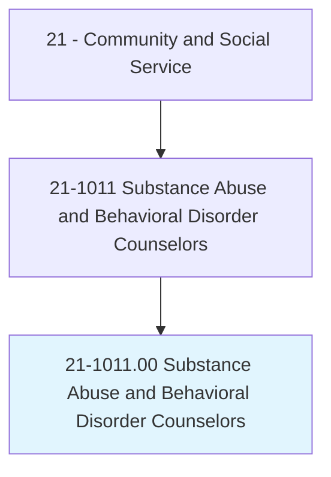
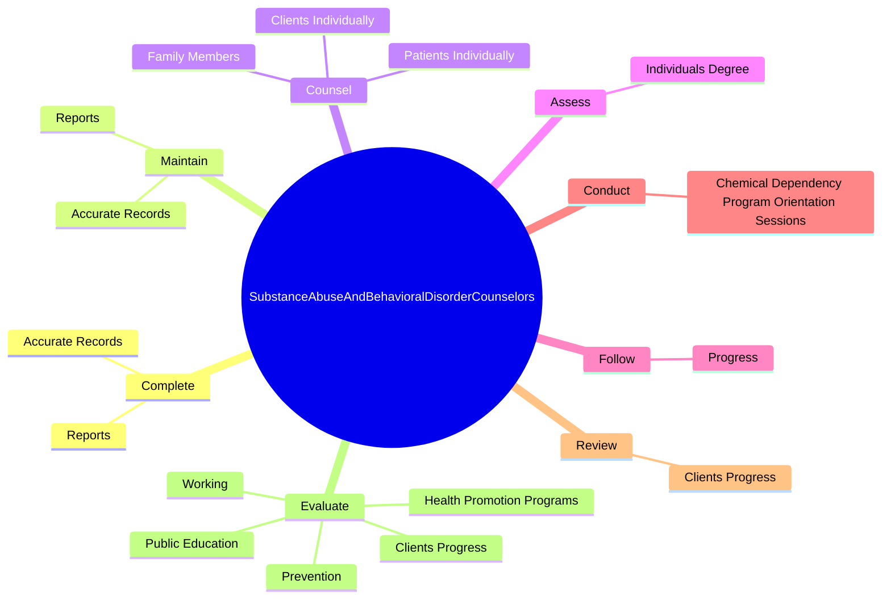
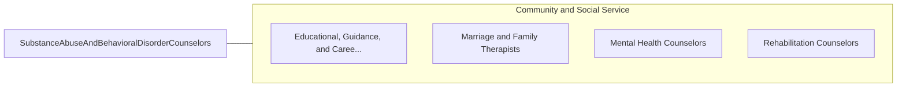

# Substance Abuse and Behavioral Disorder Counselors

> Counsel and advise individuals with alcohol, tobacco, drug, or other problems, such as gambling and eating disorders. May counsel individuals, families, or groups or engage in prevention programs.

## Overview

Substance Abuse and Behavioral Disorder Counselors is an occupation within the Community and Social Service category. Counsel and advise individuals with alcohol, tobacco, drug, or other problems, such as gambling and eating disorders. 

## Classification Hierarchy

## Key Statistics

| Metric | Value |
|--------|-------|
| SOC Code | 21-1011.00 |
| Category | [Community and Social Service](/occupations/SocialServices) |
| Task Count | 115 |
| Source | O*NET |

## Core Tasks

### complete.AccurateRecords

Substance Abuse and Behavioral Disorder Counselors complete accurate records as part of their core responsibilities.

**Actions:**
- `complete.AccurateRecords.regarding.PatientsHistoriesProgress`
- `complete.AccurateRecords.regarding.ServicesProvided`
- `complete.AccurateRecords.regarding.OtherRequiredInformation`
- `complete.Reports.regarding.PatientsHistoriesProgress`

### maintain.AccurateRecords

Substance Abuse and Behavioral Disorder Counselors maintain accurate records as part of their core responsibilities.

**Actions:**
- `maintain.AccurateRecords.regarding.PatientsHistoriesProgress`
- `maintain.AccurateRecords.regarding.ServicesProvided`
- `maintain.AccurateRecords.regarding.OtherRequiredInformation`
- `maintain.Reports.regarding.PatientsHistoriesProgress`

### counsel.ClientsIndividually

Substance Abuse and Behavioral Disorder Counselors counsel clients individually as part of their core responsibilities.

**Actions:**
- `counsel.ClientsIndividually.in.GroupSessions`
- `counsel.ClientsIndividually.in.assist.InOvercomingDependencies`
- `counsel.ClientsIndividually.in.Adjusting.to.Life`
- `counsel.ClientsIndividually.in.MakingChanges`

## Skills & Competencies

### Technical Skills
- **Counseling** - Advanced
- **Case Management** - Advanced
- **Community Outreach** - Advanced

### Soft Skills
- **Communication** - Essential
- **Problem Solving** - Essential
- **Critical Thinking** - Important
- **Teamwork** - Important
- **Adaptability** - Important

## Related Occupations

## Industries

This occupation is found across multiple industries. See [Industries](/industries) for sector-specific employment data.

## Career Progression

---

*Source: O*NET 21-1011.00 - ONETOccupation*
