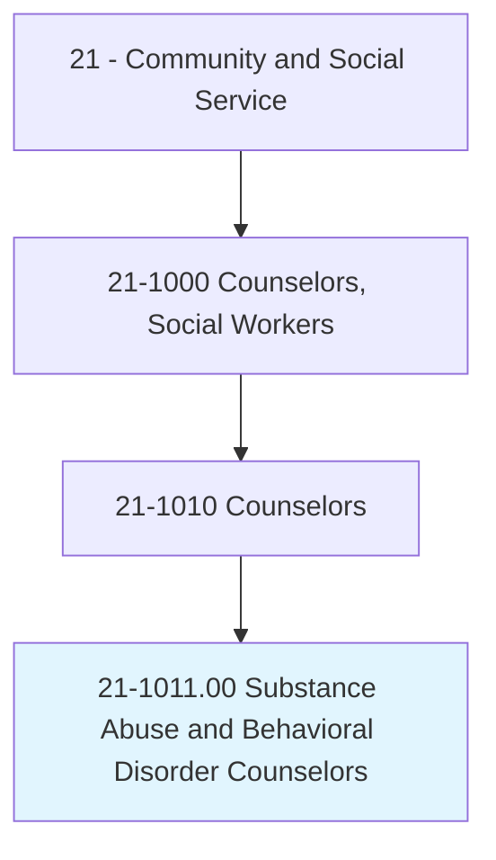
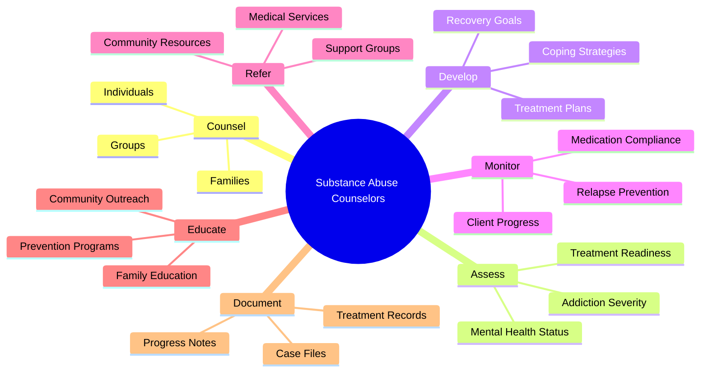
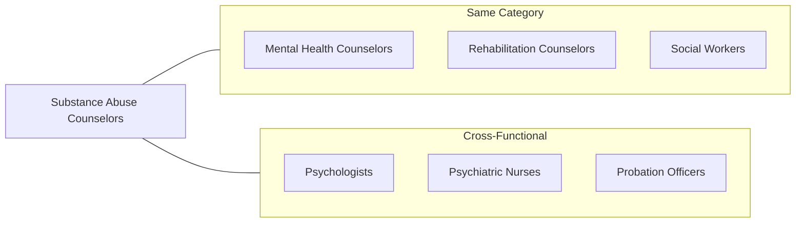
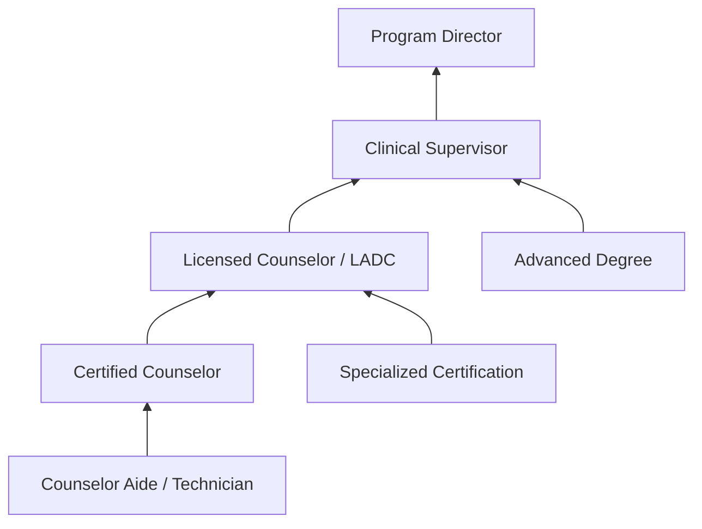

# Substance Abuse and Behavioral Disorder Counselors

> Counsel and advise individuals with alcohol, tobacco, drug, or other problems, such as gambling and eating disorders. May counsel individuals, families, or groups or engage in prevention programs.

## Overview

Substance Abuse and Behavioral Disorder Counselors are specialized professionals who help individuals overcome addictions and behavioral disorders including alcohol dependency, drug abuse, gambling addiction, and eating disorders. They provide individual and group counseling, develop treatment plans, conduct assessments, and work with families affected by addiction. These counselors play a critical role in recovery by helping clients understand their behaviors, develop coping strategies, and build support systems for long-term sobriety and wellness.

## Classification Hierarchy



## Key Statistics

| Metric | Value |
|--------|-------|
| SOC Code | 21-1011.00 |
| Job Zone | 4 (Considerable Preparation) |
| Category | [Community and Social Service](/occupations/SocialServices) |
| Education Level | Bachelor's to Master's degree |
| Source | O*NET |

## Core Tasks



### counsel.Individuals

Substance Abuse Counselors provide one-on-one therapeutic support to help clients address addiction and behavioral issues.

**Actions:**
- `counsel.Individuals.with.AlcoholProblems` - Provide therapy for alcohol addiction and dependency
- `counsel.Individuals.with.DrugProblems` - Address illicit and prescription drug abuse issues
- `counsel.Individuals.with.GamblingProblems` - Help clients overcome compulsive gambling behaviors
- `counsel.Individuals.with.EatingDisorders` - Support recovery from anorexia, bulimia, and binge eating

### assess.ClientNeeds

Counselors evaluate clients to determine appropriate treatment approaches and intervention strategies.

**Actions:**
- `assess.ClientNeeds.to.determine.TreatmentApproach` - Evaluate presenting problems and history
- `assess.AddictionSeverity.using.StandardizedInstruments` - Administer diagnostic assessments
- `assess.MentalHealthStatus.for.CoOccurringDisorders` - Screen for dual diagnosis conditions
- `assess.ReadinessForChange.to.plan.Interventions` - Gauge client motivation and stage of change

### develop.TreatmentPlans

Counselors create individualized treatment strategies based on client assessments and recovery goals.

**Actions:**
- `develop.TreatmentPlans.based.on.ClinicalAssessment` - Create personalized recovery roadmaps
- `develop.RecoveryGoals.with.ClientInput` - Establish measurable treatment objectives
- `develop.CopingStrategies.to.prevent.Relapse` - Build skills for maintaining sobriety
- `develop.AftercarePrograms.for.ContinuedRecovery` - Plan post-treatment support

### conduct.GroupSessions

Counselors facilitate group therapy to provide peer support and shared learning experiences.

**Actions:**
- `conduct.GroupSessions.for.PeerSupport` - Lead support groups for recovery
- `conduct.FamilyEducation.to.improve.FamilyDynamics` - Educate families on addiction
- `conduct.PreventionPrograms.for.AtRiskPopulations` - Deliver community education

### monitor.ClientProgress

Counselors track treatment outcomes and adjust approaches as needed.

**Actions:**
- `monitor.ClientProgress.through.RegularSessions` - Conduct ongoing evaluations
- `monitor.MedicationCompliance.for.MedicationAssistedTreatment` - Ensure proper medication use
- `monitor.RelapseIndicators.to.provide.EarlyIntervention` - Watch for warning signs

## Skills & Competencies

### Technical Skills
- **Addiction Assessment** - Expert
- **Treatment Planning** - Advanced
- **Crisis Intervention** - Advanced
- **Group Facilitation** - Advanced
- **Motivational Interviewing** - Advanced
- **Case Documentation** - Proficient

### Soft Skills
- **Active Listening** - Critical
- **Empathy** - Critical
- **Non-judgmental Attitude** - Critical
- **Patience** - Essential
- **Cultural Sensitivity** - Essential
- **Boundary Setting** - Essential

## Related Occupations



### Same Category
- [Mental Health Counselors](./MentalHealthCounselors.mdx) - Overlapping mental health focus
- [Rehabilitation Counselors](./RehabilitationCounselors.mdx) - Vocational rehabilitation
- Social Workers - Case management and advocacy

### Cross-Functional
- Psychologists - Clinical assessment and therapy
- Psychiatric Nurses - Medical support for withdrawal
- Probation Officers - Court-mandated treatment coordination

## Industries

- [Healthcare and Social Assistance](/industries/Healthcare) - High Employment
- [Government](/industries/Government) - Moderate Employment
- [Residential Treatment Facilities](/industries/ResidentialCare) - Moderate Employment
- [Outpatient Care Centers](/industries/OutpatientCare) - Moderate Employment
- [Correctional Facilities](/industries/Corrections) - Moderate Employment

## Industry Variations

### Healthcare Settings
Focus on clinical treatment, medical detox support, and integration with healthcare teams. Emphasis on evidence-based practices and documentation for insurance purposes.

### Criminal Justice
Work with court-mandated clients, drug courts, and probation systems. Requires understanding of legal requirements and reporting obligations.

### Private Practice
Independent practice serving voluntary clients. Greater autonomy in treatment approaches with focus on business development and insurance billing.

### Community Organizations
Prevention-focused work, outreach to underserved populations, and harm reduction approaches. Often work with limited resources.

## Career Progression



### Career Levels

| Level | Title | Experience | Typical Responsibilities |
|-------|-------|------------|-------------------------|
| Entry | Counselor Aide | 0-2 years | Support services, group facilitation |
| Mid | Certified Counselor | 2-5 years | Individual counseling, assessments |
| Senior | Licensed Counselor (LADC) | 5-10 years | Complex cases, supervision |
| Lead | Clinical Supervisor | 10+ years | Staff supervision, quality assurance |
| Executive | Program Director | 15+ years | Program management, strategy |

## Education & Training

| Requirement | Details |
|-------------|---------|
| Typical Education | Bachelor's or Master's degree in Counseling, Psychology, or Social Work |
| Work Experience | Supervised clinical hours (varies by state, typically 2,000-4,000 hours) |
| On-the-Job Training | Moderate - specialized training in addiction treatment |
| Common Certifications | CADC, LADC, CASAC, MAC, NAADAC credentials |

### Certification Path

1. **Entry Credentials**: Certified Alcohol and Drug Counselor (CADC)
2. **Advanced Credentials**: Licensed Alcohol and Drug Counselor (LADC)
3. **Specialty Credentials**: Master Addiction Counselor (MAC)
4. **Supervisory Credentials**: Clinical Supervisor certification

## Alternative Job Titles

- Addiction Counselor
- Chemical Dependency Counselor
- Drug and Alcohol Counselor
- Recovery Specialist
- Behavioral Health Technician
- Prevention Specialist
- Quitline Counselor

## Departments

This occupation typically works in:
- [Behavioral Health](/departments/BehavioralHealth)
- [Counseling Services](/departments/CounselingServices)
- [Social Services](/departments/SocialServices)
- [Employee Assistance Programs](/departments/EAP)

## GraphDL Semantic Structure

```
Entity: SubstanceAbuseAndBehavioralDisorderCounselors
Namespace: occupations.org.ai
Type: Occupation

Core Actions:
- counsel.Individuals.with.AddictionProblems
- assess.ClientNeeds.for.TreatmentPlanning
- develop.TreatmentPlans.based.on.Assessment
- conduct.GroupSessions.for.Recovery
- monitor.ClientProgress.through.Sessions
- refer.Clients.to.CommunityResources
- educate.Families.about.Addiction
- document.CaseFiles.for.Compliance

Related Concepts:
- concepts.org.ai/SubstanceAbuse
- concepts.org.ai/BehavioralDisorder
- concepts.org.ai/Counselors
```

---

*Source: O*NET 21-1011.00 - ONETOccupation*
