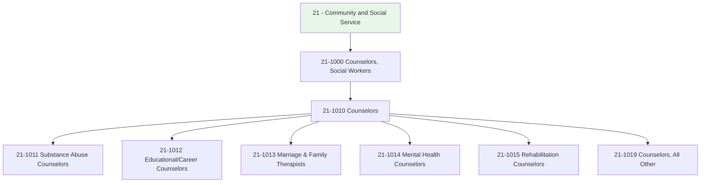
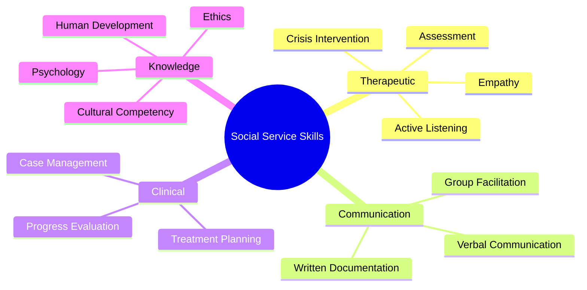
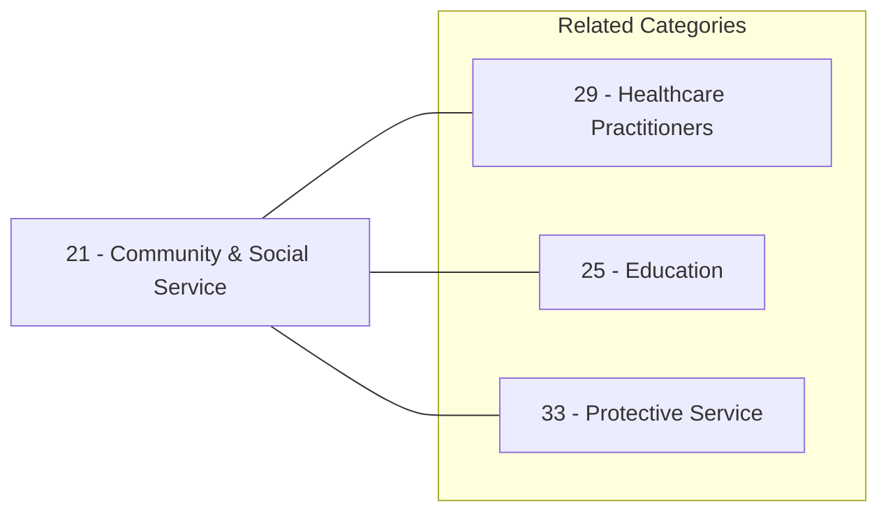

# Community and Social Service

> SOC Category 21 - Community and Social Service Occupations

## Overview

Community and Social Service occupations focus on providing assistance, counseling, and support services to individuals, families, and communities. Professionals in this category help people address personal challenges including mental health issues, substance abuse, relationship problems, career decisions, and disabilities. These roles require strong interpersonal skills, empathy, and specialized training in therapeutic and counseling techniques.

## Classification Hierarchy

## Key Statistics

| Metric | Value |
|--------|-------|
| SOC Category Code | 21 |
| Category Name | Community and Social Service |
| Total Occupations | 20+ |
| Job Zone Range | 4-5 (High Preparation) |
| Common Education | Master's Degree |

## Occupations in this Category

### Counseling Specializations

| Occupation | SOC Code | Focus Area |
|------------|----------|------------|
| [Substance Abuse and Behavioral Disorder Counselors](./SubstanceAbuseCounselors.mdx) | 21-1011.00 | Addiction and behavioral disorders |
| [Educational, Guidance, and Career Counselors](./CareerCounselors.mdx) | 21-1012.00 | Academic and career development |
| [Marriage and Family Therapists](./FamilyTherapists.mdx) | 21-1013.00 | Relationship and family systems |
| [Mental Health Counselors](./MentalHealthCounselors.mdx) | 21-1014.00 | Mental and emotional wellness |
| [Rehabilitation Counselors](./RehabilitationCounselors.mdx) | 21-1015.00 | Disability and vocational rehabilitation |

## Common Skills Across Category

## Career Entry Points

Most positions in this category require:
- **Education**: Master's degree in counseling, social work, psychology, or related field
- **Licensure**: State licensure or certification (varies by state)
- **Supervised Experience**: 2,000-4,000 hours of supervised clinical practice
- **Continuing Education**: Ongoing professional development requirements

## Related Categories

## Industries

These occupations are found across multiple sectors:

- [Healthcare and Social Assistance](/industries/Healthcare/index) - Primary employment sector
- [Educational Services](/industries/Education) - Schools and universities
- [Government](/industries/Government) - Public welfare agencies
- [Religious Organizations](/industries/Religious) - Faith-based counseling
- [Private Practice](/industries/ProfessionalServices) - Independent practitioners

## Departmental Alignment

Professionals in this category typically work in:

- [Counseling Services](/departments/CounselingServices)
- [Student Services](/departments/StudentServices)
- [Human Resources](/departments/HR/index)
- [Behavioral Health](/departments/BehavioralHealth)
- [Social Services](/departments/SocialServices)

---

*Source: O*NET SOC Category 21 - Community and Social Service Occupations*
