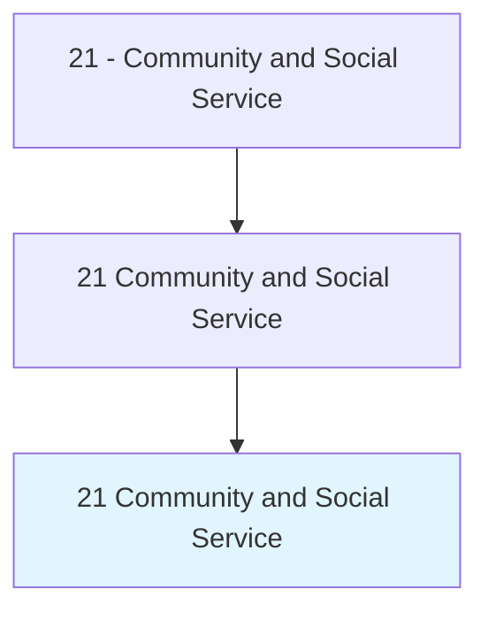
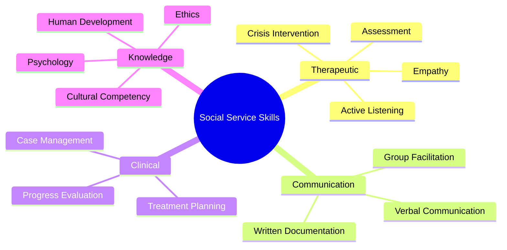
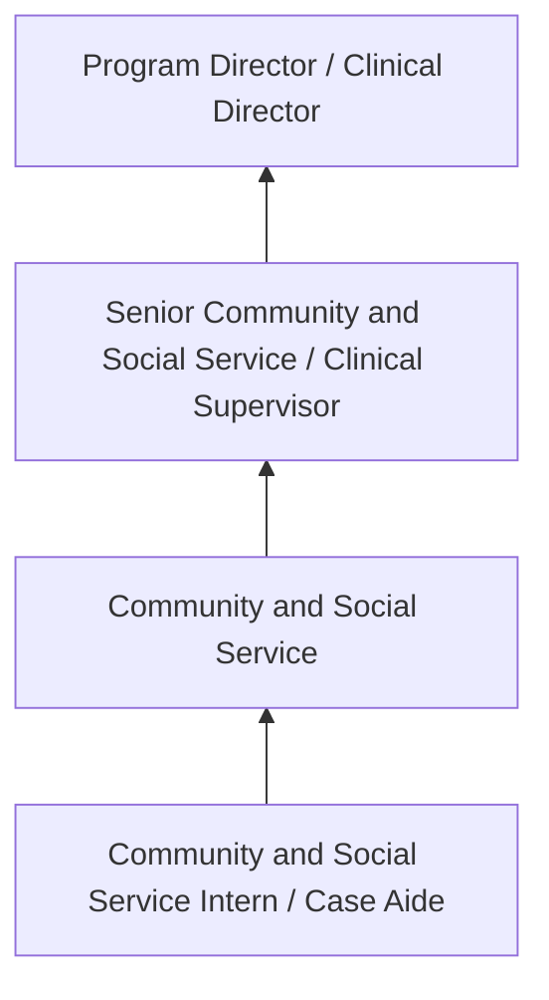
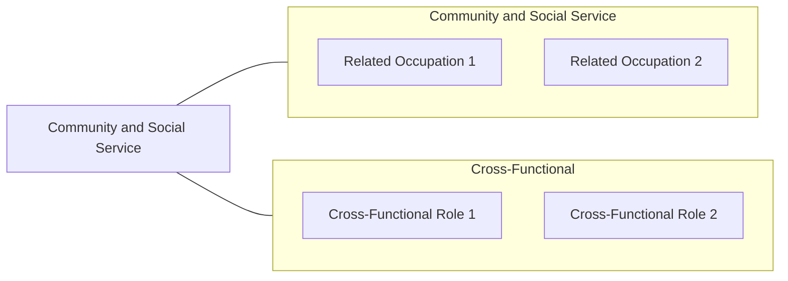

# Community and Social Service

> Community and Social Service professionals working in the Community and Social Service field.

## Overview

Community and Social Service professionals serve a vital function within the Community and Social Service field. They bring specialized skills and knowledge to their roles, contributing to organizational objectives and societal needs.

These practitioners work in varied environments, adapting their expertise to meet specific requirements of their industry and employer. The role requires ongoing professional development to maintain competency and respond to changing demands.

Career paths in this field offer opportunities for advancement through experience, additional education, and specialized certifications. Employment prospects are influenced by industry trends, technological change, and workforce demographics.

## Classification Hierarchy



## Key Statistics

| Metric | Value |
|--------|-------|
| SOC Code | 21 |
| Job Zone | N/A |
| Category | [Community and Social Service](/occupations/SocialServices/index) |
| Core Tasks | N/A+ |
| Salary Range | $35,000 - $80,000 |
| Median Salary | $50,000 |
| Growth Outlook | 10% (Much faster than average) |
| Source | O*NET |

## Core Tasks



### Counseling Specializations

| Occupation | SOC Code | Focus Area |
|------------|----------|------------|
| [Substance Abuse and Behavioral Disorder Counselors](./SubstanceAbuseCounselors.mdx) | 21-1011.00 | Addiction and behavioral disorders |
| [Educational, Guidance, and Career Counselors](./CareerCounselors.mdx) | 21-1012.00 | Academic and career development |
| [Marriage and Family Therapists](./FamilyTherapists.mdx) | 21-1013.00 | Relationship and family systems |
| [Mental Health Counselors](./MentalHealthCounselors.mdx) | 21-1014.00 | Mental and emotional wellness |
| [Rehabilitation Counselors](./RehabilitationCounselors.mdx) | 21-1015.00 | Disability and vocational rehabilitation |


## Skills & Competencies

### Technical Skills
- **Assessment and Evaluation** - Expert
- **Case Management** - Advanced
- **Crisis Intervention** - Advanced
- **Treatment Planning** - Advanced
- **Documentation and Reporting** - Advanced
- **Cultural Competency** - Advanced

### Soft Skills
- **Empathy** - Critical
- **Active Listening** - Critical
- **Communication** - Essential
- **Ethical Judgment** - Essential
- **Emotional Resilience** - Essential

## Education & Certifications

| Requirement | Details |
|-------------|---------|
| Typical Education | Bachelor's or Master's degree in social work, counseling, or related field |
| Work Experience | 1-2 years supervised clinical experience |
| On-the-Job Training | Moderate to extensive - supervised practice hours required |
| Certifications | State licensure typically required (LCSW, LPC, etc.) |

## Career Progression



## Industry Variations

### Nonprofit Organizations
Community-based service delivery. Community and Social Service professionals focus on underserved populations with limited resources.

### Healthcare Settings
Integrated behavioral and physical health services. Collaboration with medical teams and emphasis on holistic patient care.

### Government Agencies
Public service delivery and policy implementation. Focus on compliance, documentation, and serving diverse community needs.

### Private Practice
Independent or group practice settings. Greater autonomy in service delivery with focus on building a client base.

## Technology & Tools

- **Case management software**
- **Electronic health records (EHR)**
- **Assessment and screening tools**
- **Telehealth platforms**
- **Documentation and reporting systems**

## Related Occupations



## Industries

- Social Assistance - High Employment
- [Healthcare](/industries/Healthcare/index) - High Employment
- [Government](/industries/PublicAdministration) - Moderate Employment
- [Education](/industries/Education) - Moderate Employment

## Departments

This occupation typically works in:
- Client Services
- Program Administration
- Community Outreach

## GraphDL Semantic Structure

```graphdl
Community and Social Service perform:
- assess.Clients.for.ServiceNeeds
- develop.Plans.for.ClientInterventions
- provide.Counseling.to.ClientsAndFamilies
- coordinate.Services.with.CommunityResources
- document.Progress.in.ClientRecords
```

---

*Source: O*NET 21 - ONETOccupation*
