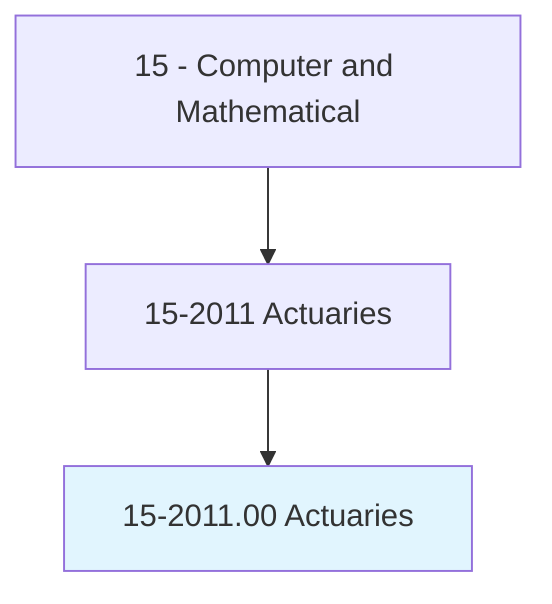
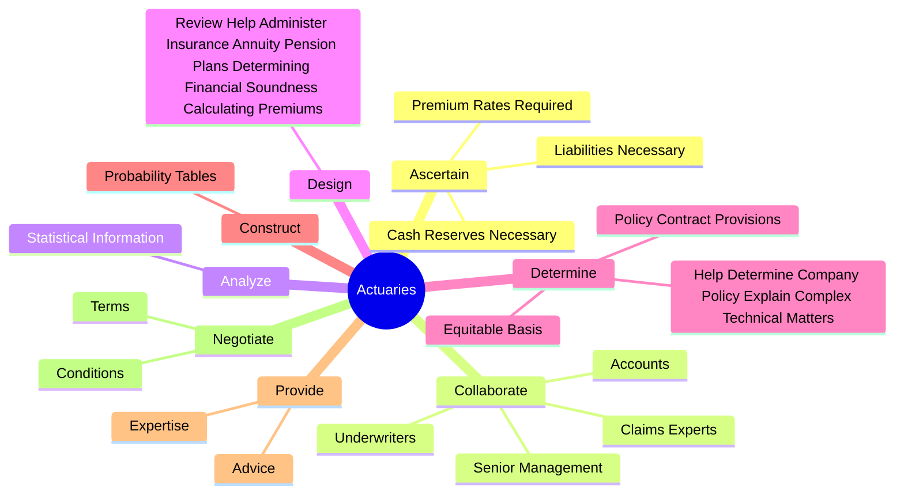
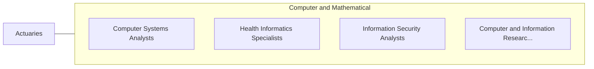

# Actuaries

> Analyze statistical data, such as mortality, accident, sickness, disability, and retirement rates and construct probability tables to forecast risk and liability for payment of future benefits. May ascertain insurance rates required and cash reserves necessary to ensure payment of future benefits.

## Overview

Actuaries is an occupation within the Computer and Mathematical category. Analyze statistical data, such as mortality, accident, sickness, disability, and retirement rates and construct probability tables to forecast risk and liability for payment of future benefits. 

## Classification Hierarchy

## Key Statistics

| Metric | Value |
|--------|-------|
| SOC Code | 15-2011.00 |
| Category | [Computer and Mathematical](/occupations/Technology) |
| Task Count | 38 |
| Source | O*NET |

## Core Tasks

### ascertain.PremiumRatesRequired

Actuaries ascertain premium rates required as part of their core responsibilities.

**Actions:**
- `ascertain.PremiumRatesRequired.to.ensure.PaymentOfFutureBenefits`
- `ascertain.CashReservesNecessary.to.ensure.PaymentOfFutureBenefits`
- `ascertain.LiabilitiesNecessary.to.ensure.PaymentOfFutureBenefits`

### collaborate.Underwriters

Actuaries collaborate underwriters as part of their core responsibilities.

**Actions:**
- `collaborate.Underwriters.to.help.CompaniesDevelopPlansForNewLinesOfBusinessToExistingBusiness`
- `collaborate.Underwriters.to.ImprovementsToExistingBusiness`
- `collaborate.Accounts.to.help.CompaniesDevelopPlansForNewLinesOfBusinessToExistingBusiness`
- `collaborate.Accounts.to.ImprovementsToExistingBusiness`

### analyze.StatisticalInformation

Actuaries analyze statistical information as part of their core responsibilities.

**Actions:**
- `analyze.StatisticalInformation.to.estimate.Mortality`
- `analyze.StatisticalInformation.to.Accident`
- `analyze.StatisticalInformation.to.Sickness`
- `analyze.StatisticalInformation.to.Disability`

## Skills & Competencies

### Technical Skills
- **Programming** - Advanced
- **Systems Analysis** - Advanced
- **Database Management** - Advanced

### Soft Skills
- **Communication** - Essential
- **Problem Solving** - Essential
- **Critical Thinking** - Important
- **Teamwork** - Important
- **Adaptability** - Important

## Related Occupations

## Industries

This occupation is found across multiple industries. See [Industries](/industries) for sector-specific employment data.

## Career Progression

---

*Source: O*NET 15-2011.00 - ONETOccupation*
