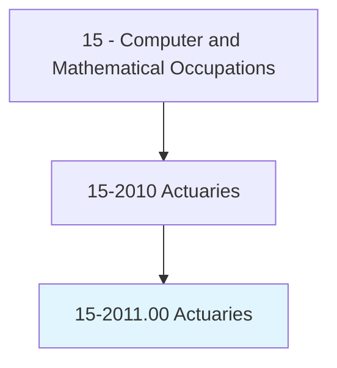
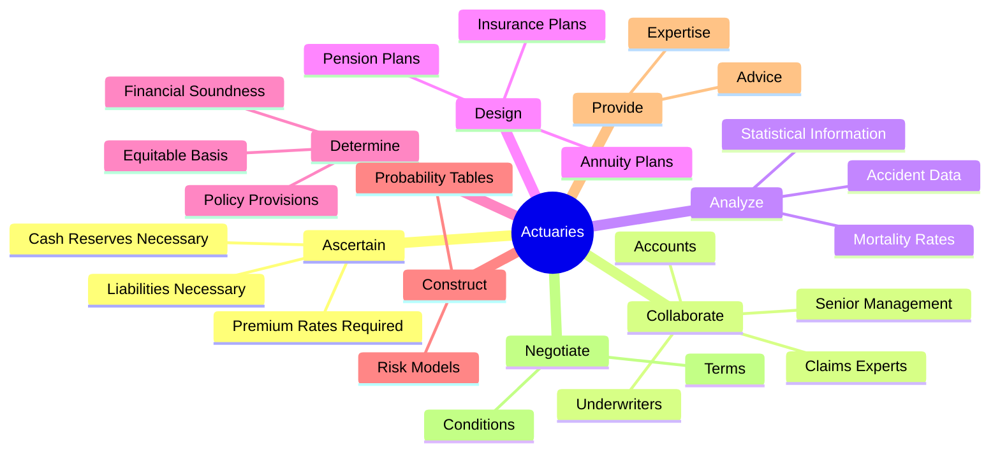
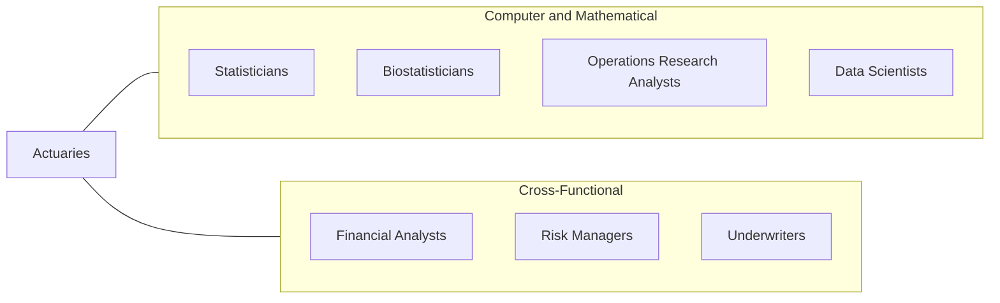
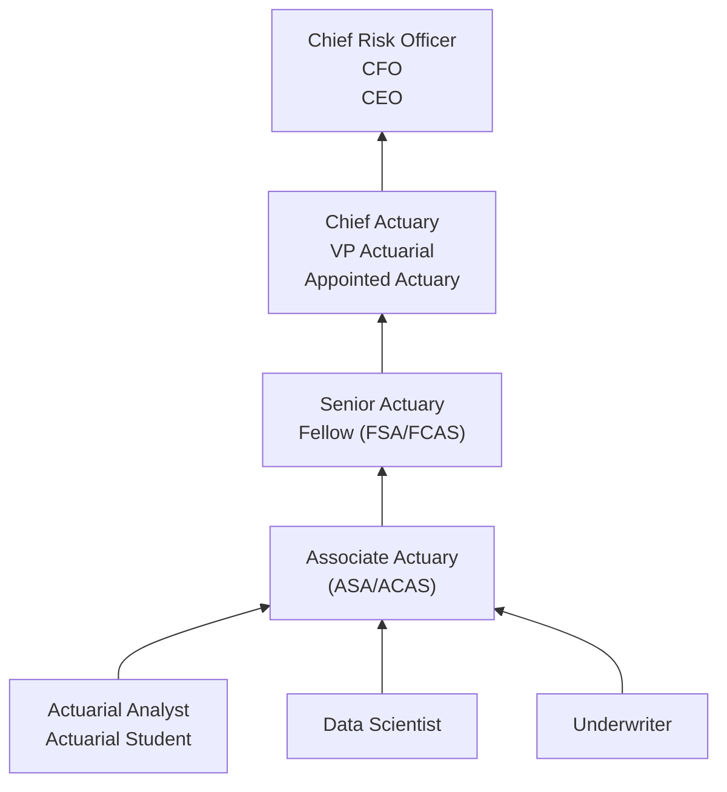

# Actuaries

> Analyze statistical data, such as mortality, accident, sickness, disability, and retirement rates and construct probability tables to forecast risk and liability for payment of future benefits. May ascertain insurance rates required and cash reserves necessary to ensure payment of future benefits.

## Overview

Actuaries are specialized professionals who use mathematics, statistics, and financial theory to assess and quantify risk in the insurance and financial industries. They analyze data on mortality, accidents, illness, disability, and retirement to build probability models that help organizations plan for uncertain future events. Their work is fundamental to the financial stability of insurance companies, pension funds, and other organizations that must manage long-term financial obligations.

Beyond traditional insurance pricing, modern actuaries play increasingly strategic roles in enterprise risk management, helping organizations identify, measure, and mitigate financial risks across all business functions. They combine deep mathematical expertise with business acumen to translate complex quantitative analyses into actionable recommendations for senior leadership. The profession is consistently ranked among the top careers for job satisfaction, work-life balance, and compensation.

Actuaries must pass a rigorous series of professional examinations administered by the Society of Actuaries (SOA) or the Casualty Actuarial Society (CAS) to achieve full professional credentials, a process that typically spans 7-10 years of study alongside professional work experience.

## Classification Hierarchy

## Key Statistics

| Metric | Value |
|--------|-------|
| SOC Code | 15-2011.00 |
| Job Zone | 5 (Extensive Preparation) |
| Category | [Computer and Mathematical](/occupations/Technology/index) |
| Task Count | 38 |
| Median Salary | $113,990 |
| Employment | ~27,700 |
| Growth Rate | Faster Than Average (21%) |
| Source | O*NET |

## Core Tasks

### ascertain.PremiumRatesRequired

Actuaries determine the rates and reserves necessary to ensure financial obligations can be met.

**Actions:**
- `ascertain.PremiumRatesRequired.to.ensure.PaymentOfFutureBenefits`
- `ascertain.CashReservesNecessary.to.ensure.PaymentOfFutureBenefits`
- `ascertain.LiabilitiesNecessary.to.ensure.PaymentOfFutureBenefits`
- `calculate.Premiums.using.ProbabilityTables`

### collaborate.Underwriters

Actuaries work closely with underwriters, accountants, and senior management to develop business strategies.

**Actions:**
- `collaborate.Underwriters.to.help.CompaniesDevelopPlansForNewLinesOfBusiness`
- `collaborate.Accounts.to.evaluate.FinancialPerformance`
- `collaborate.ClaimsExperts.to.assess.LossPatterns`
- `collaborate.SeniorManagement.to.inform.StrategicDecisions`

### analyze.StatisticalInformation

Actuaries analyze statistical data to estimate probabilities and forecast risk.

**Actions:**
- `analyze.StatisticalInformation.to.estimate.Mortality`
- `analyze.StatisticalInformation.to.estimate.AccidentRates`
- `analyze.StatisticalInformation.to.estimate.SicknessRates`
- `analyze.StatisticalInformation.to.estimate.DisabilityRates`

### construct.ProbabilityTables

Actuaries build mathematical models to forecast future events and financial outcomes.

**Actions:**
- `construct.ProbabilityTables.to.forecast.RiskAndLiability`
- `develop.RiskModels.using.StatisticalData`
- `model.FinancialScenarios.to.assess.Exposure`

### design.InsurancePlans

Actuaries design and evaluate insurance, annuity, and pension plan structures.

**Actions:**
- `design.InsurancePlans.to.determine.FinancialSoundness`
- `review.AnnuityPlans.to.calculate.Premiums`
- `evaluate.PensionPlans.to.ensure.Adequacy`

## Tech Stack

### Programming & Statistical Software
- **R** - Statistical computing and modeling
- **Python** - Data analysis and machine learning
- **SAS** - Statistical analysis and reporting
- **SQL** - Database querying
- **VBA/Excel** - Financial modeling and automation
- **MATLAB** - Numerical computing

### Actuarial Software
- **MoSes** - Life insurance modeling
- **Prophet** - Actuarial projection software
- **AXIS** - Life and annuity valuation
- **ResQ** - Reserving and pricing
- **Emblem** - Pricing optimization
- **Earnix** - Insurance pricing analytics

### Data & Analytics Tools
- **Tableau** - Data visualization
- **Power BI** - Business intelligence
- **Alteryx** - Data preparation
- **Hadoop/Spark** - Big data processing

## Certifications

| Certification | Provider | Level |
|---------------|----------|-------|
| Associate of the Society of Actuaries (ASA) | SOA | Associate |
| Fellow of the Society of Actuaries (FSA) | SOA | Fellow |
| Associate of the Casualty Actuarial Society (ACAS) | CAS | Associate |
| Fellow of the Casualty Actuarial Society (FCAS) | CAS | Fellow |
| Chartered Enterprise Risk Analyst (CERA) | SOA | Specialty |
| Enrolled Actuary (EA) | Joint Board | Federal |

## Skills & Competencies

### Technical Skills
- **Statistical Analysis** - Expert
- **Probability Theory** - Expert
- **Financial Mathematics** - Expert
- **Risk Modeling** - Expert
- **Programming (R/Python/SAS)** - Advanced
- **Database Management** - Advanced
- **Machine Learning** - Intermediate
- **Data Visualization** - Advanced

### Soft Skills
- **Analytical Thinking** - Critical
- **Communication** - Essential (presenting to non-technical audiences)
- **Problem Solving** - Critical
- **Business Acumen** - Essential
- **Attention to Detail** - Critical
- **Teamwork** - Important

## Related Occupations

- [Statisticians](/occupations/Technology/Statisticians)
- [Biostatisticians](/occupations/Technology/Biostatisticians)
- [Operations Research Analysts](/occupations/Technology/OperationsResearchAnalysts)
- [Data Scientists](/occupations/Technology/DataScientists)

## Industry Variations

### Insurance (Life & Health)
- Mortality and morbidity modeling
- Product pricing and reserving
- Regulatory compliance (state insurance departments)
- Experience studies and assumption setting

### Property & Casualty Insurance
- Loss reserving and catastrophe modeling
- Ratemaking and classification analysis
- Reinsurance pricing
- Claims trend analysis

### Consulting
- Client advisory across multiple industries
- Mergers and acquisitions due diligence
- Expert witness and litigation support
- Retirement plan consulting

### Financial Services & Banking
- Enterprise risk management (ERM)
- Credit risk and capital modeling
- Asset-liability management
- Investment strategy

### Government & Regulatory
- Social Security and Medicare projections
- State pension fund valuations
- Insurance regulation
- Public policy analysis

## Career Progression

## Education & Training

| Requirement | Details |
|-------------|---------|
| Typical Education | Bachelor's degree in Actuarial Science, Mathematics, Statistics, or related field |
| Alternative Paths | Strong quantitative degree with self-study for exams |
| Exam Process | 7-10 exams over ~7 years (SOA or CAS pathway) |
| Work Experience | Entry with 0-2 exams passed; Fellowship requires years of practice |
| Continuing Education | Required to maintain credentials (30+ hours per cycle) |
| VEE Requirements | Economics, Accounting & Finance, Mathematical Statistics |

## Departments

This occupation typically works in:
- [Risk Management](/departments/Risk)
- [Insurance Operations](/departments/Insurance)
- [Finance](/departments/Finance)
- [Product Development](/departments/Product)
- [Compliance & Regulatory](/departments/Compliance)

---

*Source: O*NET 15-2011.00 - ONETOccupation*
