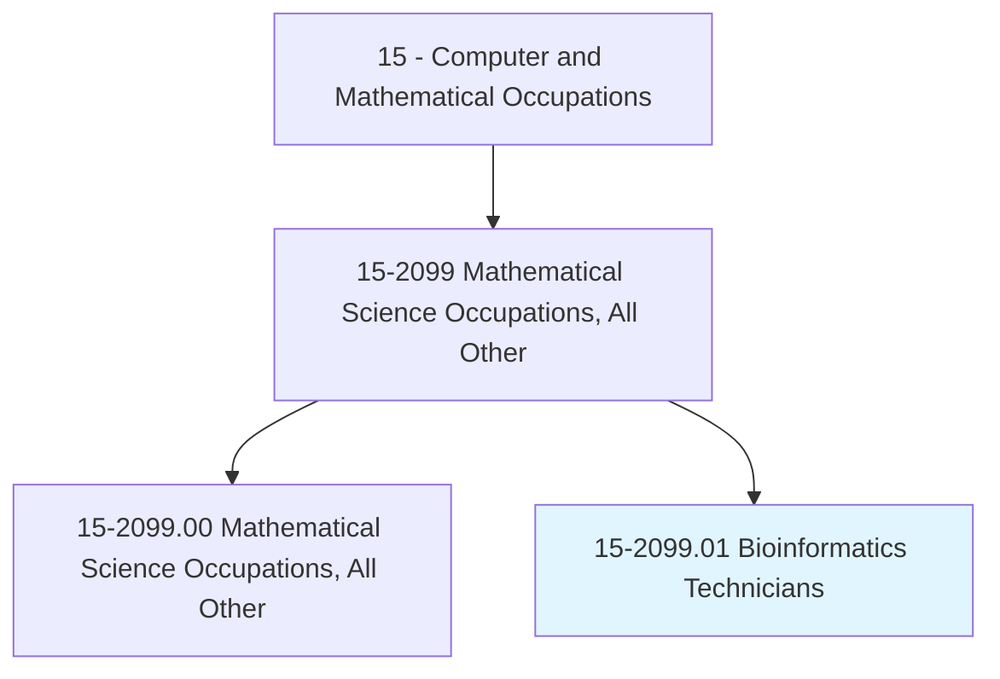
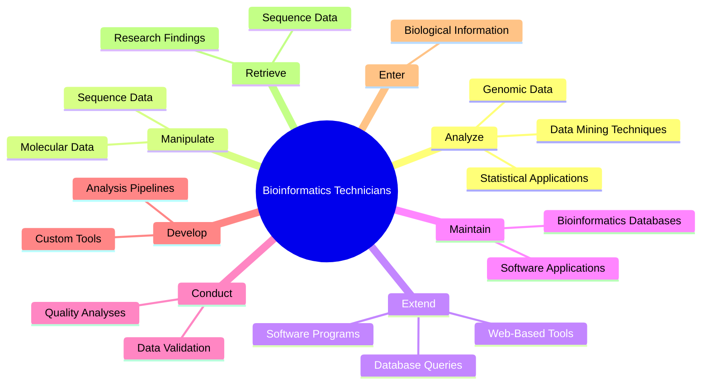
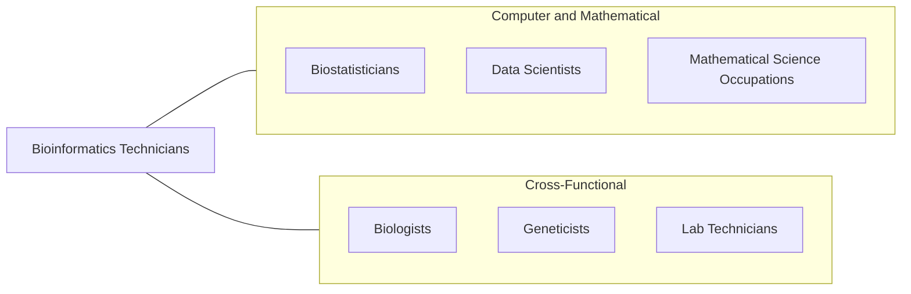
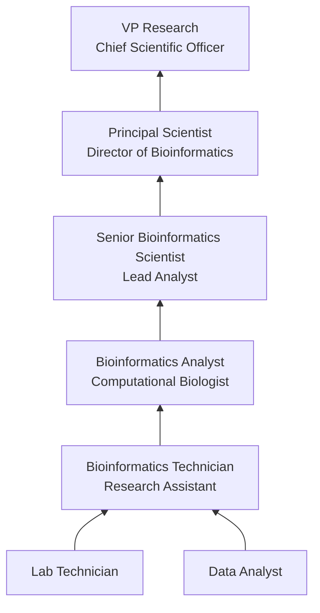

# Bioinformatics Technicians

> Apply principles and methods of bioinformatics to assist scientists in areas such as pharmaceuticals, medical technology, biotechnology, computational biology, proteomics, computer information science, biology and medical informatics. Apply bioinformatics tools to visualize, analyze, manipulate or interpret molecular data. May build and maintain databases for processing and analyzing genomic or other biological information.

## Overview

Bioinformatics Technicians work at the intersection of biology, computer science, and data analysis to support scientific research. They apply computational tools and statistical methods to analyze biological data, including genomic sequences, protein structures, and molecular interactions. Their work is essential to advancing our understanding of genetics, disease mechanisms, and drug development.

These professionals serve as the technical backbone of bioinformatics research labs, managing the databases, pipelines, and software tools that researchers depend on to process vast amounts of biological data. As genomic sequencing costs have plummeted and the volume of biological data has exploded, bioinformatics technicians play an increasingly critical role in translating raw data into actionable scientific knowledge.

The role bridges traditional wet-lab biology with computational science, requiring a unique combination of biological domain knowledge and programming expertise. Bioinformatics technicians may specialize in areas such as genomics, proteomics, structural biology, systems biology, or pharmacogenomics, depending on their organization and research focus.

## Classification Hierarchy

## Key Statistics

| Metric | Value |
|--------|-------|
| SOC Code | 15-2099.01 |
| Job Zone | 4 (Considerable Preparation) |
| Category | [Computer and Mathematical](/occupations/Technology/index) |
| Task Count | 65 |
| Median Salary | $60,820 |
| Employment | ~6,300 |
| Growth Rate | Faster Than Average |
| Source | O*NET |

## Core Tasks

### analyze.GenomicData

Bioinformatics Technicians analyze biological data using specialized software and statistical methods.

**Actions:**
- `analyze.GenomicData.using.BioinformaticsSoftwarePackages`
- `analyze.ProteomicData.using.StatisticalApplications`
- `analyze.SequenceData.using.DataMiningTechniques`
- `analyze.MolecularData.to.identify.Patterns`

### manipulate.MolecularData

Bioinformatics Technicians process and transform molecular data for research use.

**Actions:**
- `manipulate.SequenceData.using.AlignmentTools`
- `manipulate.GenomicData.for.DownstreamAnalysis`
- `manipulate.ProteomicData.using.VisualizationSoftware`
- `clean.RawData.to.ensure.DataQuality`

### extend.SoftwarePrograms

Bioinformatics Technicians extend and customize tools to meet evolving research needs.

**Actions:**
- `extend.ExistingSoftwarePrograms.to.support.NewAnalysisMethods`
- `extend.WebBasedInteractiveTools.for.ResearchCollaboration`
- `extend.DatabaseQueries.as.SequenceManagementNeedsEvolve`
- `develop.AnalysisPipelines.for.HighThroughputData`

### maintain.BioinformaticsDatabases

Bioinformatics Technicians build and maintain databases for biological information.

**Actions:**
- `maintain.GenomicDatabases.for.ResearchTeams`
- `maintain.SequenceDatabases.to.ensure.DataIntegrity`
- `build.Databases.for.ProcessingBiologicalInformation`
- `update.DatabaseSchemas.to.accommodate.NewDataTypes`

## Tech Stack

### Programming Languages
- **Python** - Primary scripting and analysis
- **R** - Statistical computing and Bioconductor
- **Perl** - Legacy bioinformatics scripts
- **Bash/Shell** - Pipeline automation
- **SQL** - Database querying
- **Java** - Enterprise bioinformatics tools

### Bioinformatics Tools
- **BLAST** - Sequence alignment
- **Bowtie/BWA** - Short read alignment
- **GATK** - Variant calling
- **SAMtools** - Sequence manipulation
- **Bioconductor** - R genomic analysis
- **Galaxy** - Web-based analysis platform
- **UCSC Genome Browser** - Genome visualization

### Data & Infrastructure
- **AWS/GCP** - Cloud computing for genomics
- **Docker/Singularity** - Containerized pipelines
- **Nextflow/Snakemake** - Workflow management
- **PostgreSQL/MySQL** - Relational databases
- **MongoDB** - Unstructured data storage
- **HPC Clusters** - High-performance computing

### Visualization
- **IGV** - Integrative Genomics Viewer
- **Cytoscape** - Network visualization
- **R/ggplot2** - Statistical plotting
- **Matplotlib** - Python plotting
- **Jupyter Notebooks** - Interactive analysis

## Certifications

| Certification | Provider | Level |
|---------------|----------|-------|
| AWS Certified Cloud Practitioner | Amazon | Foundation |
| ISCB Bioinformatics Certification | ISCB | Professional |
| SAS Certified Statistical Business Analyst | SAS | Professional |
| CompTIA Data+ | CompTIA | Foundation |

## Skills & Competencies

### Technical Skills
- **Genomic Data Analysis** - Expert
- **Programming (Python/R/Perl)** - Advanced
- **Statistical Methods** - Advanced
- **Database Management** - Advanced
- **Sequence Alignment & Analysis** - Expert
- **Pipeline Development** - Advanced
- **Linux/Unix Systems** - Advanced
- **Cloud Computing** - Intermediate

### Soft Skills
- **Attention to Detail** - Critical
- **Scientific Communication** - Essential
- **Problem Solving** - Critical
- **Collaboration** - Essential (working with bench scientists)
- **Documentation** - Important
- **Continuous Learning** - Essential

## Related Occupations

- [Biostatisticians](/occupations/Technology/Biostatisticians)
- [Data Scientists](/occupations/Technology/DataScientists)
- [Mathematical Science Occupations](/occupations/Technology/MathematicalScienceOccupations)

## Industry Variations

### Pharmaceutical & Biotech
- Drug target identification
- Pharmacogenomics analysis
- Clinical trial data processing
- ADME/toxicity prediction

### Academic Research
- Genomic and transcriptomic analysis
- Publication-quality visualizations
- Grant-supported research pipelines
- Open-source tool development

### Healthcare / Clinical
- Clinical genomics (variant interpretation)
- Precision medicine support
- Diagnostic test development
- Electronic health records integration

### Agriculture
- Crop genome analysis
- Trait identification and selection
- Pathogen genomics
- Environmental DNA analysis

## Career Progression

## Education & Training

| Requirement | Details |
|-------------|---------|
| Typical Education | Bachelor's or Master's in Bioinformatics, Computational Biology, Computer Science, or Biology |
| Alternative Paths | Biology degree with self-taught programming, CS degree with biology coursework |
| Work Experience | 0-2 years entry, 3-5 years mid-level |
| On-the-Job Training | Moderate - domain-specific tools and databases |
| Key Knowledge Areas | Molecular biology, statistics, algorithms, database design |

## Departments

This occupation typically works in:
- Research & Development
- [Information Technology](/departments/Technology)
- Clinical Operations
- Data Science & Analytics

---

*Source: O*NET 15-2099.01 - ONETOccupation*
