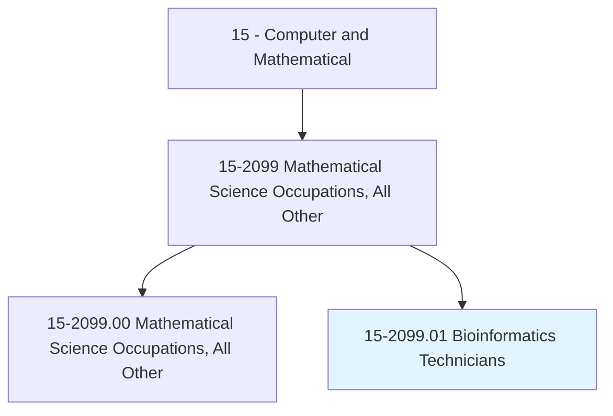
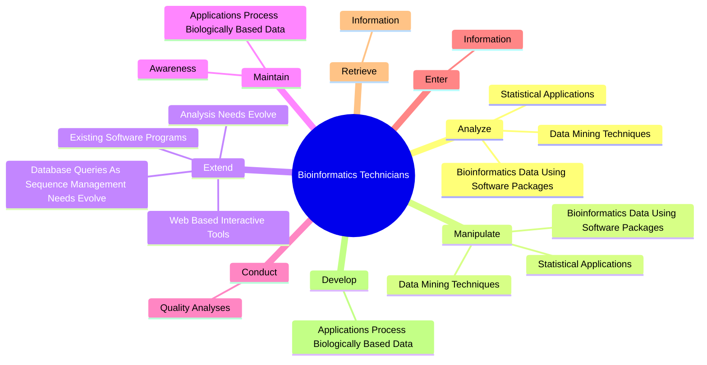
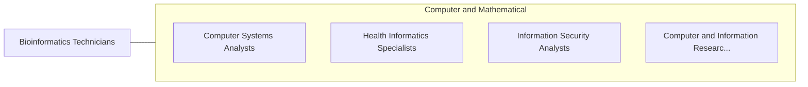

# Bioinformatics Technicians

> Apply principles and methods of bioinformatics to assist scientists in areas such as pharmaceuticals, medical technology, biotechnology, computational biology, proteomics, computer information science, biology and medical informatics. Apply bioinformatics tools to visualize, analyze, manipulate or interpret molecular data. May build and maintain databases for processing and analyzing genomic or other biological information.

## Overview

Bioinformatics Technicians is a specialized variant within the Computer and Mathematical category. Apply principles and methods of bioinformatics to assist scientists in areas such as pharmaceuticals, medical technology, biotechnology, computational biology, proteomics, computer information science, biology and medical informatics. Apply bioinformatics tools to visualize, analyze, manipulate or interpret molecular data.

## Classification Hierarchy

## Key Statistics

| Metric | Value |
|--------|-------|
| SOC Code | 15-2099.01 |
| Category | [Computer and Mathematical](/occupations/Technology/index) |
| Task Count | 65 |
| Source | O*NET |

## Core Tasks

### analyze.BioinformaticsDataUsingSoftwarePackages

Bioinformatics Technicians analyze bioinformatics data using software packages as part of their core responsibilities.

**Actions:**
- `analyze.BioinformaticsDataUsingSoftwarePackages`
- `analyze.StatisticalApplications`
- `analyze.DataMiningTechniques`

### manipulate.BioinformaticsDataUsingSoftwarePackages

Bioinformatics Technicians manipulate bioinformatics data using software packages as part of their core responsibilities.

**Actions:**
- `manipulate.BioinformaticsDataUsingSoftwarePackages`
- `manipulate.StatisticalApplications`
- `manipulate.DataMiningTechniques`

### extend.ExistingSoftwarePrograms

Bioinformatics Technicians extend existing software programs as part of their core responsibilities.

**Actions:**
- `extend.ExistingSoftwarePrograms`
- `extend.WebBasedInteractiveTools`
- `extend.DatabaseQueriesAsSequenceManagementNeedsEvolve`
- `extend.AnalysisNeedsEvolve`

## Skills & Competencies

### Technical Skills
- **Programming** - Advanced
- **Systems Analysis** - Advanced
- **Database Management** - Advanced

### Soft Skills
- **Communication** - Essential
- **Problem Solving** - Essential
- **Critical Thinking** - Important
- **Teamwork** - Important
- **Adaptability** - Important

## Related Occupations

## Industries

This occupation is found across multiple industries. See [Industries](/industries) for sector-specific employment data.

## Career Progression

---

*Source: O*NET 15-2099.01 - ONETOccupation*
