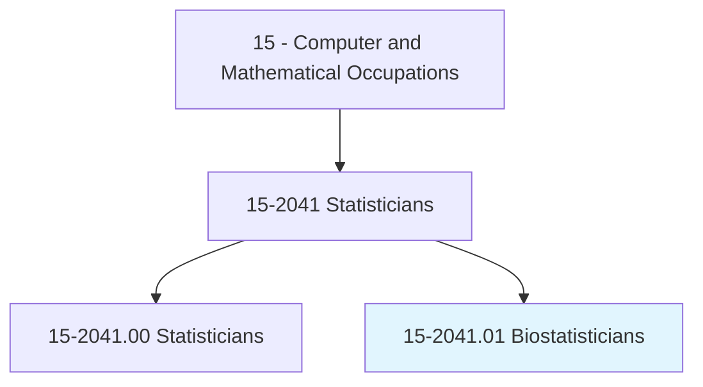
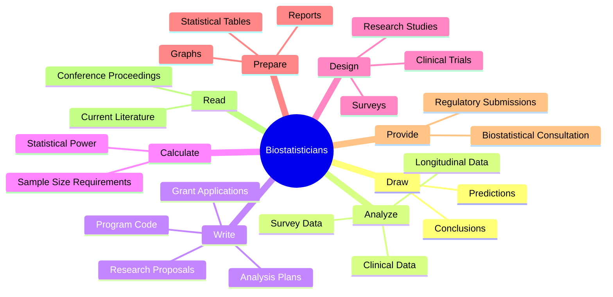
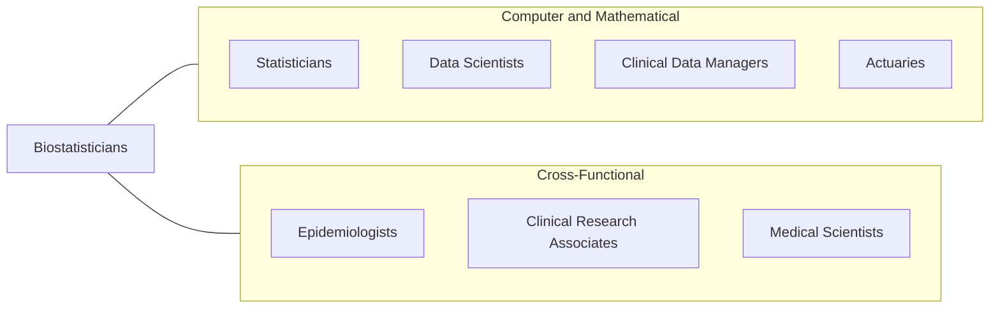
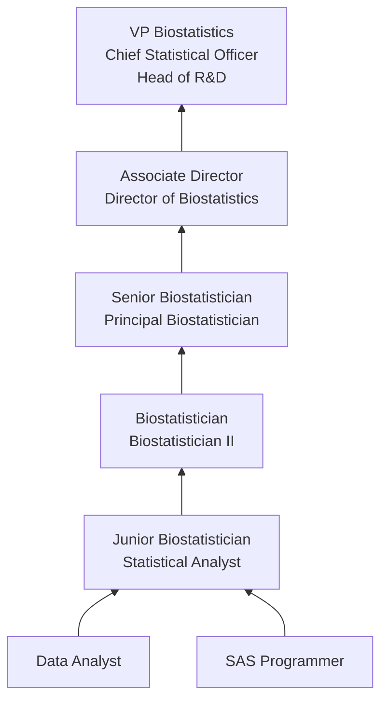

# Biostatisticians

> Develop and apply biostatistical theory and methods to the study of life sciences.

## Overview

Biostatisticians are specialized statisticians who apply statistical methods to biological, medical, and public health research. They design experiments, analyze clinical trial data, and develop new statistical methodologies tailored to the unique challenges of life sciences research. Their work is critical to determining whether new drugs are effective, understanding disease patterns in populations, and advancing evidence-based medicine.

In the pharmaceutical industry, biostatisticians are integral to every phase of drug development, from early discovery through Phase I-IV clinical trials and post-market surveillance. They design trials to maximize statistical power while minimizing patient risk, analyze complex longitudinal data, and prepare statistical sections of regulatory submissions to the FDA and other agencies. Their analyses directly influence whether new treatments reach patients.

The field has expanded significantly with the growth of genomics, personalized medicine, and real-world evidence. Modern biostatisticians increasingly work with large observational datasets, electronic health records, and high-dimensional genomic data, applying techniques from machine learning alongside traditional statistical inference to extract meaningful insights from complex biological systems.

## Classification Hierarchy

## Key Statistics

| Metric | Value |
|--------|-------|
| SOC Code | 15-2041.01 |
| Job Zone | 5 (Extensive Preparation) |
| Category | [Computer and Mathematical](/occupations/Technology/index) |
| Task Count | 94 |
| Median Salary | $104,110 |
| Employment | ~10,900 |
| Growth Rate | Much Faster Than Average (32%) |
| Source | O*NET |

## Core Tasks

### draw.Conclusions

Biostatisticians draw evidence-based conclusions and predictions from data.

**Actions:**
- `draw.Conclusions.on.DataSummariesAnalyses`
- `draw.Conclusions.on.StatisticalAnalyses`
- `make.Predictions.based.on.StatisticalModels`
- `interpret.Results.to.inform.ClinicalDecisions`

### analyze.ClinicalData

Biostatisticians analyze clinical trial and health data using advanced statistical approaches.

**Actions:**
- `analyze.ClinicalTrialData.using.SurvivalAnalysis`
- `analyze.LongitudinalData.using.MixedEffectModeling`
- `analyze.SurveyData.using.StatisticalApproaches`
- `analyze.GenomicData.using.HighDimensionalMethods`

### write.AnalysisPlans

Biostatisticians write detailed statistical analysis plans and research documentation.

**Actions:**
- `write.DetailedAnalysisPlans.for.ResearchProtocols`
- `write.StatisticalSections.for.RegulatorySubmissions`
- `write.ProgramCode.for.DataAnalysis`
- `write.GrantApplications.to.secure.ResearchFunding`

### design.ClinicalTrials

Biostatisticians design research studies with appropriate statistical methodology.

**Actions:**
- `design.ClinicalTrials.with.AppropriateRandomization`
- `design.ResearchStudies.to.maximize.StatisticalPower`
- `calculate.SampleSizeRequirements.for.AdequatePower`
- `design.AdaptiveTrials.to.improve.Efficiency`

## Tech Stack

### Statistical Software
- **SAS** - Industry standard for clinical trials
- **R** - Statistical computing and visualization
- **Python** - Data analysis and machine learning
- **Stata** - Epidemiological analysis
- **SPSS** - Survey and social science analysis

### Clinical Trial Software
- **SAS Drug Development** - Clinical data management
- **nQuery** - Sample size calculation
- **EAST** - Group sequential design
- **ADDPLAN** - Adaptive designs
- **WinNonlin** - Pharmacokinetic modeling

### Specialized Tools
- **PASS** - Power and sample size
- **Cytel Studio** - Exact statistics
- **S-PLUS** - Advanced statistics
- **JMP** - Visual statistics
- **NONMEM** - Nonlinear mixed effects modeling

### Data Management
- **CDISC Standards (SDTM/ADaM)** - Clinical data standards
- **Oracle Clinical** - EDC systems
- **Medidata Rave** - Clinical data capture
- **REDCap** - Research data capture

## Certifications

| Certification | Provider | Level |
|---------------|----------|-------|
| Accredited Professional Statistician (PStat) | ASA | Professional |
| Graduate Statistician (GStat) | RSS | Associate |
| SAS Certified Statistical Business Analyst | SAS | Professional |
| Certified Clinical Data Manager (CCDM) | SCDM | Professional |

## Skills & Competencies

### Technical Skills
- **Statistical Methodology** - Expert
- **Clinical Trial Design** - Expert
- **SAS Programming** - Expert
- **R Programming** - Advanced
- **Survival Analysis** - Expert
- **Bayesian Statistics** - Advanced
- **Longitudinal Data Analysis** - Expert
- **Regulatory Requirements (ICH/FDA)** - Advanced
- **CDISC Standards** - Advanced
- **Machine Learning** - Intermediate

### Soft Skills
- **Analytical Thinking** - Critical
- **Written Communication** - Critical (publications, regulatory documents)
- **Collaboration** - Essential (cross-functional clinical teams)
- **Attention to Detail** - Critical
- **Scientific Rigor** - Critical
- **Presentation Skills** - Essential

## Related Occupations

- [Statisticians](/occupations/Technology/Statisticians)
- [Data Scientists](/occupations/Technology/DataScientists)
- [Clinical Data Managers](/occupations/Technology/ClinicalDataManagers)
- [Actuaries](/occupations/Technology/Actuaries)

## Industry Variations

### Pharmaceutical
- Phase I-IV clinical trial design and analysis
- FDA/EMA regulatory submissions
- CDISC data standards compliance
- Safety and efficacy endpoint analysis

### Biotechnology
- Genomic and proteomic data analysis
- Biomarker discovery and validation
- Companion diagnostic development
- Adaptive trial design

### Academic / Research
- Grant writing and funded research
- Publication in peer-reviewed journals
- Novel methodology development
- Collaborative multi-site studies

### Government / Public Health
- Epidemiological surveillance (CDC, NIH)
- Public health policy analysis
- Environmental health studies
- Vaccine efficacy analysis

### Medical Devices
- Device clinical trials
- Real-world evidence studies
- Post-market surveillance
- FDA 510(k) and PMA submissions

## Career Progression

## Education & Training

| Requirement | Details |
|-------------|---------|
| Typical Education | Master's or PhD in Biostatistics, Statistics, or Epidemiology |
| Alternative Paths | MS in Statistics with life sciences coursework |
| Work Experience | 0-2 years entry (with MS), direct entry with PhD |
| Key Coursework | Clinical trials methodology, survival analysis, longitudinal data, categorical data |
| Continuing Education | Conference attendance, regulatory training updates |

## Departments

This occupation typically works in:
- Biostatistics
- Clinical Development
- Research & Development
- Regulatory Affairs
- Epidemiology & Outcomes Research

---

*Source: O*NET 15-2041.01 - ONETOccupation*
