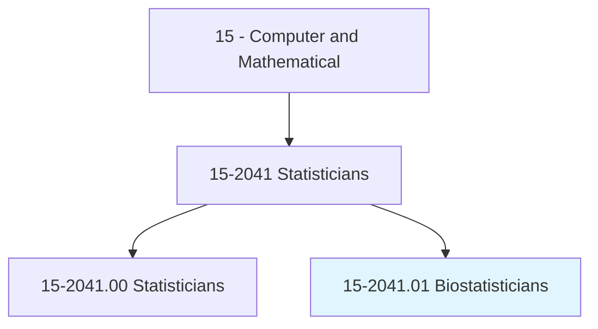
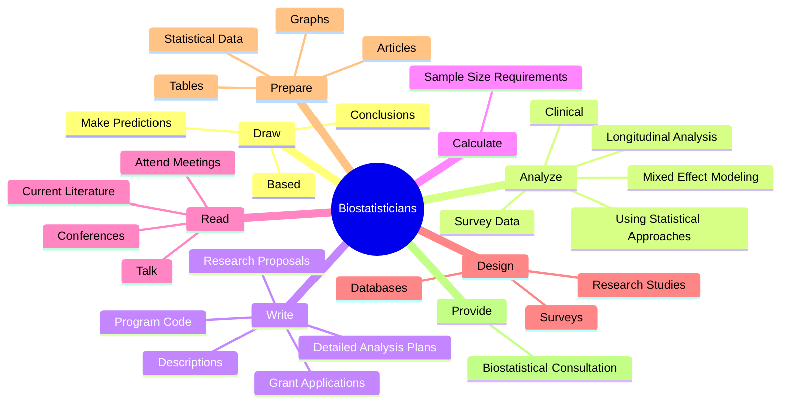
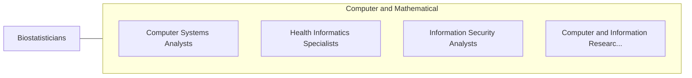

# Biostatisticians

> Develop and apply biostatistical theory and methods to the study of life sciences.

## Overview

Biostatisticians is classified under Computer and Mathematical (SOC 15). Develop and apply biostatistical theory and methods to the study of life sciences.

## Classification Hierarchy

## Key Statistics

| Metric | Value |
|--------|-------|
| SOC Code | 15-2041.01 |
| Category | [Computer and Mathematical](/occupations/Technology) |
| Task Count | 94 |
| Source | O*NET |

## Core Tasks

### draw.Conclusions

Biostatisticians draw conclusions as part of their core responsibilities.

**Actions:**
- `draw.Conclusions.on.DataSummariesAnalyses`
- `draw.Conclusions.on.StatisticalAnalyses`
- `draw.MakePredictions.on.DataSummariesAnalyses`
- `draw.MakePredictions.on.StatisticalAnalyses`

### analyze.Clinical

Biostatisticians analyze clinical as part of their core responsibilities.

**Actions:**
- `analyze.Clinical`
- `analyze.SurveyData`
- `analyze.UsingStatisticalApproaches`
- `analyze.LongitudinalAnalysis`

### write.DetailedAnalysisPlans

Biostatisticians write detailed analysis plans as part of their core responsibilities.

**Actions:**
- `write.DetailedAnalysisPlans.of.Analyses.for.ResearchProtocolsReports`
- `write.DetailedAnalysisPlans.of.Findings.for.ResearchProtocolsReports`
- `write.Descriptions.of.Analyses.for.ResearchProtocolsReports`
- `write.Descriptions.of.Findings.for.ResearchProtocolsReports`

## Skills & Competencies

### Technical Skills
- **Programming** - Advanced
- **Systems Analysis** - Advanced
- **Database Management** - Advanced

### Soft Skills
- **Communication** - Essential
- **Problem Solving** - Essential
- **Critical Thinking** - Important
- **Teamwork** - Important
- **Adaptability** - Important

## Related Occupations

## Industries

This occupation is found across multiple industries. See [Industries](/industries) for sector-specific employment data.

## Career Progression

---

*Source: O*NET 15-2041.01 - ONETOccupation*
