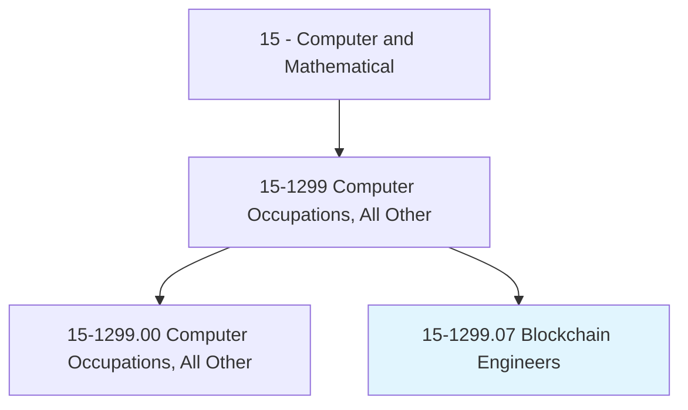
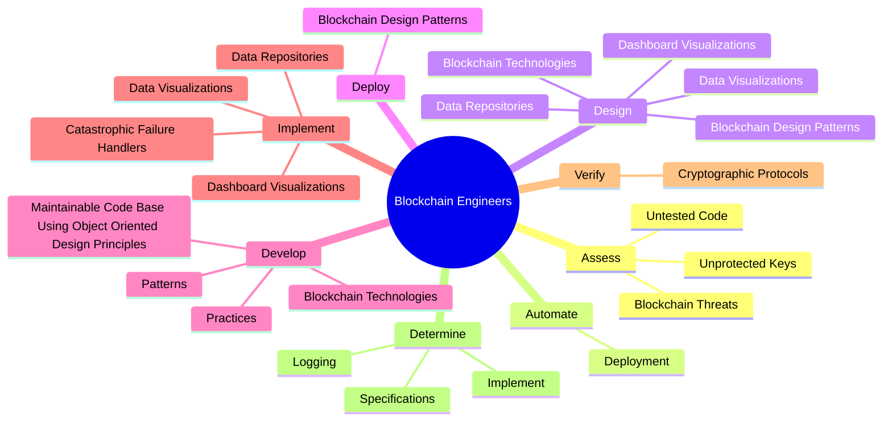
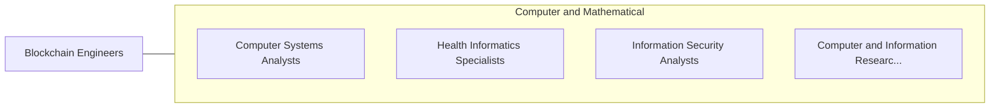

# Blockchain Engineers

> Maintain and support distributed and decentralized blockchain-based networks or block-chain applications such as cryptocurrency exchange, payment processing, document sharing, and digital voting. Design and deploy secure block-chain design patterns and solutions over geographically distributed networks using advanced technologies. May assist with infrastructure setup and testing for application transparency and security.

## Overview

Blockchain Engineers is a specialized variant within the Computer and Mathematical category. Maintain and support distributed and decentralized blockchain-based networks or block-chain applications such as cryptocurrency exchange, payment processing, document sharing, and digital voting. Design and deploy secure block-chain design patterns and solutions over geographically distributed networks using advanced technologies.

## Classification Hierarchy

## Key Statistics

| Metric | Value |
|--------|-------|
| SOC Code | 15-1299.07 |
| Category | [Computer and Mathematical](/occupations/Technology/index) |
| Task Count | 54 |
| Source | O*NET |

## Core Tasks

### assess.BlockchainThreats

Blockchain Engineers assess blockchain threats as part of their core responsibilities.

**Actions:**
- `assess.BlockchainThreats`
- `assess.UntestedCode`
- `assess.UnprotectedKeys`

### automate.Deployment

Blockchain Engineers automate deployment as part of their core responsibilities.

**Actions:**
- `automate.Deployment.of.SoftwareUpdatesOverGeographicallyDistributedNetworkNodes`

### design.BlockchainDesignPatterns

Blockchain Engineers design blockchain design patterns as part of their core responsibilities.

**Actions:**
- `design.BlockchainDesignPatterns.to.make.TransactionsSecure`
- `design.BlockchainDesignPatterns.to.Transparent`
- `design.BlockchainDesignPatterns.to.Immutable`
- `design.BlockchainTechnologies.for.Industries`

## Skills & Competencies

### Technical Skills
- **Programming** - Advanced
- **Systems Analysis** - Advanced
- **Database Management** - Advanced

### Soft Skills
- **Communication** - Essential
- **Problem Solving** - Essential
- **Critical Thinking** - Important
- **Teamwork** - Important
- **Adaptability** - Important

## Related Occupations

## Industries

This occupation is found across multiple industries. See [Industries](/industries) for sector-specific employment data.

## Career Progression

---

*Source: O*NET 15-1299.07 - ONETOccupation*
