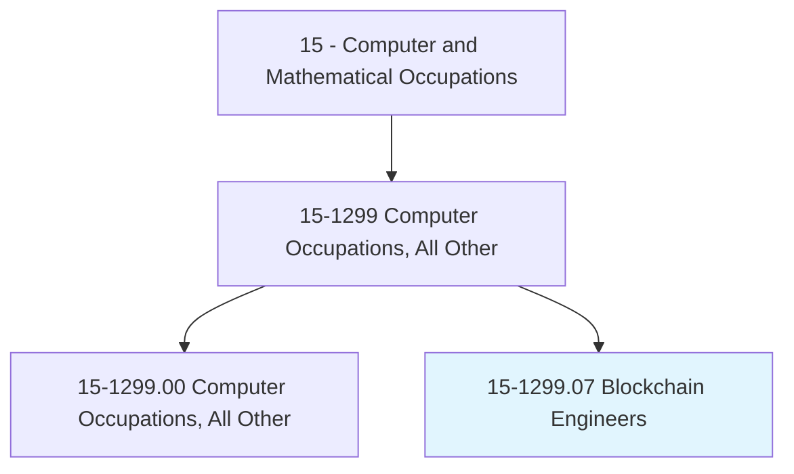
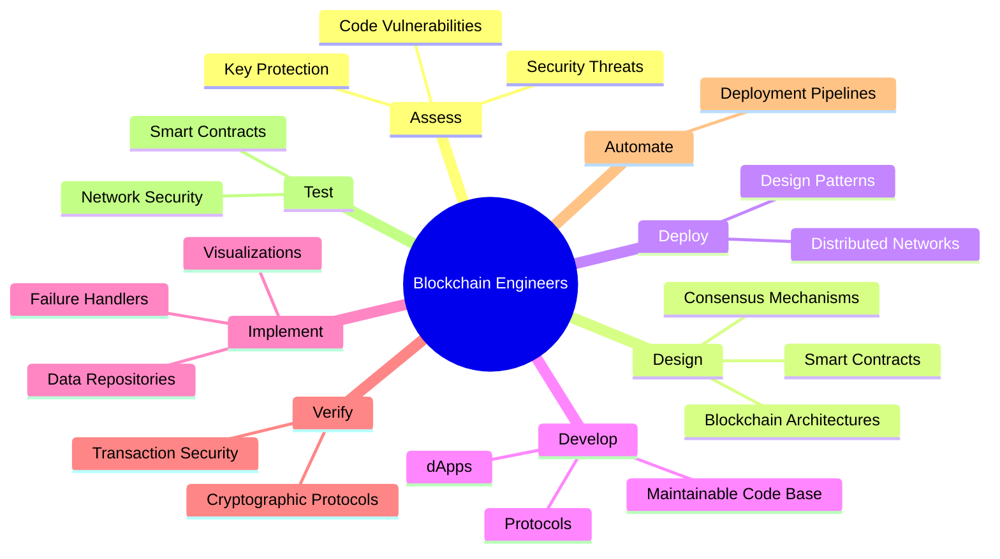
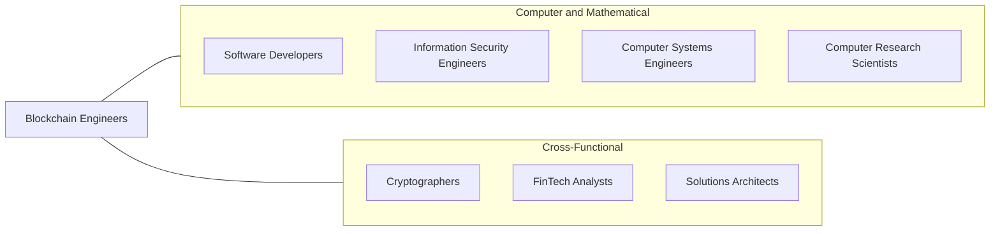
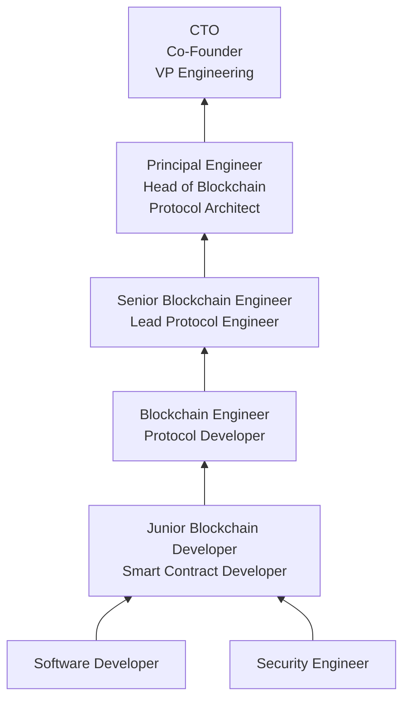

# Blockchain Engineers

> Maintain and support distributed and decentralized blockchain-based networks or block-chain applications such as cryptocurrency exchange, payment processing, document sharing, and digital voting. Design and deploy secure block-chain design patterns and solutions over geographically distributed networks using advanced technologies. May assist with infrastructure setup and testing for application transparency and security.

## Overview

Blockchain Engineers design, develop, and maintain distributed ledger systems and decentralized applications (dApps) that enable secure, transparent, and tamper-proof transactions without intermediaries. They work with cryptographic protocols, consensus mechanisms, and smart contract languages to build solutions for cryptocurrency exchanges, supply chain tracking, digital identity, decentralized finance (DeFi), and numerous other applications.

The role requires a deep understanding of distributed systems, cryptography, network security, and software engineering. Blockchain engineers must navigate the technical complexities of consensus algorithms (Proof of Work, Proof of Stake, Byzantine Fault Tolerance), manage the trade-offs between decentralization, security, and scalability, and write highly secure code where vulnerabilities can result in direct financial losses.

As blockchain technology matures beyond cryptocurrency into enterprise applications, tokenization of real-world assets, and Web3 infrastructure, blockchain engineers are increasingly sought by financial institutions, supply chain companies, healthcare organizations, and government agencies looking to leverage distributed ledger technology for improved transparency, efficiency, and trust.

## Classification Hierarchy

## Key Statistics

| Metric | Value |
|--------|-------|
| SOC Code | 15-1299.07 |
| Job Zone | 4 (Considerable Preparation) |
| Category | [Computer and Mathematical](/occupations/Technology/index) |
| Task Count | 54 |
| Median Salary | $124,000 |
| Growth Rate | Much Faster Than Average |
| Source | O*NET |

## Core Tasks

### assess.SecurityThreats

Blockchain Engineers evaluate and mitigate security risks across distributed systems.

**Actions:**
- `assess.BlockchainThreats.to.identify.Vulnerabilities`
- `assess.SmartContractCode.for.SecurityFlaws`
- `assess.UnprotectedKeys.to.prevent.UnauthorizedAccess`
- `audit.CryptographicProtocols.to.verify.Integrity`

### design.BlockchainArchitectures

Blockchain Engineers architect secure, scalable distributed systems.

**Actions:**
- `design.BlockchainDesignPatterns.to.make.TransactionsSecure`
- `design.ConsensusMechanisms.for.NetworkReliability`
- `design.SmartContracts.for.AutomatedExecution`
- `design.TokenEconomics.for.IncentiveAlignment`

### develop.DecentralizedApplications

Blockchain Engineers build decentralized applications and protocols.

**Actions:**
- `develop.DecentralizedApplications.using.SmartContracts`
- `develop.MaintainableCodeBase.using.ObjectOrientedDesignPrinciples`
- `develop.CryptographicProtocols.for.SecureTransactions`
- `automate.Deployment.of.SoftwareUpdatesOverDistributedNetworks`

### implement.Infrastructure

Blockchain Engineers build and maintain blockchain infrastructure and tooling.

**Actions:**
- `implement.DashboardVisualizations.for.NetworkMonitoring`
- `implement.DataRepositories.for.TransactionHistory`
- `implement.CatastrophicFailureHandlers.for.SystemResilience`
- `deploy.Nodes.across.GeographicallyDistributedNetworks`

## Tech Stack

### Smart Contract Languages
- **Solidity** - Ethereum smart contracts
- **Rust** - Solana, Polkadot, Near
- **Move** - Aptos, Sui
- **Vyper** - Ethereum (Python-like)
- **Cairo** - StarkNet
- **Cadence** - Flow blockchain

### Blockchain Platforms
- **Ethereum** - Smart contract platform
- **Solana** - High-performance blockchain
- **Polygon** - Layer 2 scaling
- **Avalanche** - Multi-chain platform
- **Hyperledger Fabric** - Enterprise blockchain
- **Cosmos** - Interchain protocol

### Development Tools
- **Hardhat** - Ethereum development environment
- **Foundry** - Smart contract toolkit
- **Truffle** - Development framework
- **Remix** - Solidity IDE
- **OpenZeppelin** - Security library
- **Ethers.js/Web3.js** - JavaScript libraries

### Infrastructure & DevOps
- **IPFS** - Decentralized storage
- **The Graph** - Blockchain indexing
- **Alchemy/Infura** - Node providers
- **Docker** - Containerization
- **AWS/GCP** - Cloud infrastructure
- **Chainlink** - Oracle network

### Security & Testing
- **Slither** - Static analysis
- **Mythril** - Security analysis
- **Echidna** - Fuzzing
- **Tenderly** - Smart contract debugging
- **CertiK** - Security auditing platform

## Certifications

| Certification | Provider | Level |
|---------------|----------|-------|
| Certified Blockchain Developer | Blockchain Council | Professional |
| Certified Ethereum Developer | ConsenSys | Professional |
| Certified Hyperledger Developer | Linux Foundation | Professional |
| AWS Certified Solutions Architect | Amazon | Associate |
| Certified Blockchain Security Professional | EC-Council | Professional |

## Skills & Competencies

### Technical Skills
- **Smart Contract Development** - Expert
- **Cryptography** - Expert
- **Distributed Systems** - Expert
- **Solidity/Rust Programming** - Expert
- **Consensus Algorithms** - Advanced
- **Security Auditing** - Advanced
- **Web3 Frontend Integration** - Advanced
- **DevOps & CI/CD** - Advanced
- **Database Design** - Advanced
- **API Development** - Advanced

### Soft Skills
- **Security Mindset** - Critical
- **Problem Solving** - Critical
- **Analytical Thinking** - Critical
- **Communication** - Essential
- **Continuous Learning** - Essential (rapidly evolving field)
- **Collaboration** - Important

## Related Occupations

- [Software Developers](/occupations/Technology/SoftwareDevelopers)
- [Information Security Engineers](/occupations/Technology/InformationSecurityEngineers)
- [Computer Systems Engineers/Architects](/occupations/Technology/ComputerSystemsEngineersArchitects)

## Industry Variations

### Financial Services / DeFi
- Decentralized exchange development
- Payment processing systems
- Tokenization of assets
- Regulatory compliance (KYC/AML)

### Supply Chain
- Provenance tracking
- Document verification
- IoT integration with distributed ledgers
- Cross-border trade facilitation

### Healthcare
- Medical records on blockchain
- Drug supply chain verification
- Clinical trial data integrity
- Patient consent management

### Government
- Digital identity systems
- Voting systems
- Land registry
- Public records management

### Enterprise
- Private/permissioned blockchain networks
- Cross-organization data sharing
- Smart contract automation
- Digital asset management

## Career Progression

## Education & Training

| Requirement | Details |
|-------------|---------|
| Typical Education | Bachelor's in Computer Science, Cryptography, or related field |
| Alternative Paths | Self-taught with open-source contributions and portfolio |
| Work Experience | 1-3 years software development + blockchain specialization |
| Key Knowledge Areas | Cryptography, distributed systems, consensus algorithms, game theory |
| Continuing Education | Rapid - new protocols and standards emerge frequently |

## Departments

This occupation typically works in:
- [Engineering](/departments/Engineering)
- [Research & Development](/departments/RnD)
- [Information Security](/departments/Security)
- [Product Development](/departments/Product)

---

*Source: O*NET 15-1299.07 - ONETOccupation*
