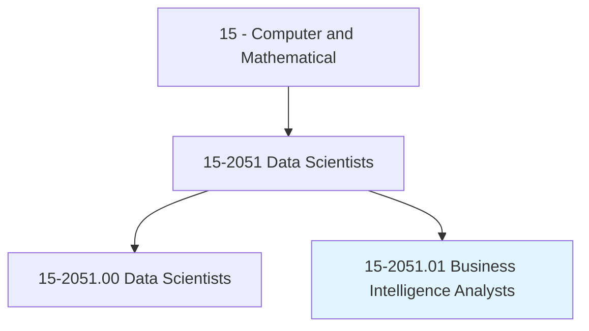
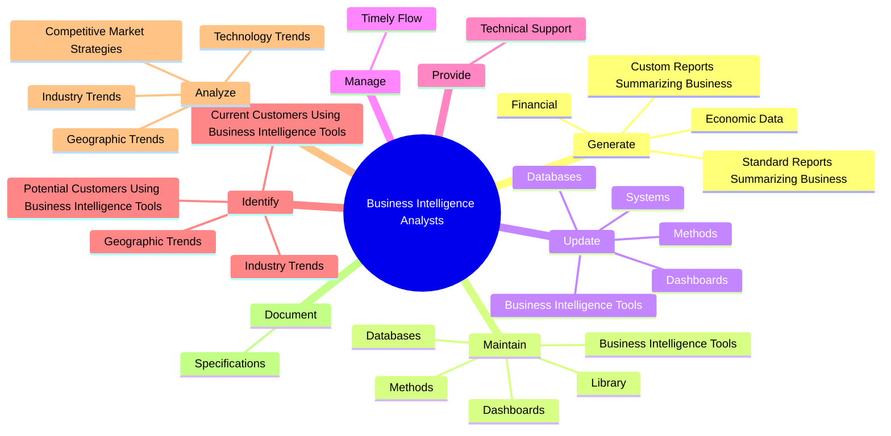
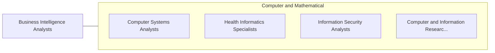

# Business Intelligence Analysts

> Produce financial and market intelligence by querying data repositories and generating periodic reports. Devise methods for identifying data patterns and trends in available information sources.

## Overview

Business Intelligence Analysts is a specialized variant within the Computer and Mathematical category. Produce financial and market intelligence by querying data repositories and generating periodic reports. 

## Classification Hierarchy

## Key Statistics

| Metric | Value |
|--------|-------|
| SOC Code | 15-2051.01 |
| Category | [Computer and Mathematical](/occupations/Technology) |
| Task Count | 76 |
| Source | O*NET |

## Core Tasks

### generate.StandardReportsSummarizingBusiness

Business Intelligence Analysts generate standard reports summarizing business as part of their core responsibilities.

**Actions:**
- `generate.StandardReportsSummarizingBusiness.for.Review.by.Executives`
- `generate.StandardReportsSummarizingBusiness.for.Managers`
- `generate.StandardReportsSummarizingBusiness.for.Clients`
- `generate.StandardReportsSummarizingBusiness.for.OtherStakeholders`

### maintain.BusinessIntelligenceTools

Business Intelligence Analysts maintain business intelligence tools as part of their core responsibilities.

**Actions:**
- `maintain.BusinessIntelligenceTools`
- `maintain.Databases`
- `maintain.Dashboards`
- `maintain.Methods`

### update.BusinessIntelligenceTools

Business Intelligence Analysts update business intelligence tools as part of their core responsibilities.

**Actions:**
- `update.BusinessIntelligenceTools`
- `update.Databases`
- `update.Dashboards`
- `update.Systems`

## Skills & Competencies

### Technical Skills
- **Programming** - Advanced
- **Systems Analysis** - Advanced
- **Database Management** - Advanced

### Soft Skills
- **Communication** - Essential
- **Problem Solving** - Essential
- **Critical Thinking** - Important
- **Teamwork** - Important
- **Adaptability** - Important

## Related Occupations

## Industries

This occupation is found across multiple industries. See [Industries](/industries) for sector-specific employment data.

## Career Progression

---

*Source: O*NET 15-2051.01 - ONETOccupation*
