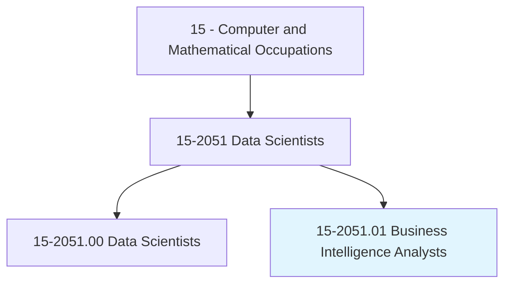
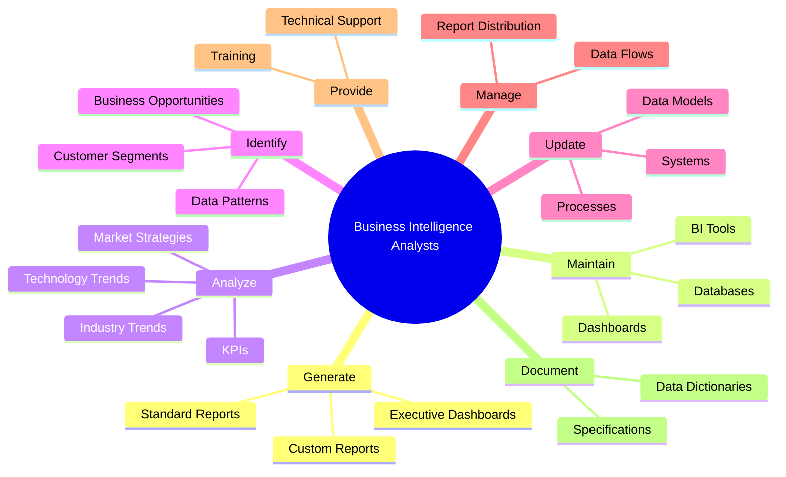
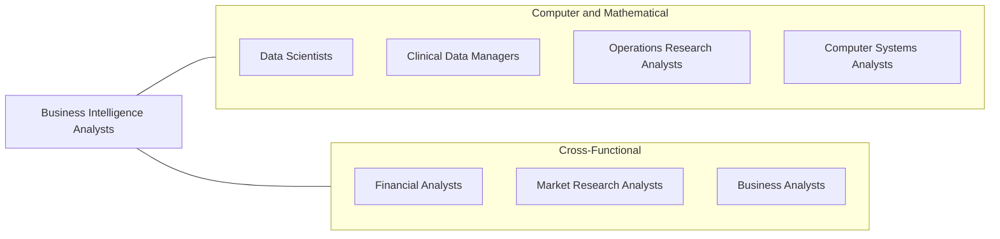
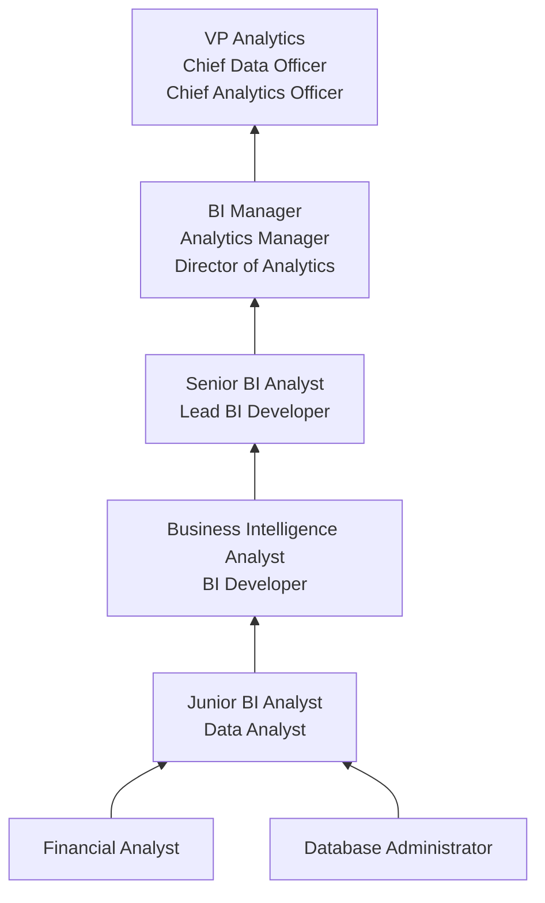

# Business Intelligence Analysts

> Produce financial and market intelligence by querying data repositories and generating periodic reports. Devise methods for identifying data patterns and trends in available information sources.

## Overview

Business Intelligence Analysts transform raw organizational data into actionable insights that drive strategic decision-making. They design and maintain reporting systems, build interactive dashboards, and analyze business performance metrics to help executives, managers, and other stakeholders understand trends, identify opportunities, and address challenges. Their work bridges the gap between data and business strategy.

BI Analysts work with large volumes of structured data from enterprise systems such as CRM, ERP, and financial platforms. They write complex SQL queries, build ETL processes, and create visualizations that make data accessible and meaningful to non-technical audiences. Unlike data scientists who focus on predictive modeling, BI analysts emphasize descriptive and diagnostic analytics -- understanding what happened, why it happened, and presenting it clearly.

The role has evolved with the rise of self-service BI tools, cloud data warehouses, and the growing expectation that every business function should be data-driven. Modern BI analysts are expected to be both technically proficient (SQL, Python, data modeling) and business-savvy, serving as trusted advisors who can translate data into clear narratives and recommendations.

## Classification Hierarchy

## Key Statistics

| Metric | Value |
|--------|-------|
| SOC Code | 15-2051.01 |
| Job Zone | 4 (Considerable Preparation) |
| Category | [Computer and Mathematical](/occupations/Technology/index) |
| Task Count | 76 |
| Median Salary | $95,000 |
| Employment | ~100,000 |
| Growth Rate | Faster Than Average |
| Source | O*NET |

## Core Tasks

### generate.Reports

Business Intelligence Analysts produce regular and ad-hoc reports for stakeholders at all levels.

**Actions:**
- `generate.StandardReports.for.ExecutiveReview`
- `generate.CustomReports.for.DepartmentManagers`
- `generate.FinancialReports.for.Stakeholders`
- `build.InteractiveDashboards.for.SelfServiceAnalytics`

### analyze.BusinessTrends

Business Intelligence Analysts analyze data to identify patterns, trends, and opportunities.

**Actions:**
- `analyze.IndustryTrends.to.inform.Strategy`
- `analyze.CompetitiveMarketStrategies.to.identify.Opportunities`
- `analyze.CustomerData.to.segment.Markets`
- `analyze.OperationalMetrics.to.improve.Efficiency`

### maintain.BIInfrastructure

Business Intelligence Analysts maintain and optimize BI tools and data systems.

**Actions:**
- `maintain.BusinessIntelligenceTools.for.ReliableReporting`
- `maintain.DataWarehouse.for.AnalyticsPerformance`
- `maintain.Dashboards.to.reflect.CurrentMetrics`
- `update.DataModels.to.accommodate.NewRequirements`

## Tech Stack

### BI & Visualization Tools
- **Tableau** - Enterprise visualization
- **Power BI** - Microsoft BI platform
- **Looker** - Google BI platform
- **Qlik Sense** - Associative analytics
- **Sisense** - Embedded analytics
- **Metabase** - Open-source BI

### Data Querying & Programming
- **SQL** - Core data querying (Expert level required)
- **Python** - Data analysis and automation
- **R** - Statistical analysis
- **DAX** - Power BI expressions
- **VBA/Excel** - Spreadsheet automation

### Data Warehousing & ETL
- **Snowflake** - Cloud data warehouse
- **BigQuery** - Google cloud warehouse
- **Redshift** - AWS data warehouse
- **dbt** - Data transformation
- **Informatica** - Enterprise ETL
- **Fivetran** - Data integration
- **Airflow** - Pipeline orchestration

### Databases
- **PostgreSQL** - Relational database
- **SQL Server** - Microsoft database
- **Oracle** - Enterprise database
- **MySQL** - Open-source database

### Collaboration & Productivity
- **Jira/Confluence** - Project management
- **Slack** - Team communication
- **Google Sheets** - Collaborative analysis
- **Notion** - Documentation

## Certifications

| Certification | Provider | Level |
|---------------|----------|-------|
| Tableau Desktop Certified Professional | Tableau | Professional |
| Microsoft Certified: Power BI Data Analyst | Microsoft | Associate |
| Google Data Analytics Professional | Google | Professional |
| Certified Analytics Professional (CAP) | INFORMS | Professional |
| AWS Certified Data Analytics | Amazon | Specialty |
| Qlik Sense Business Analyst | Qlik | Professional |

## Skills & Competencies

### Technical Skills
- **SQL** - Expert
- **Data Visualization (Tableau/Power BI)** - Expert
- **Data Modeling** - Advanced
- **ETL/Data Pipelines** - Advanced
- **Python/R** - Intermediate to Advanced
- **Data Warehousing** - Advanced
- **Excel/Spreadsheets** - Expert
- **Statistical Analysis** - Intermediate

### Soft Skills
- **Business Acumen** - Critical
- **Communication** - Critical (storytelling with data)
- **Stakeholder Management** - Essential
- **Problem Solving** - Essential
- **Attention to Detail** - Critical
- **Curiosity** - Important

## Related Occupations

- [Data Scientists](/occupations/Technology/DataScientists)
- [Clinical Data Managers](/occupations/Technology/ClinicalDataManagers)
- [Operations Research Analysts](/occupations/Technology/OperationsResearchAnalysts)
- [Computer Systems Analysts](/occupations/Technology/ComputerSystemsAnalysts)

## Industry Variations

### Technology / SaaS
- Product usage analytics
- Subscription and churn metrics
- Growth and acquisition funnels
- Real-time operational dashboards

### Financial Services
- Risk and compliance reporting
- Portfolio performance tracking
- Regulatory reporting (Basel, SOX)
- Customer profitability analysis

### Healthcare
- Clinical outcomes reporting
- Hospital operational metrics
- Patient satisfaction analytics
- Revenue cycle analysis

### Retail / E-commerce
- Sales performance analysis
- Inventory optimization
- Customer lifetime value modeling
- Marketing attribution reporting

### Manufacturing
- Production efficiency metrics
- Quality control analytics
- Supply chain visibility
- Equipment utilization tracking

## Career Progression

## Education & Training

| Requirement | Details |
|-------------|---------|
| Typical Education | Bachelor's in Business, Computer Science, Statistics, or related field |
| Alternative Paths | Bootcamps, self-taught with BI tool certifications |
| Work Experience | 0-2 years entry, 3-5 years mid-level, 5+ years senior |
| On-the-Job Training | Moderate - domain-specific metrics and systems |
| Key Knowledge Areas | SQL, data modeling, business processes, statistical analysis |

## Departments

This occupation typically works in:
- Business Intelligence
- [Finance](/departments/Finance)
- [Marketing Analytics](/departments/Marketing)
- [Operations](/departments/Operations)
- [Information Technology](/departments/Technology)

---

*Source: O*NET 15-2051.01 - ONETOccupation*
