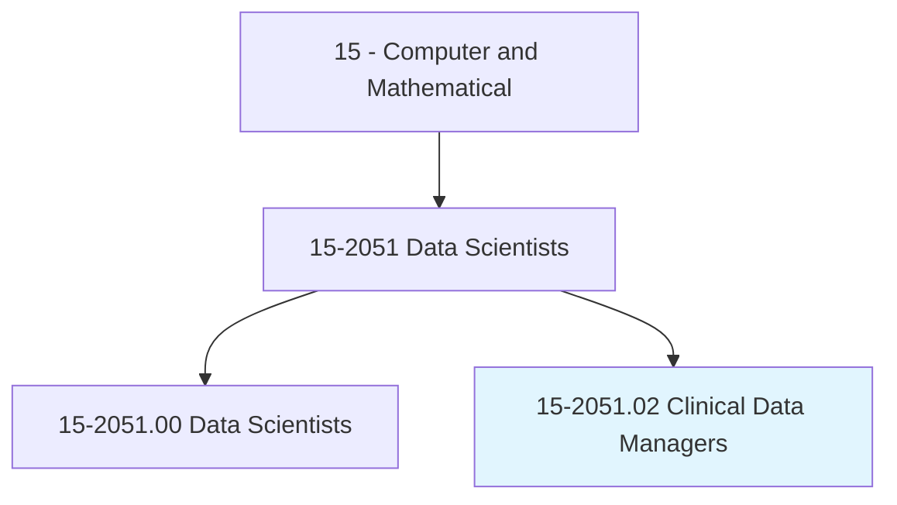
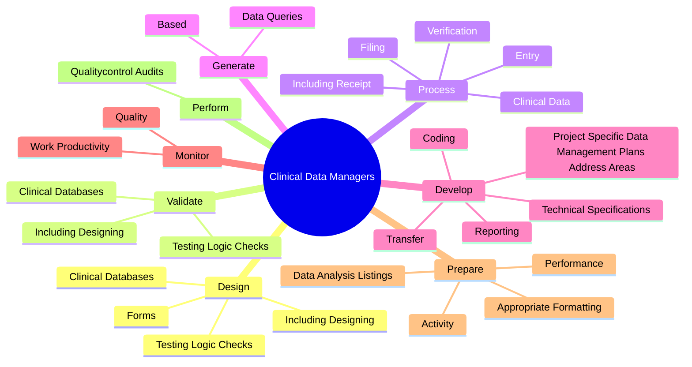
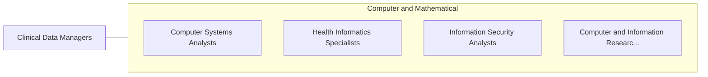

# Clinical Data Managers

> Apply knowledge of health care and database management to analyze clinical data, and to identify and report trends.

## Overview

Clinical Data Managers is classified under Computer and Mathematical (SOC 15). Apply knowledge of health care and database management to analyze clinical data, and to identify and report trends.

## Classification Hierarchy

## Key Statistics

| Metric | Value |
|--------|-------|
| SOC Code | 15-2051.02 |
| Category | [Computer and Mathematical](/occupations/Technology) |
| Task Count | 79 |
| Source | O*NET |

## Core Tasks

### design.ClinicalDatabases

Clinical Data Managers design clinical databases as part of their core responsibilities.

**Actions:**
- `design.ClinicalDatabases`
- `design.IncludingDesigning`
- `design.TestingLogicChecks`
- `design.Forms.for.Receiving`

### validate.ClinicalDatabases

Clinical Data Managers validate clinical databases as part of their core responsibilities.

**Actions:**
- `validate.ClinicalDatabases`
- `validate.IncludingDesigning`
- `validate.TestingLogicChecks`

### process.ClinicalData

Clinical Data Managers process clinical data as part of their core responsibilities.

**Actions:**
- `process.ClinicalData.of.Information`
- `process.IncludingReceipt.of.Information`
- `process.Entry.of.Information`
- `process.Verification.of.Information`

## Skills & Competencies

### Technical Skills
- **Programming** - Advanced
- **Systems Analysis** - Advanced
- **Database Management** - Advanced

### Soft Skills
- **Communication** - Essential
- **Problem Solving** - Essential
- **Critical Thinking** - Important
- **Teamwork** - Important
- **Adaptability** - Important

## Related Occupations

## Industries

This occupation is found across multiple industries. See [Industries](/industries) for sector-specific employment data.

## Career Progression

---

*Source: O*NET 15-2051.02 - ONETOccupation*
