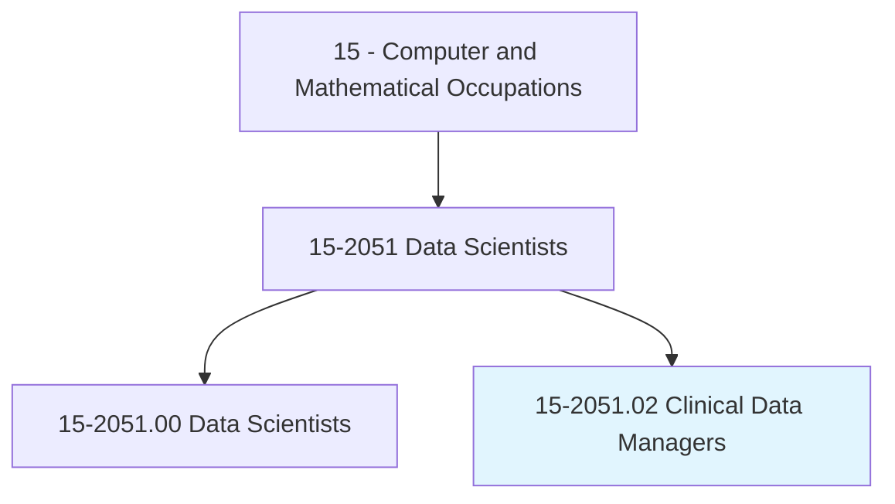
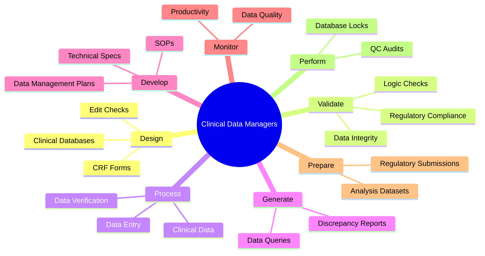
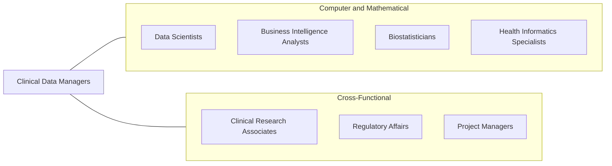
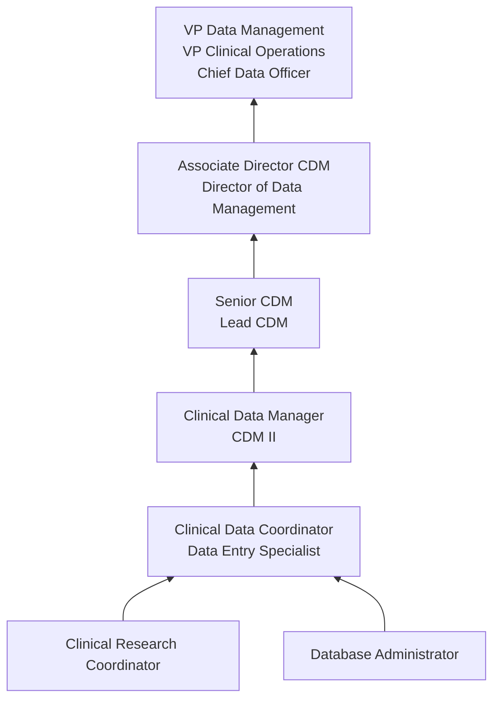

# Clinical Data Managers

> Apply knowledge of health care and database management to analyze clinical data, and to identify and report trends.

## Overview

Clinical Data Managers are responsible for the integrity, quality, and management of clinical trial data throughout the drug development lifecycle. They design clinical databases, develop data collection instruments (case report forms), implement data validation checks, and ensure that clinical data meets the rigorous standards required by regulatory agencies such as the FDA, EMA, and PMDA.

In the pharmaceutical and biotechnology industries, clinical data managers serve as the gatekeepers of data quality. They work closely with clinical research associates, biostatisticians, medical monitors, and regulatory affairs professionals to ensure that clinical trial data is collected accurately, processed efficiently, and stored securely. Any errors or inconsistencies in clinical data can delay drug approvals, increase costs, or jeopardize patient safety.

The field has been transformed by the shift from paper-based data collection to electronic data capture (EDC) systems, and more recently by the adoption of cloud-based platforms, risk-based monitoring, and AI-assisted data management. Modern clinical data managers must be proficient in CDISC data standards (SDTM, ADaM), understand regulatory requirements across global markets, and manage increasingly complex data from diverse sources including wearable devices, electronic health records, and patient-reported outcomes.

## Classification Hierarchy

## Key Statistics

| Metric | Value |
|--------|-------|
| SOC Code | 15-2051.02 |
| Job Zone | 4 (Considerable Preparation) |
| Category | [Computer and Mathematical](/occupations/Technology/index) |
| Task Count | 79 |
| Median Salary | $90,270 |
| Employment | ~15,000 |
| Growth Rate | Faster Than Average |
| Source | O*NET |

## Core Tasks

### design.ClinicalDatabases

Clinical Data Managers design and build databases that capture clinical trial data accurately and efficiently.

**Actions:**
- `design.ClinicalDatabases.for.DataCapture`
- `design.CaseReportForms.for.DataCollection`
- `design.EditChecks.to.ensure.DataConsistency`
- `design.ValidationRules.to.enforce.DataQuality`

### validate.DataIntegrity

Clinical Data Managers ensure clinical data meets quality and regulatory standards.

**Actions:**
- `validate.ClinicalDatabases.for.RegulatoryCompliance`
- `validate.DataIntegrity.using.LogicChecks`
- `validate.SourceDataVerification.against.SourceDocuments`
- `perform.QualityControlAudits.to.identify.DataIssues`

### process.ClinicalData

Clinical Data Managers oversee the end-to-end processing of clinical trial data.

**Actions:**
- `process.ClinicalData.including.Receipt`
- `process.ClinicalData.including.Entry`
- `process.ClinicalData.including.Verification`
- `process.ClinicalData.including.Filing`

### develop.DataManagementPlans

Clinical Data Managers create comprehensive plans for managing trial data.

**Actions:**
- `develop.DataManagementPlans.for.ClinicalTrials`
- `develop.StandardOperatingProcedures.for.DataProcessing`
- `develop.TechnicalSpecifications.for.DatabaseDesign`
- `develop.CodingGuidelines.for.MedicalTerminology`

## Tech Stack

### EDC / Clinical Data Systems
- **Medidata Rave** - Electronic data capture
- **Oracle Clinical / InForm** - Clinical data management
- **Veeva Vault CDMS** - Cloud-based CDMS
- **REDCap** - Research data capture
- **Castor EDC** - Electronic data capture
- **OpenClinica** - Open-source EDC

### Data Standards & Tools
- **CDISC SDTM** - Submission data standard
- **CDISC ADaM** - Analysis data standard
- **MedDRA** - Medical terminology coding
- **WHODrug** - Drug coding dictionary
- **Pinnacle 21** - CDISC compliance validation

### Programming & Analysis
- **SAS** - Data processing and validation
- **SQL** - Database querying
- **Python** - Automation and analysis
- **R** - Statistical analysis
- **Excel** - Data review and tracking

### Project Management
- **Jira** - Issue and query tracking
- **SharePoint** - Document management
- **Microsoft Project** - Project planning
- **Smartsheet** - Collaborative tracking

## Certifications

| Certification | Provider | Level |
|---------------|----------|-------|
| Certified Clinical Data Manager (CCDM) | SCDM | Professional |
| CDISC Standards Training | CDISC | Foundation |
| Clinical Research Associate (CCRA) | ACRP | Professional |
| Certified Clinical Research Professional (CCRP) | SOCRA | Professional |
| SAS Certified Specialist | SAS | Professional |

## Skills & Competencies

### Technical Skills
- **Database Design** - Expert
- **CDISC Standards (SDTM/ADaM)** - Expert
- **EDC Systems** - Expert
- **SQL** - Advanced
- **SAS Programming** - Advanced
- **Data Validation** - Expert
- **Medical Coding (MedDRA/WHODrug)** - Advanced
- **Regulatory Requirements (ICH-GCP)** - Advanced

### Soft Skills
- **Attention to Detail** - Critical
- **Process Orientation** - Critical
- **Communication** - Essential (cross-functional teams)
- **Problem Solving** - Essential
- **Project Management** - Important
- **Quality Mindset** - Critical

## Related Occupations

- [Data Scientists](/occupations/Technology/DataScientists)
- [Business Intelligence Analysts](/occupations/Technology/BusinessIntelligenceAnalysts)
- [Biostatisticians](/occupations/Technology/Biostatisticians)
- [Health Informatics Specialists](/occupations/Technology/HealthInformaticsSpecialists)

## Industry Variations

### Pharmaceutical
- Large-scale Phase II-IV trials
- Complex multi-site global studies
- FDA/EMA submission datasets
- Post-marketing surveillance

### Biotechnology
- Early-phase trial data management
- Biomarker and genomic data integration
- Adaptive trial data handling
- Companion diagnostic data

### Contract Research Organizations (CROs)
- Multi-sponsor trial management
- Standardized processes across clients
- High volume of concurrent studies
- Regulatory expertise across markets

### Medical Devices
- Device trial data management
- Post-market clinical follow-up
- Unique endpoint tracking
- FDA 510(k)/PMA data packages

### Academic Medical Centers
- Investigator-initiated trials
- REDCap and open-source tools
- Grant-funded research data
- Multi-institutional collaborations

## Career Progression

## Education & Training

| Requirement | Details |
|-------------|---------|
| Typical Education | Bachelor's in Life Sciences, Computer Science, Health Informatics, or related field |
| Alternative Paths | Healthcare background with database training |
| Work Experience | 0-2 years entry, 3-5 years mid, 7+ years senior/director |
| Key Knowledge Areas | Clinical trials methodology, ICH-GCP, CDISC standards, database design |
| Continuing Education | CDISC training, SCDM conferences, regulatory updates |

## Departments

This occupation typically works in:
- [Clinical Data Management](/departments/CDM)
- [Clinical Operations](/departments/Clinical)
- [Regulatory Affairs](/departments/Regulatory)
- [Biostatistics](/departments/Biostatistics)
- [Information Technology](/departments/IT)

---

*Source: O*NET 15-2051.02 - ONETOccupation*
