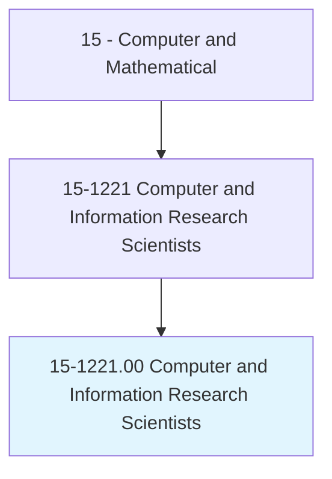
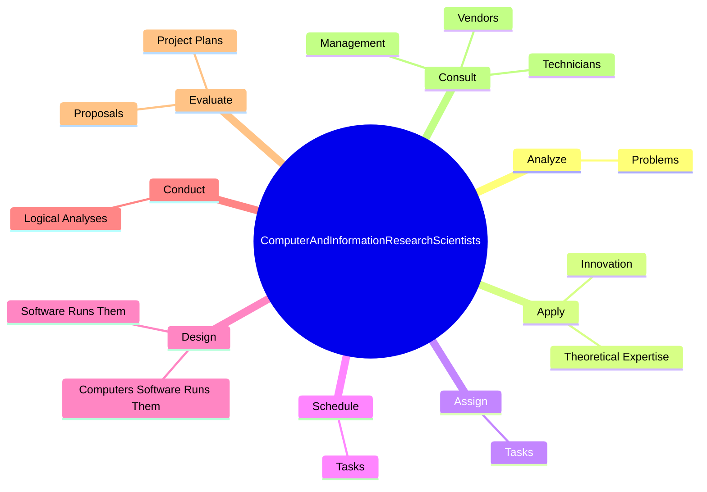

# Computer and Information Research Scientists

> Conduct research into fundamental computer and information science as theorists, designers, or inventors. Develop solutions to problems in the field of computer hardware and software.

## Overview

Computer and Information Research Scientists is an occupation within the Computer and Mathematical category. Conduct research into fundamental computer and information science as theorists, designers, or inventors. 

## Classification Hierarchy

## Key Statistics

| Metric | Value |
|--------|-------|
| SOC Code | 15-1221.00 |
| Category | [Computer and Mathematical](/occupations/Technology) |
| Task Count | 38 |
| Source | O*NET |

## Core Tasks

### analyze.Problems

Computer and Information Research Scientists analyze problems as part of their core responsibilities.

**Actions:**
- `analyze.Problems.to.develop.SolutionsInvolvingComputerHardware`
- `analyze.Problems.to.Software`

### apply.TheoreticalExpertise

Computer and Information Research Scientists apply theoretical expertise as part of their core responsibilities.

**Actions:**
- `apply.TheoreticalExpertise.to.create.NewTechnology`
- `apply.TheoreticalExpertise.to.apply.NewTechnology`
- `apply.TheoreticalExpertise.to.AdaptingPrinciplesForApplyingComputersToNewUses`
- `apply.Innovation.to.create.NewTechnology`

### assign.Tasks

Computer and Information Research Scientists assign tasks as part of their core responsibilities.

**Actions:**
- `assign.Tasks.to.meet.WorkPriorities`
- `assign.Tasks.to.Goals`

## Skills & Competencies

### Technical Skills
- **Programming** - Advanced
- **Systems Analysis** - Advanced
- **Database Management** - Advanced

### Soft Skills
- **Communication** - Essential
- **Problem Solving** - Essential
- **Critical Thinking** - Important
- **Teamwork** - Important
- **Adaptability** - Important

## Related Occupations

## Industries

This occupation is found across multiple industries. See [Industries](/industries) for sector-specific employment data.

## Career Progression

---

*Source: O*NET 15-1221.00 - ONETOccupation*
