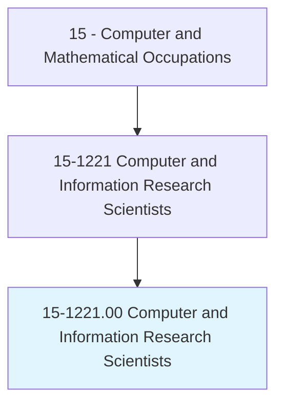
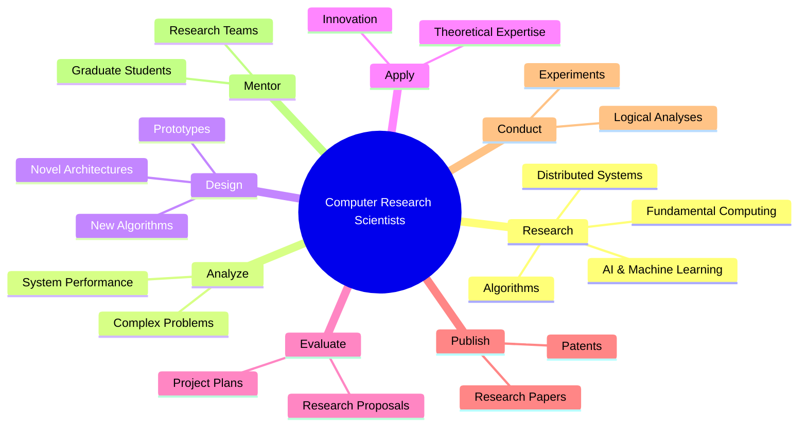
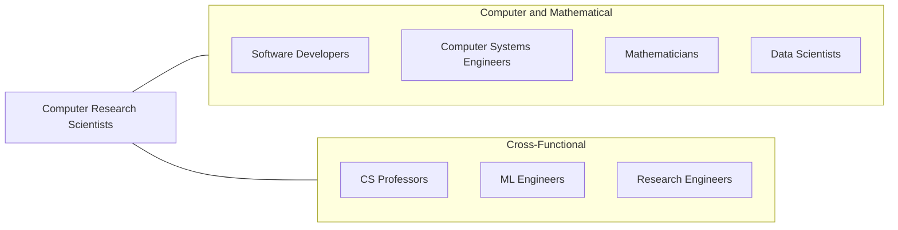
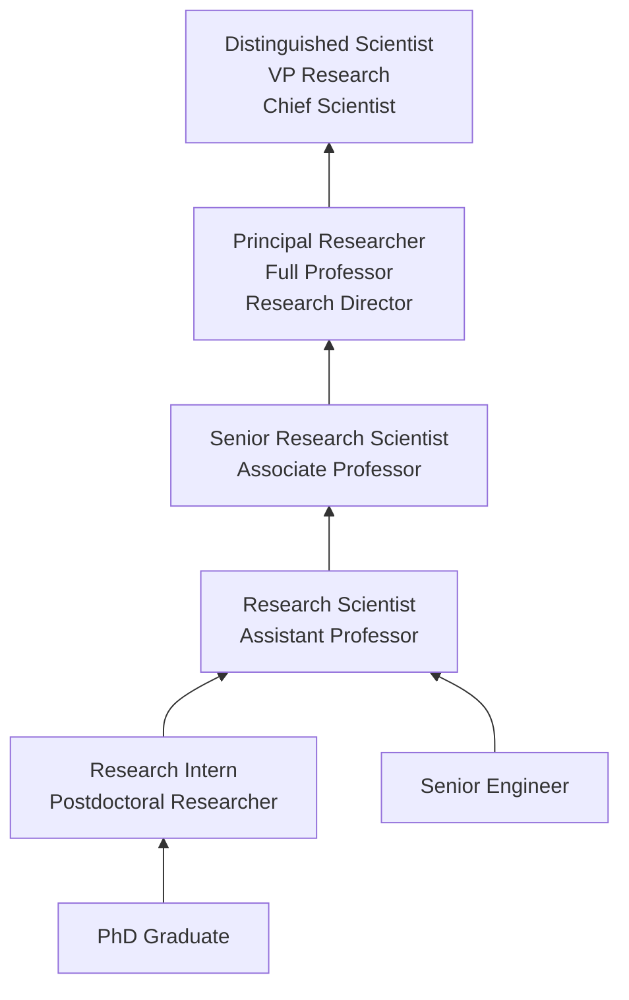

# Computer and Information Research Scientists

> Conduct research into fundamental computer and information science as theorists, designers, or inventors. Develop solutions to problems in the field of computer hardware and software.

## Overview

Computer and Information Research Scientists work at the frontiers of computing, conducting fundamental and applied research to advance the state of the art in areas such as artificial intelligence, machine learning, algorithms, distributed systems, programming languages, computer architecture, and human-computer interaction. They invent new approaches to computing problems that may not have solutions with current technology.

Unlike software developers who build applications using existing technologies, research scientists push the boundaries of what computers can do. They formulate hypotheses, design experiments, develop prototypes, publish peer-reviewed papers, and contribute to the theoretical foundations upon which future technologies are built. Many breakthroughs in AI, cryptography, databases, and networking have originated from the work of computer research scientists in academic, government, and industrial research labs.

The role has gained tremendous importance with the explosion of artificial intelligence and machine learning. Research scientists at major technology companies and academic institutions are at the forefront of developing large language models, computer vision systems, robotics, quantum computing algorithms, and other transformative technologies. The position typically requires a PhD and a track record of published research.

## Classification Hierarchy

## Key Statistics

| Metric | Value |
|--------|-------|
| SOC Code | 15-1221.00 |
| Job Zone | 5 (Extensive Preparation) |
| Category | [Computer and Mathematical](/occupations/Technology/index) |
| Task Count | 38 |
| Median Salary | $145,080 |
| Employment | ~36,500 |
| Growth Rate | Much Faster Than Average (23%) |
| Source | O*NET |

## Core Tasks

### research.FundamentalComputing

Computer Research Scientists investigate core computing problems and advance theoretical foundations.

**Actions:**
- `analyze.Problems.to.develop.SolutionsInvolvingComputerHardware`
- `analyze.Problems.to.develop.SoftwareSolutions`
- `research.FundamentalAlgorithms.to.improve.ComputationalEfficiency`
- `research.AIAndMachineLearning.to.advance.StateOfTheArt`

### apply.TheoreticalExpertise

Computer Research Scientists apply theory and innovation to create new technology.

**Actions:**
- `apply.TheoreticalExpertise.to.create.NewTechnology`
- `apply.Innovation.to.develop.NovelApproaches`
- `adapt.ComputingPrinciples.for.NewApplications`
- `design.Prototypes.to.validate.ResearchHypotheses`

### publish.ResearchFindings

Computer Research Scientists disseminate findings through publications and presentations.

**Actions:**
- `publish.ResearchPapers.in.PeerReviewedJournals`
- `present.Findings.at.AcademicConferences`
- `file.Patents.for.NovelInventions`
- `write.GrantProposals.to.fund.Research`

### evaluate.ProjectPlans

Computer Research Scientists evaluate research directions and mentor teams.

**Actions:**
- `evaluate.ProjectPlans.for.TechnicalFeasibility`
- `evaluate.ResearchProposals.for.ScientificMerit`
- `assign.Tasks.to.meet.WorkPriorities`
- `mentor.GraduateStudents.in.ResearchMethodology`

## Tech Stack

### Programming Languages
- **Python** - ML/AI research and prototyping
- **C/C++** - Systems and performance-critical research
- **Rust** - Systems research
- **Julia** - Scientific computing
- **Haskell/OCaml** - Programming language research
- **CUDA** - GPU computing
- **LaTeX** - Academic writing

### AI/ML Frameworks
- **PyTorch** - Deep learning research (most common)
- **TensorFlow** - Production ML
- **JAX** - Differentiable computing
- **Hugging Face** - NLP and transformer models
- **DeepSpeed** - Distributed training
- **ONNX** - Model interoperability

### Research Infrastructure
- **HPC Clusters** - Large-scale computation
- **NVIDIA GPUs/TPUs** - Training accelerators
- **AWS/GCP/Azure** - Cloud computing
- **Docker/Kubernetes** - Reproducible environments
- **Git/GitHub** - Version control
- **Jupyter/Colab** - Interactive notebooks

### Research Tools
- **arXiv** - Research paper preprints
- **Weights & Biases** - Experiment tracking
- **Overleaf** - Collaborative LaTeX
- **Zotero/Mendeley** - Reference management
- **MatLab** - Numerical computing

## Certifications

| Certification | Provider | Level |
|---------------|----------|-------|
| PhD in Computer Science | Universities | Doctoral |
| Google Research Scientist | Google | Internal |
| AWS Machine Learning Specialty | Amazon | Professional |
| NVIDIA Deep Learning Institute | NVIDIA | Professional |

## Skills & Competencies

### Technical Skills
- **Algorithm Design** - Expert
- **Machine Learning / AI** - Expert
- **Mathematical Foundations** - Expert
- **Programming (Python/C++)** - Expert
- **Experimental Design** - Expert
- **Statistical Analysis** - Advanced
- **Systems Architecture** - Advanced
- **Academic Writing** - Expert
- **Distributed Computing** - Advanced

### Soft Skills
- **Intellectual Curiosity** - Critical
- **Analytical Thinking** - Critical
- **Written Communication** - Critical (publications)
- **Presentation Skills** - Essential (conferences)
- **Mentorship** - Important
- **Collaboration** - Essential (research teams)

## Related Occupations

- [Software Developers](/occupations/Technology/SoftwareDevelopers)
- [Computer Systems Engineers/Architects](/occupations/Technology/ComputerSystemsEngineersArchitects)
- [Mathematicians](/occupations/Technology/Mathematicians)
- [Data Scientists](/occupations/Technology/DataScientists)

## Industry Variations

### Technology Companies (FAANG+)
- Applied AI/ML research
- Large-scale systems research
- Product-oriented research
- Publication at top venues (NeurIPS, ICML, CVPR)

### Academic / University
- Fundamental theoretical research
- Teaching and mentoring
- Grant-funded research programs
- Peer-reviewed publication focus

### Government / National Labs
- National security computing
- Cryptography and cybersecurity
- High-performance computing
- Quantum computing research

### Healthcare / Biotech
- Computational biology
- Medical imaging AI
- Drug discovery algorithms
- Electronic health record analysis

### Robotics / Autonomous Systems
- Computer vision research
- Reinforcement learning
- Motion planning algorithms
- Sensor fusion and perception

## Career Progression

## Education & Training

| Requirement | Details |
|-------------|---------|
| Typical Education | PhD in Computer Science, AI/ML, or related field |
| Alternative Paths | Master's with extensive publication record (rare) |
| Work Experience | Postdoc common; industry entry with strong PhD research |
| Key Knowledge Areas | Algorithms, computational theory, ML, statistics, domain specialization |
| Continuing Education | Conference attendance, paper review, ongoing research |

## Departments

This occupation typically works in:
- Research & Development
- AI/ML Research Labs
- [Engineering (Research Track)](/departments/Technology)
- Academic Departments

---

*Source: O*NET 15-1221.00 - ONETOccupation*
