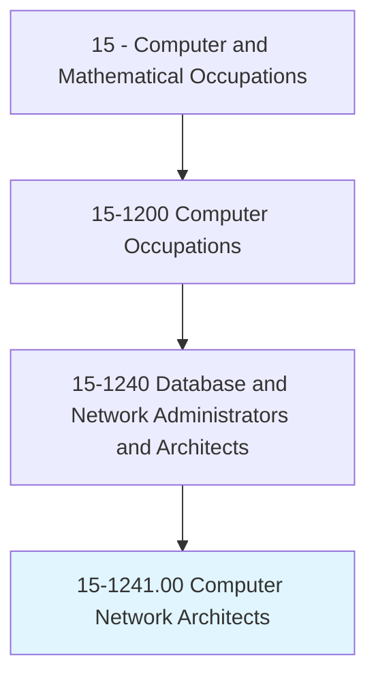
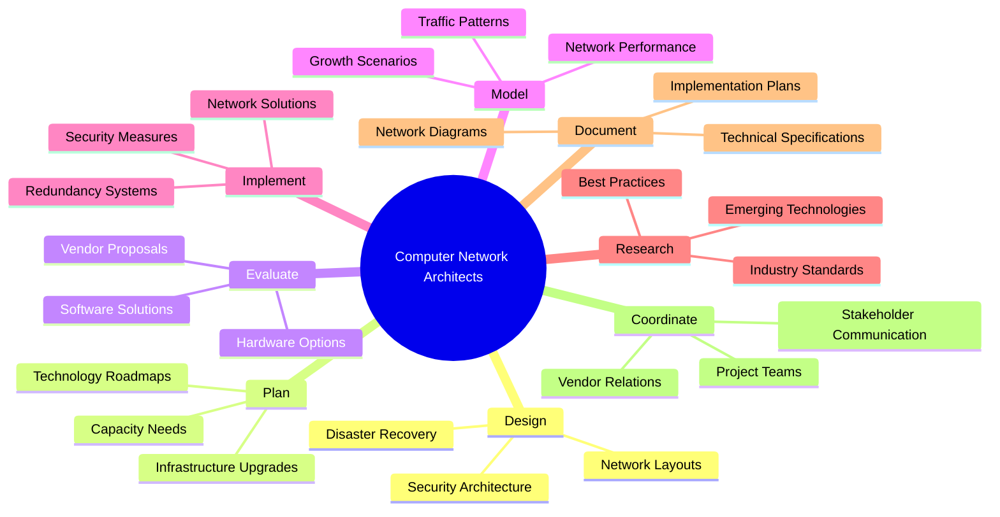
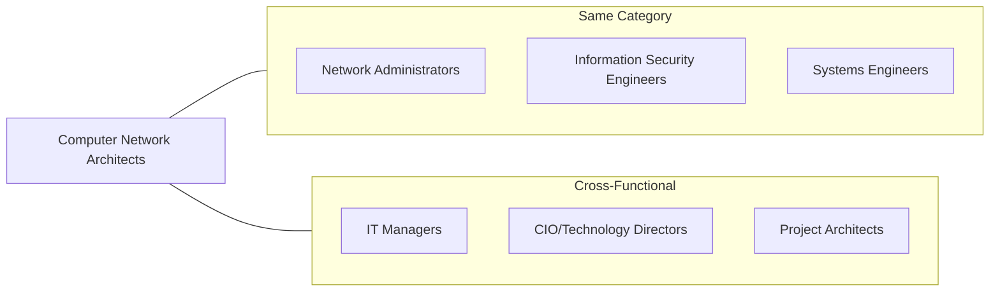
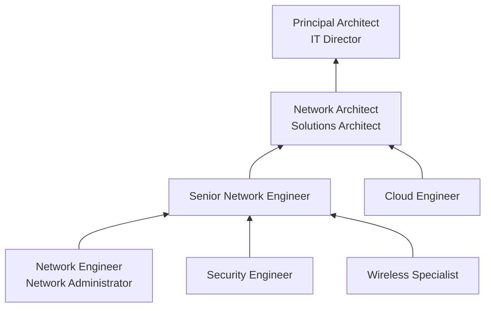

# Computer Network Architects

> Design and implement computer and information networks, such as local area networks (LAN), wide area networks (WAN), intranets, extranets, and other data communications networks. Perform network modeling, analysis, and planning, including analysis of capacity needs for network infrastructures. May also design network and computer security measures. May research and recommend network and data communications hardware and software.

## Overview

Computer Network Architects are the strategic designers of organizational network infrastructure, responsible for creating the blueprints that enable reliable, secure, and scalable data communications. They analyze current and future networking needs, design solutions that align with business objectives, and stay current with emerging technologies to recommend optimal network configurations. This role bridges technical expertise with business strategy, often working closely with executives to plan major infrastructure investments.

## Classification Hierarchy

## Key Statistics

| Metric | Value |
|--------|-------|
| SOC Code | 15-1241.00 |
| Job Zone | 4 (Considerable Preparation) |
| Category | [Computer and Mathematical](/occupations/Technology) |
| Core Tasks | 12+ |
| Source | O*NET |

## Core Tasks

### design.Networks

Computer Network Architects create comprehensive network infrastructure designs.

**Actions:**
- `design.LocalAreaNetworks.for.Organizations` - Create LAN architectures
- `design.WideAreaNetworks.for.MultipleLocations` - Plan WAN connectivity
- `design.Intranets.for.InternalCommunications` - Build internal networks
- `design.Extranets.for.PartnerConnectivity` - Enable external collaboration

### plan.NetworkInfrastructure

Computer Network Architects develop strategic infrastructure plans.

**Actions:**
- `analyze.CapacityNeeds.for.NetworkInfrastructure` - Assess bandwidth requirements
- `plan.NetworkUpgrades.to.support.BusinessGrowth` - Prepare expansion strategies
- `model.NetworkPerformance.to.optimize.Operations` - Simulate network behavior
- `forecast.TechnologyRequirements.for.FutureDemand` - Project infrastructure needs

### evaluate.Solutions

Computer Network Architects assess technology options and vendors.

**Actions:**
- `evaluate.NetworkHardware.to.meet.Requirements` - Compare equipment options
- `evaluate.NetworkSoftware.to.meet.Requirements` - Assess software solutions
- `research.DataCommunicationsHardware.for.Recommendations` - Study hardware capabilities
- `recommend.NetworkSolutions.to.Management` - Present technology options

### implement.Security

Computer Network Architects design security architectures.

**Actions:**
- `design.NetworkSecurityMeasures.to.protect.Infrastructure` - Create security frameworks
- `implement.FirewallSolutions.for.NetworkProtection` - Deploy perimeter security
- `design.DisasterRecovery.for.BusinessContinuity` - Plan recovery strategies
- `implement.Redundancy.to.ensure.Availability` - Build fault tolerance

## Tech Stack

### Network Design Tools
- **Cisco Packet Tracer** - Network simulation
- **GNS3** - Network emulator
- **SolarWinds Network Topology Mapper** - Discovery and mapping
- **Lucidchart/Visio** - Network diagramming
- **NetBrain** - Network automation platform

### Cloud Network Platforms
- **AWS VPC** - Amazon cloud networking
- **Azure Virtual Network** - Microsoft cloud networking
- **Google Cloud VPC** - Google cloud networking
- **Cisco Meraki** - Cloud-managed networking
- **VMware NSX** - Network virtualization

### Monitoring & Analysis
- **Wireshark** - Protocol analysis
- **PRTG Network Monitor** - Network monitoring
- **Nagios** - Infrastructure monitoring
- **SolarWinds NPM** - Network performance monitor
- **Datadog** - Cloud monitoring

### Security Platforms
- **Palo Alto Networks** - Next-gen firewalls
- **Fortinet FortiGate** - Security appliances
- **Cisco ASA/Firepower** - Firewall solutions
- **Zscaler** - Cloud security
- **CrowdStrike** - Endpoint protection

## Certifications

| Certification | Provider | Level |
|---------------|----------|-------|
| CCNA | Cisco | Associate |
| CCNP Enterprise | Cisco | Professional |
| CCIE | Cisco | Expert |
| AWS Advanced Networking | Amazon | Specialty |
| Azure Network Engineer | Microsoft | Associate |
| JNCIP-ENT | Juniper | Professional |
| CompTIA Network+ | CompTIA | Entry |

## Skills & Competencies

### Technical Skills
- **Network Design** - Expert
- **Routing & Switching** - Expert
- **Cloud Networking** - Advanced
- **Network Security** - Advanced
- **Wireless Technologies** - Advanced
- **SD-WAN** - Advanced
- **Network Automation** - Intermediate

### Soft Skills
- **Strategic Thinking** - Critical
- **Communication** - Critical
- **Project Management** - Essential
- **Vendor Management** - Essential
- **Documentation** - Essential

## Related Occupations

## Industry Variations

### Enterprise IT
- Large-scale data center design
- Global WAN architecture
- Hybrid cloud integration
- High-availability requirements

### Telecommunications
- Carrier-grade network design
- 5G/LTE infrastructure
- Service provider architectures
- Massive scalability focus

### Financial Services
- Ultra-low latency networks
- High-frequency trading infrastructure
- Stringent security requirements
- Disaster recovery mandates

### Healthcare
- Clinical network segmentation
- Medical device networking
- HIPAA-compliant designs
- Telemedicine infrastructure

## Career Progression

## Education & Training

| Requirement | Details |
|-------------|---------|
| Typical Education | Bachelor's degree in Computer Science, Network Engineering, or Information Technology |
| Work Experience | 5-10 years in network engineering or administration |
| On-the-Job Training | Limited - expertise expected; continuous technology updates |
| Common Certifications | CCNP/CCIE, AWS/Azure Networking, JNCIP |

## Departments

This occupation typically works in:
- [Network Engineering](/departments/NetworkEngineering)
- [Enterprise Architecture](/departments/EnterpriseArchitecture)
- [Infrastructure](/departments/Infrastructure)
- [Information Technology](/departments/IT)

---

*Source: O*NET 15-1241.00 - ONETOccupation*
