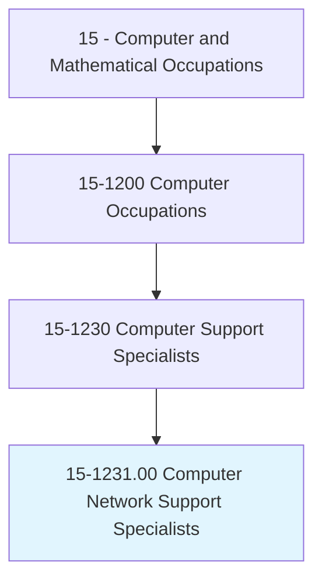
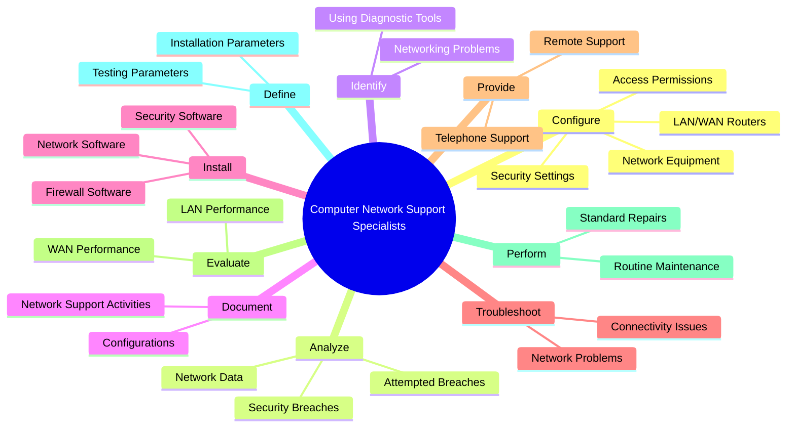
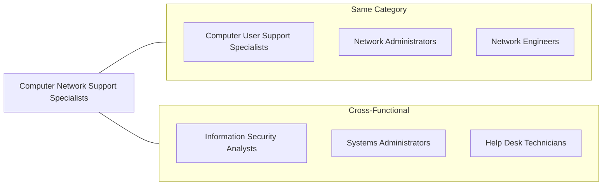
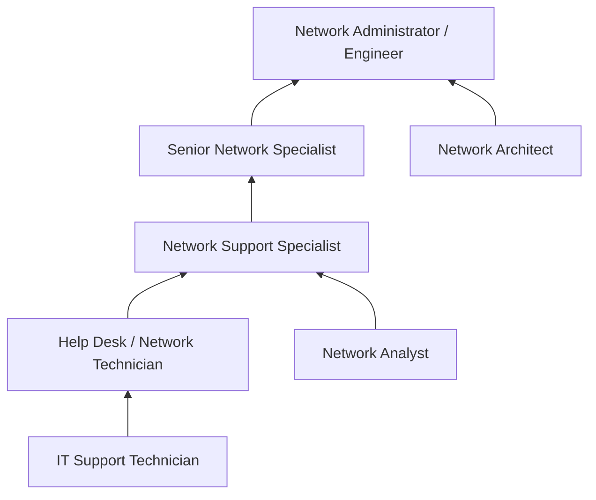

# Computer Network Support Specialists

> Analyze, test, troubleshoot, and evaluate existing network systems, such as local area networks (LAN), wide area networks (WAN), cloud networks, servers, and other data communications networks. Perform network maintenance to ensure networks operate correctly with minimal interruption.

## Overview

Computer Network Support Specialists are essential to maintaining the connectivity that modern organizations depend on. They diagnose and resolve network issues, configure network equipment, and ensure that data flows securely and efficiently across organizational infrastructure. Working with LANs, WANs, cloud networks, and data communications systems, these professionals keep businesses connected and operational. Their role combines hands-on technical troubleshooting with proactive monitoring and maintenance to minimize downtime and optimize network performance.

## Classification Hierarchy

## Key Statistics

| Metric | Value |
|--------|-------|
| SOC Code | 15-1231.00 |
| Job Zone | 3 (Medium Preparation) |
| Category | [Computer and Mathematical](/occupations/Technology/index) |
| Core Tasks | 15+ |
| Source | O*NET |

## Core Tasks

### configure.SecuritySettings

Computer Network Support Specialists establish and maintain network security configurations.

**Actions:**
- `configure.SecuritySettings.for.Groups` - Set group-level access controls
- `configure.SecuritySettings.for.Individuals` - Define user-specific permissions
- `configure.AccessPermissions.for.Groups` - Manage group network access
- `configure.AccessPermissions.for.Individuals` - Control individual user access

### analyze.ComputerNetworkSecurityBreaches

Computer Network Support Specialists investigate and respond to security incidents.

**Actions:**
- `analyze.ComputerNetworkSecurityBreaches.to.identify.RootCause` - Determine breach origins
- `analyze.AttemptedBreaches.to.prevent.FutureIncidents` - Learn from attempted attacks
- `report.ComputerNetworkSecurityBreaches.to.Management` - Communicate security incidents
- `report.AttemptedBreaches.to.SecurityTeam` - Escalate threat intelligence

### identify.Causes

Computer Network Support Specialists diagnose network issues using specialized tools.

**Actions:**
- `identify.Causes.of.NetworkingProblems` - Pinpoint issue sources
- `identify.Causes.using.DiagnosticTestingSoftware` - Leverage diagnostic tools
- `identify.Causes.using.Equipment` - Utilize hardware analyzers
- `diagnose.NetworkIssues.to.restore.Connectivity` - Resolve connectivity problems

### document.NetworkSupportActivities

Computer Network Support Specialists maintain records of network operations.

**Actions:**
- `document.NetworkSupportActivities.for.Compliance` - Meet audit requirements
- `document.ConfigurationChanges.for.KnowledgeBase` - Build institutional knowledge
- `document.Troubleshooting.for.FutureReference` - Create solution repositories

### configure.WideAreaNetworkWan

Computer Network Support Specialists set up and manage network infrastructure.

**Actions:**
- `configure.WideAreaNetworkWan.for.Enterprise` - Deploy WAN connectivity
- `configure.LocalAreaNetworkLan.for.Office` - Set up local networks
- `configure.RelatedEquipment.for.Integration` - Connect network devices
- `configure.Routers.for.OptimalPerformance` - Tune router configurations

### install.NetworkSoftware

Computer Network Support Specialists deploy and maintain network applications.

**Actions:**
- `install.NetworkSoftware.for.Operations` - Deploy network management tools
- `install.SecuritySoftware.for.Protection` - Implement security solutions
- `install.FirewallSoftware.for.Defense` - Set up firewall protection
- `update.NetworkSoftware.to.PatchVulnerabilities` - Maintain software currency

### troubleshoot.NetworkProblems

Computer Network Support Specialists resolve connectivity and performance issues.

**Actions:**
- `troubleshoot.NetworkProblems.for.Users` - Support end-user connectivity
- `troubleshoot.NetworkProblems.for.UserGroups` - Address department-wide issues
- `troubleshoot.ConnectivityProblems.for.RemoteUsers` - Support remote workforce
- `troubleshoot.ConnectivityProblems.for.Applications` - Resolve application connectivity

### provide.TelephoneSupportRelated

Computer Network Support Specialists offer remote assistance to users.

**Actions:**
- `provide.TelephoneSupportRelated.to.NetworkingIssues` - Assist with network problems
- `provide.TelephoneSupportRelated.to.ConnectivityIssues` - Help with connection problems
- `provide.RemoteSupport.for.NetworkTroubleshooting` - Diagnose issues remotely

### evaluate.LocalAreaNetworkLan

Computer Network Support Specialists assess network performance and capacity.

**Actions:**
- `evaluate.LocalAreaNetworkLan.for.Availability` - Ensure LAN uptime
- `evaluate.WideAreaNetworkWan.for.Speed` - Monitor WAN performance
- `evaluate.NetworkPerformance.for.DisasterRecovery` - Test failover capabilities
- `evaluate.NetworkCapacity.for.Planning` - Plan infrastructure growth

### analyze.NetworkData

Computer Network Support Specialists monitor and analyze network metrics.

**Actions:**
- `analyze.NetworkData.to.determine.NetworkUsage` - Track bandwidth utilization
- `analyze.NetworkData.to.determine.DiskSpaceAvailability` - Monitor storage capacity
- `analyze.NetworkData.to.determine.ServerFunction` - Assess server health
- `optimize.NetworkPerformance.based.on.Analytics` - Improve network efficiency

### perform.RoutineMaintenanceRepairs

Computer Network Support Specialists conduct preventive and corrective maintenance.

**Actions:**
- `perform.RoutineMaintenanceRepairs.to.NetworkingComponents` - Service network hardware
- `perform.RoutineMaintenanceRepairs.to.Equipment` - Maintain infrastructure
- `perform.StandardRepairs.to.NetworkingComponents` - Fix hardware issues
- `perform.StandardRepairs.to.Equipment` - Replace faulty components

### configure.Parameters

Computer Network Support Specialists define installation and testing specifications.

**Actions:**
- `configure.Parameters.for.Installation` - Set up deployment configurations
- `configure.Parameters.for.Testing.of.LocalAreaNetworkLan` - Define LAN test criteria
- `configure.Parameters.for.WideAreaNetworkWan` - Specify WAN requirements
- `configure.Parameters.for.Hubs` - Configure hub settings
- `configure.Parameters.for.Routers` - Define router parameters
- `configure.Parameters.for.Switches` - Set switch configurations
- `configure.Parameters.for.Controllers` - Configure controller settings
- `configure.Parameters.for.Multiplexers` - Set multiplexer parameters
- `define.Parameters.for.RelatedNetworkingEquipment` - Document equipment specs

## Skills & Competencies

### Technical Skills
- **Network Administration** - Expert
- **LAN/WAN Technologies** - Advanced
- **Network Security** - Advanced
- **Troubleshooting** - Expert
- **TCP/IP Protocols** - Advanced
- **Firewall Configuration** - Advanced
- **Network Monitoring Tools** - Advanced
- **Cisco/Juniper Equipment** - Advanced

### Soft Skills
- **Problem Solving** - Critical
- **Customer Service** - Critical
- **Communication** - Essential
- **Attention to Detail** - Essential
- **Time Management** - Essential

## Related Occupations

## Industries

- Information Technology - High Employment
- [Finance and Insurance](/industries/Finance) - Moderate Employment
- [Healthcare](/industries/Healthcare/index) - Growing Employment
- [Education](/industries/Education) - Moderate Employment
- [Government](/industries/PublicAdministration) - Moderate Employment
- [Professional Services](/industries/Scientific) - High Employment

## Career Progression

## Education & Training

| Requirement | Details |
|-------------|---------|
| Typical Education | Associate's or Bachelor's degree in IT, Computer Science, or related field |
| Work Experience | 1-3 years in IT support or networking |
| On-the-Job Training | Vendor-specific training and hands-on experience |
| Common Certifications | CompTIA Network+, CCNA, CCNP, CompTIA A+ |

## Departments

This occupation typically works in:
- [Information Technology](/departments/Technology)
- Network Operations
- Help Desk
- Infrastructure

---

*Source: O*NET 15-1231.00 - ONETOccupation*
