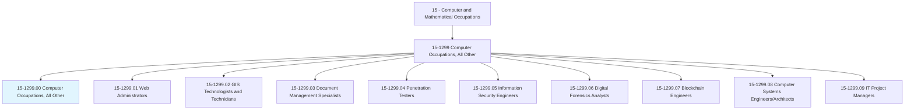
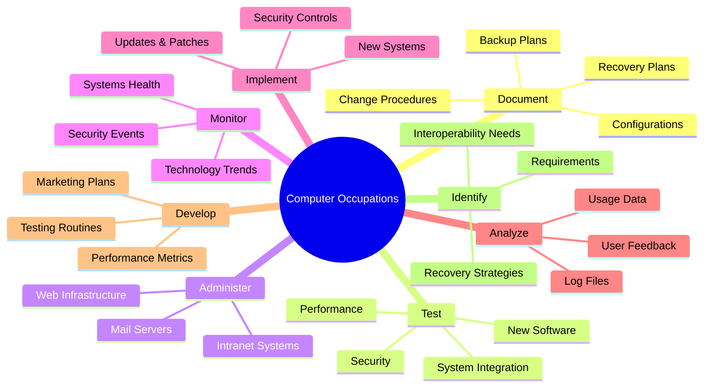
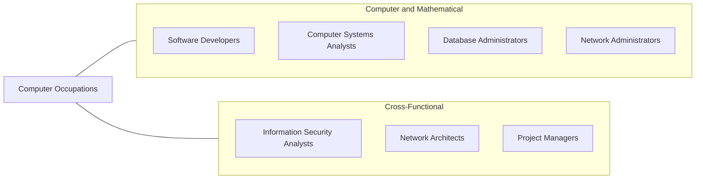
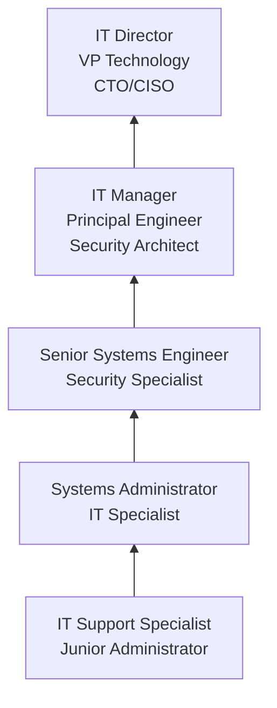

# Computer Occupations, All Other

> All computer occupations not listed separately.

## Overview

Computer Occupations, All Other is a broad classification that encompasses specialized computing roles not individually categorized elsewhere in the SOC system. This category serves as the parent for several distinct and rapidly growing specializations including web administrators, GIS technologists, document management specialists, penetration testers, information security engineers, digital forensics analysts, blockchain engineers, computer systems engineers, and IT project managers.

Professionals in this category share a foundation in computer science, information technology, and systems administration, but diverge into highly specialized domains based on their specific expertise. The category reflects the continually expanding nature of the technology field, where new roles emerge faster than occupational classification systems can accommodate. Many of the variant occupations listed here were added to O*NET in recent years as their importance became clear.

The roles within this classification span a wide spectrum of responsibilities, from managing web infrastructure and enterprise document systems to conducting cybersecurity assessments and building blockchain networks. What unites them is the application of computer science principles to solve organizational and technical challenges that fall outside the scope of traditional software development, database administration, or network administration roles.

## Classification Hierarchy

## Key Statistics

| Metric | Value |
|--------|-------|
| SOC Code | 15-1299.00 |
| Job Zone | 4 (Considerable Preparation) |
| Category | [Computer and Mathematical](/occupations/Technology/index) |
| Task Count | 121 |
| Median Salary | $99,860 |
| Employment | ~415,000 (across all variants) |
| Growth Rate | Faster Than Average |
| Source | O*NET |

## Core Tasks

### document.SystemProcedures

Computer professionals maintain comprehensive documentation of systems, procedures, and changes.

**Actions:**
- `document.BackupPlans.for.DisasterRecovery`
- `document.RecoveryPlans.for.BusinessContinuity`
- `document.ChangeProcedures.for.ConfigurationManagement`
- `document.SystemConfigurations.for.Audit`

### test.SystemIntegrity

Computer professionals test systems on regular schedules and after modifications.

**Actions:**
- `test.SystemIntegration.on.RegularSchedule`
- `test.SystemSecurity.after.MajorModifications`
- `test.Performance.to.ensure.ServiceLevels`
- `test.BackupRecovery.on.RegularSchedule`

### administer.Infrastructure

Computer professionals manage web, network, and server infrastructure.

**Actions:**
- `administer.InternetInfrastructure.for.Availability`
- `administer.IntranetInfrastructure.for.InternalOperations`
- `administer.WebServers.for.ContentDelivery`
- `administer.MailServers.for.Communication`

## Tech Stack

### Systems Administration
- **Linux/Unix** - Server operating systems
- **Windows Server** - Microsoft server environment
- **Apache/Nginx** - Web servers
- **IIS** - Microsoft web server
- **VMware/Hyper-V** - Virtualization
- **Ansible/Puppet/Chef** - Configuration management

### Cloud Platforms
- **AWS** - Amazon cloud
- **Azure** - Microsoft cloud
- **Google Cloud** - GCP
- **Docker/Kubernetes** - Containerization
- **Terraform** - Infrastructure as code

### Monitoring & Security
- **Nagios/Zabbix** - System monitoring
- **Splunk** - Log analysis
- **SIEM Tools** - Security monitoring
- **Nessus** - Vulnerability scanning
- **Wireshark** - Network analysis

### Development & Scripting
- **Python** - Automation scripting
- **Bash/PowerShell** - Shell scripting
- **SQL** - Database management
- **JavaScript** - Web technologies
- **Git** - Version control

## Certifications

| Certification | Provider | Level |
|---------------|----------|-------|
| CompTIA A+ | CompTIA | Foundation |
| CompTIA Network+ | CompTIA | Intermediate |
| CompTIA Security+ | CompTIA | Intermediate |
| AWS Solutions Architect | Amazon | Associate/Professional |
| Microsoft Azure Administrator | Microsoft | Associate |
| Certified Information Systems Security Professional (CISSP) | ISC2 | Professional |

## Skills & Competencies

### Technical Skills
- **Systems Administration** - Advanced
- **Network Management** - Advanced
- **Security Practices** - Advanced
- **Programming/Scripting** - Advanced
- **Database Management** - Advanced
- **Cloud Computing** - Advanced
- **Troubleshooting** - Expert
- **Documentation** - Advanced

### Soft Skills
- **Problem Solving** - Critical
- **Communication** - Essential
- **Attention to Detail** - Critical
- **Adaptability** - Essential
- **Teamwork** - Important
- **Time Management** - Important

## Variant Occupations

| Variant | Code | Description |
|---------|------|-------------|
| [Web Administrators](/occupations/Technology/WebAdministrators) | 15-1299.01 | Web environment management |
| [GIS Technologists](/occupations/Technology/GeographicInformationSystemsTechnologistsAndTechnicians) | 15-1299.02 | Geographic data systems |
| [Document Management Specialists](/occupations/Technology/DocumentManagementSpecialists) | 15-1299.03 | Enterprise document systems |
| [Penetration Testers](/occupations/Technology/PenetrationTesters) | 15-1299.04 | Security testing |
| [Information Security Engineers](/occupations/Technology/InformationSecurityEngineers) | 15-1299.05 | Security systems |
| [Digital Forensics Analysts](/occupations/Technology/DigitalForensicsAnalysts) | 15-1299.06 | Cyber investigation |
| [Blockchain Engineers](/occupations/Technology/BlockchainEngineers) | 15-1299.07 | Distributed ledger systems |
| [Computer Systems Engineers](/occupations/Technology/ComputerSystemsEngineersArchitects) | 15-1299.08 | Systems architecture |
| [IT Project Managers](/occupations/Technology/InformationTechnologyProjectManagers) | 15-1299.09 | Technology project management |

## Related Occupations

## Industry Variations

### Technology
- SaaS platform operations
- DevOps and SRE roles
- Cloud infrastructure management
- Security operations centers

### Financial Services
- Trading systems operations
- Regulatory technology management
- Secure infrastructure operations
- Business continuity planning

### Government & Defense
- Classified systems administration
- Cybersecurity operations
- GIS and intelligence systems
- Federal IT modernization

### Healthcare
- EHR system administration
- HIPAA compliance operations
- Health information exchange
- Medical device IT support

## Career Progression

## Education & Training

| Requirement | Details |
|-------------|---------|
| Typical Education | Bachelor's in Computer Science, Information Technology, or related field |
| Alternative Paths | Associate degree + certifications, self-taught with experience |
| Work Experience | Varies widely by variant (0-5+ years) |
| On-the-Job Training | Continuous - technology changes rapidly |
| Key Certifications | CompTIA, AWS, Azure, CISSP (depending on specialization) |

## Departments

This occupation typically works in:
- [Information Technology](/departments/Technology)
- [Engineering](/departments/Technology)
- [Information Security](/departments/Security)
- [Operations](/departments/Operations)

---

*Source: O*NET 15-1299.00 - ONETOccupation*
