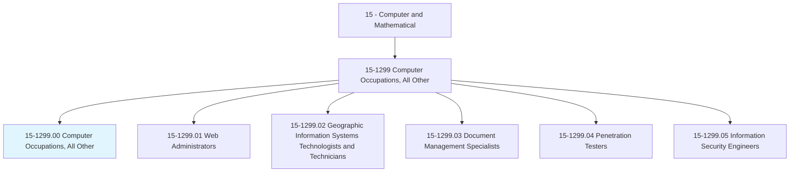
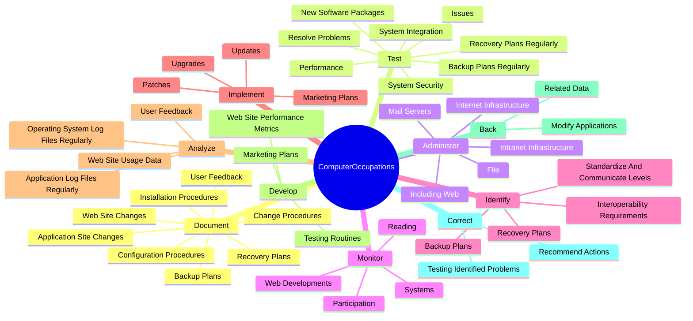
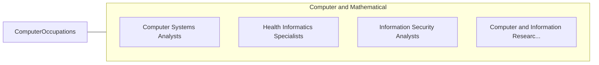

# Computer Occupations, All Other

> All computer occupations not listed separately.

## Overview

Computer Occupations, All Other is classified under Computer and Mathematical (SOC 15). All computer occupations not listed separately.

## Classification Hierarchy

## Key Statistics

| Metric | Value |
|--------|-------|
| SOC Code | 15-1299.00 |
| Category | [Computer and Mathematical](/occupations/Technology) |
| Task Count | 121 |
| Source | O*NET |

## Core Tasks

### document.BackupPlans

Computer Occupations, All Other document backup plans as part of their core responsibilities.

**Actions:**
- `document.BackupPlans`
- `document.RecoveryPlans`
- `document.ApplicationSiteChanges`
- `document.ChangeProcedures`

### test.Issues

Computer Occupations, All Other test issues as part of their core responsibilities.

**Actions:**
- `test.Issues.on.RegularSchedule`
- `test.Issues.on.AfterMajorProgramModifications`
- `test.SystemIntegration.on.RegularSchedule`
- `test.SystemIntegration.on.AfterMajorProgramModifications`

### administer.InternetInfrastructure

Computer Occupations, All Other administer internet infrastructure as part of their core responsibilities.

**Actions:**
- `administer.InternetInfrastructure`
- `administer.IntranetInfrastructure`
- `administer.IncludingWeb`
- `administer.File`

## Skills & Competencies

### Technical Skills
- **Programming** - Advanced
- **Systems Analysis** - Advanced
- **Database Management** - Advanced

### Soft Skills
- **Communication** - Essential
- **Problem Solving** - Essential
- **Critical Thinking** - Important
- **Teamwork** - Important
- **Adaptability** - Important

## Related Occupations

## Industries

This occupation is found across multiple industries. See [Industries](/industries) for sector-specific employment data.

## Career Progression

---

*Source: O*NET 15-1299.00 - ONETOccupation*
