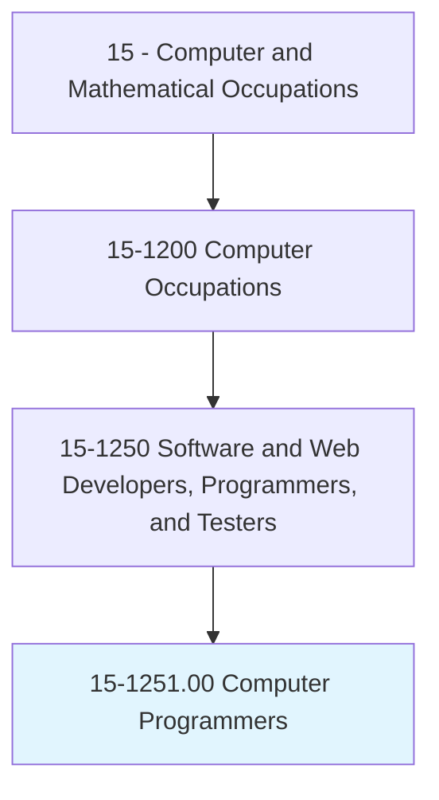
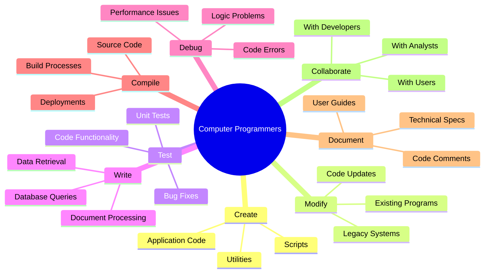
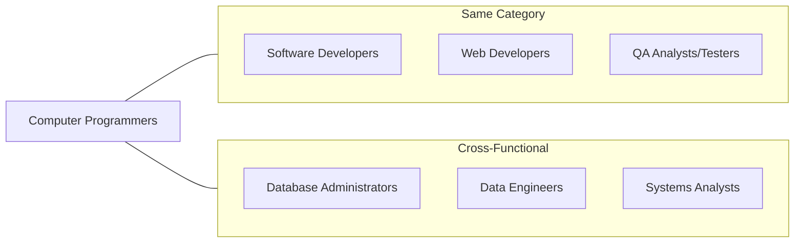
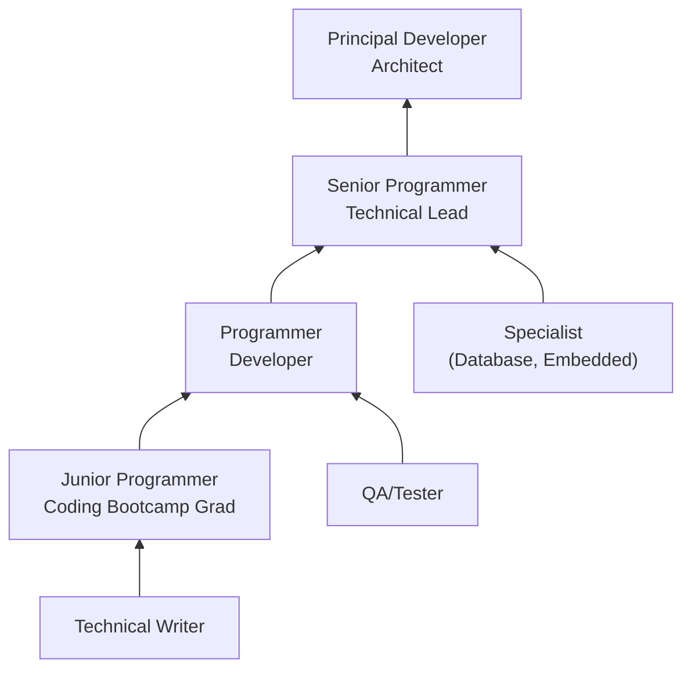

# Computer Programmers

> Create, modify, and test the code and scripts that allow computer applications to run. Work from specifications drawn up by software and web developers or other individuals. May develop and write computer programs to store, locate, and retrieve specific documents, data, and information.

## Overview

Computer Programmers translate software designs and specifications into functional code, creating the instructions that computers follow to perform specific tasks. While the distinction between programmers and software developers has blurred in modern practice, programmers traditionally focus more on the coding and testing aspects rather than design and architecture. They work with various programming languages to build applications, scripts, and utilities that support business operations.

## Classification Hierarchy

## Key Statistics

| Metric | Value |
|--------|-------|
| SOC Code | 15-1251.00 |
| Job Zone | 4 (Considerable Preparation) |
| Category | [Computer and Mathematical](/occupations/Technology) |
| Core Tasks | 12+ |
| Source | O*NET |

## Core Tasks

### create.Code

Computer Programmers write code based on specifications.

**Actions:**
- `create.Code.that.AllowsComputerApplicationsToRun` - Write executable code
- `create.Scripts.that.AllowsComputerApplicationsToRun` - Build automation scripts
- `write.ComputerPrograms.to.store.Documents` - Develop storage solutions
- `write.ComputerPrograms.to.locate.Data` - Create search functionality
- `write.ComputerPrograms.to.retrieve.Information` - Build data retrieval

### modify.Programs

Computer Programmers update and enhance existing code.

**Actions:**
- `modify.Code.to.improve.Functionality` - Enhance program features
- `modify.Scripts.to.fix.Bugs` - Correct script errors
- `update.LegacyCode.to.meet.CurrentStandards` - Modernize old systems
- `refactor.Code.to.improve.Performance` - Optimize existing code

### test.Applications

Computer Programmers validate code functionality.

**Actions:**
- `test.Code.to.verify.Correctness` - Validate code behavior
- `test.Scripts.to.ensure.Reliability` - Confirm script function
- `debug.Code.to.identify.Errors` - Find and fix bugs
- `run.UnitTests.to.validate.Components` - Test individual units

### work.FromSpecifications

Computer Programmers follow design documents and requirements.

**Actions:**
- `work.FromSpecifications.drawnUpBy.SoftwareDevelopers` - Follow developer specs
- `work.FromSpecifications.drawnUpBy.WebDevelopers` - Implement web designs
- `work.FromSpecifications.drawnUpBy.OtherIndividuals` - Execute various requirements
- `translate.Requirements.into.Code` - Convert specs to programs

## Tech Stack

### Programming Languages
- **Python** - General-purpose programming
- **Java** - Enterprise applications
- **JavaScript** - Web and application development
- **C#** - Microsoft ecosystem
- **C/C++** - Systems programming
- **SQL** - Database programming
- **PHP** - Web development
- **Ruby** - Web applications

### Development Tools
- **Visual Studio Code** - Code editor
- **IntelliJ IDEA** - Java IDE
- **PyCharm** - Python IDE
- **Eclipse** - Multi-language IDE
- **Sublime Text** - Text editor

### Version Control
- **Git** - Version control system
- **GitHub** - Code hosting
- **GitLab** - DevOps platform
- **Bitbucket** - Code repository
- **SVN** - Legacy version control

### Testing Frameworks
- **JUnit** - Java testing
- **pytest** - Python testing
- **Jest** - JavaScript testing
- **NUnit** - .NET testing
- **Selenium** - Browser automation

### Build & Deployment
- **Maven** - Java build tool
- **npm** - Node package manager
- **Docker** - Containerization
- **Jenkins** - CI/CD automation
- **GitHub Actions** - Workflow automation

## Certifications

| Certification | Provider | Level |
|---------------|----------|-------|
| Oracle Certified Professional Java | Oracle | Professional |
| Microsoft Certified: Azure Developer | Microsoft | Associate |
| AWS Certified Developer | Amazon | Associate |
| Python Institute PCPP | Python Institute | Professional |
| CompTIA ITF+ | CompTIA | Entry |

## Skills & Competencies

### Technical Skills
- **Programming Languages** - Expert (multiple)
- **Debugging** - Advanced
- **Testing** - Advanced
- **Version Control** - Advanced
- **Database Programming** - Intermediate
- **Documentation** - Intermediate
- **Algorithm Design** - Intermediate

### Soft Skills
- **Attention to Detail** - Critical
- **Problem Solving** - Critical
- **Logical Thinking** - Essential
- **Communication** - Essential
- **Patience** - Essential

## Related Occupations

## Industry Variations

### Software Companies
- Product development focus
- Agile/Scrum methodologies
- Multiple language expertise
- Continuous deployment

### Financial Services
- Trading system development
- High-performance requirements
- Security-critical code
- Regulatory compliance

### Healthcare
- EHR system programming
- Medical device software
- HIPAA-compliant development
- Integration programming

### Government
- Legacy system maintenance
- Security clearance requirements
- COBOL and mainframe
- Contract-based work

## Career Progression

## Education & Training

| Requirement | Details |
|-------------|---------|
| Typical Education | Bachelor's degree in Computer Science, or Associate's degree with experience |
| Work Experience | 0-3 years; entry-level positions available |
| On-the-Job Training | Moderate - language-specific and domain-specific learning |
| Common Certifications | Language-specific certifications (Java, Python, etc.) |

## Departments

This occupation typically works in:
- [Software Development](/departments/SoftwareDevelopment)
- [Information Technology](/departments/IT)
- [Application Development](/departments/AppDev)
- [Research & Development](/departments/RnD)

---

*Source: O*NET 15-1251.00 - ONETOccupation*
