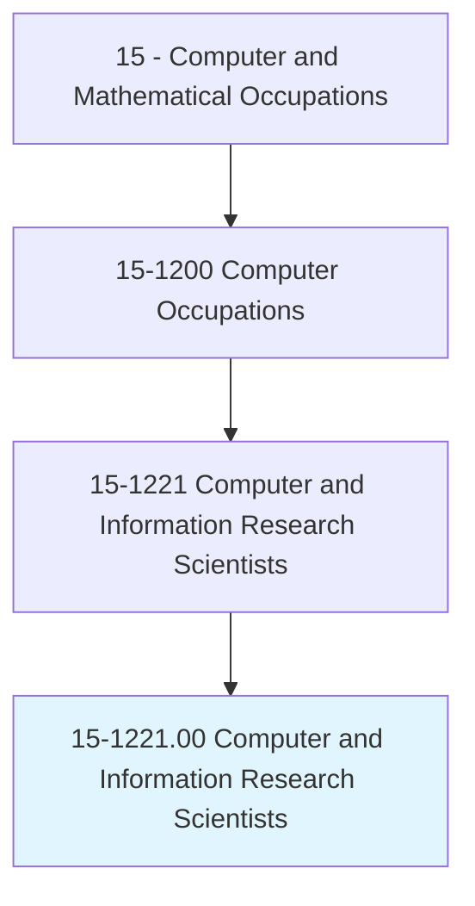
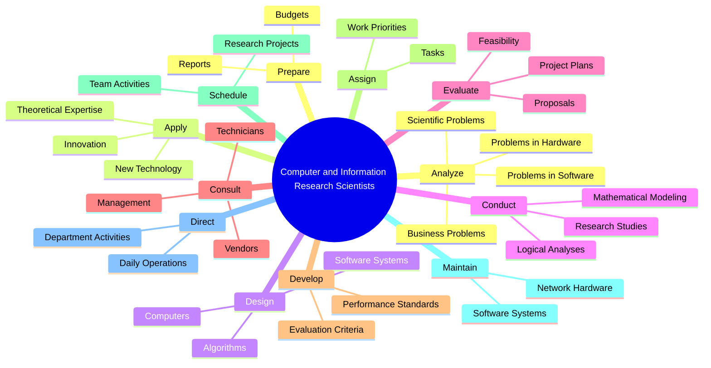
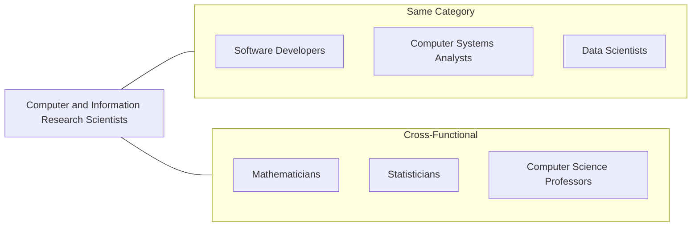
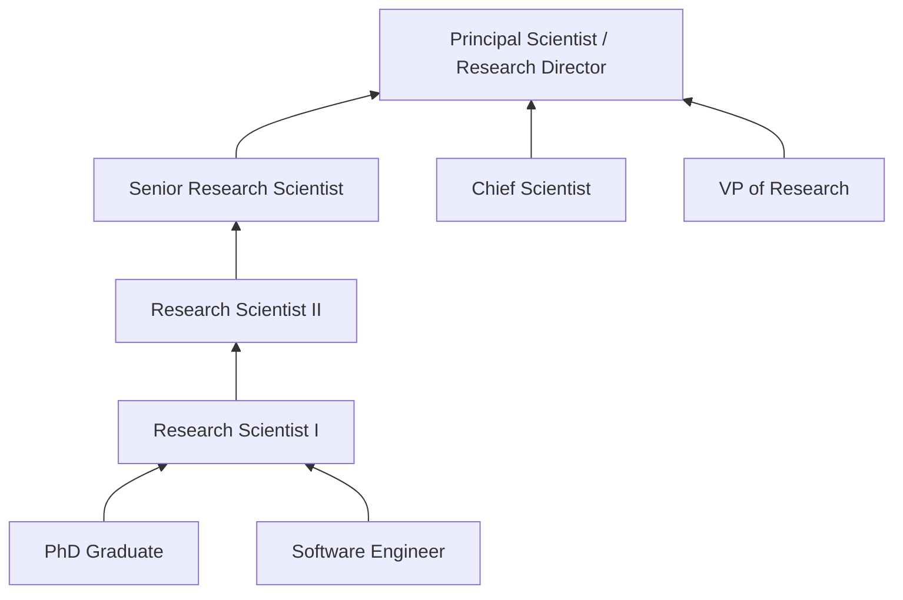

# Computer and Information Research Scientists

> Conduct research into fundamental computer and information science as theorists, designers, or inventors. Develop solutions to problems in the field of computer hardware and software.

## Overview

Computer and Information Research Scientists push the boundaries of computing by conducting original research into fundamental computer science theory and applications. Working as theorists, designers, and inventors, they develop new algorithms, programming languages, and computing architectures. These professionals solve complex problems that advance fields like artificial intelligence, machine learning, cybersecurity, and quantum computing. Their work often leads to innovations that transform technology capabilities across all industries.

## Classification Hierarchy

## Key Statistics

| Metric | Value |
|--------|-------|
| SOC Code | 15-1221.00 |
| Job Zone | 5 (Extensive Preparation) |
| Category | [Computer and Mathematical](/occupations/Technology) |
| Core Tasks | 12+ |
| Source | O*NET |

## Core Tasks

### analyze.Problems

Computer and Information Research Scientists investigate complex computing challenges.

**Actions:**
- `analyze.Problems.to.develop.SolutionsInvolvingComputerHardware` - Research hardware solutions
- `analyze.Problems.to.develop.SolutionsInvolvingSoftware` - Create software innovations
- `analyze.BusinessProblems.to.develop.ComputingSolutions` - Apply research to business needs
- `analyze.ScientificProblems.to.develop.ComputationalMethods` - Advance scientific computing

### apply.TheoreticalExpertise

Computer and Information Research Scientists leverage deep knowledge to create innovations.

**Actions:**
- `apply.TheoreticalExpertise.to.create.NewTechnology` - Invent new computing technologies
- `apply.TheoreticalExpertise.to.apply.NewTechnology` - Implement theoretical advances
- `apply.TheoreticalExpertise.to.adapt.PrinciplesForNewUses` - Extend computing to new domains
- `apply.Innovation.to.create.NewTechnology` - Drive technological breakthroughs

### design.ComputersSoftware

Computer and Information Research Scientists architect computing systems and software.

**Actions:**
- `design.Computers.for.SpecializedApplications` - Create specialized hardware
- `design.SoftwareSystemsThatRunThem` - Develop system software
- `design.Algorithms.for.Efficiency` - Optimize computational methods
- `design.Architectures.for.Performance` - Engineer high-performance systems

### conduct.LogicalAnalyses

Computer and Information Research Scientists apply rigorous analytical methods.

**Actions:**
- `conduct.LogicalAnalyses.of.BusinessProblems` - Analyze business computing needs
- `conduct.LogicalAnalyses.of.ScientificProblems` - Address scientific computing challenges
- `conduct.LogicalAnalyses.of.EngineeringProblems` - Solve engineering computing issues
- `conduct.LogicalAnalyses.of.OtherTechnicalProblems` - Tackle diverse technical challenges
- `conduct.LogicalAnalyses.by.FormulatingMathematicalModels` - Create mathematical representations
- `conduct.LogicalAnalyses.for.SolutionByComputers` - Develop computational solutions

### evaluate.ProjectPlans

Computer and Information Research Scientists assess research initiatives.

**Actions:**
- `evaluate.ProjectPlans.to.assess.FeasibilityIssues` - Determine project viability
- `evaluate.Proposals.to.assess.TechnicalMerit` - Review research proposals
- `evaluate.Research.to.assess.ScientificValidity` - Validate research findings
- `assess.ComputingApproaches.for.Appropriateness` - Select optimal methods

### consult.Stakeholders

Computer and Information Research Scientists collaborate with various parties.

**Actions:**
- `consult.Management.to.determine.ComputingNeedsRequirements` - Align research with organizational goals
- `consult.Vendors.to.determine.TechnologyCapabilities` - Evaluate vendor offerings
- `consult.Technicians.to.determine.ImplementationRequirements` - Plan technical deployment
- `collaborate.with.CrossFunctionalTeams.to.deliver.Solutions` - Work across disciplines

### develop.PerformanceStandards

Computer and Information Research Scientists establish evaluation criteria.

**Actions:**
- `develop.PerformanceStandards.in.LightOf.EstablishedStandards` - Create benchmarks
- `develop.EvaluationCriteria.for.Research` - Define success metrics
- `evaluate.Work.against.EstablishedStandards` - Assess research quality
- `refine.Standards.based.on.NewFindings` - Update criteria as knowledge advances

### assign.Tasks

Computer and Information Research Scientists coordinate research activities.

**Actions:**
- `assign.Tasks.to.meet.WorkPriorities` - Distribute work effectively
- `assign.Tasks.to.achieve.Goals` - Align tasks with objectives
- `schedule.Tasks.to.meet.WorkPriorities` - Plan research timelines
- `schedule.Tasks.to.achieve.Goals` - Coordinate project milestones

### maintain.NetworkHardware

Computer and Information Research Scientists ensure system availability for research.

**Actions:**
- `maintain.NetworkHardware.to.ensure.AvailabilityToSystemUsers` - Support research infrastructure
- `maintain.Software.to.ensure.AvailabilityToSystemUsers` - Keep software operational
- `maintain.DirectNetworkSecurityMeasures.to.ensure.Security` - Protect research systems
- `monitor.Networks.to.ensure.AvailabilityToSystemUsers` - Track system performance

### direct.DailyOperations

Computer and Information Research Scientists oversee research operations.

**Actions:**
- `direct.DailyOperations.of.Departments` - Lead research teams
- `direct.DailyOperations.by.CoordinatingProjectActivities` - Manage project coordination
- `coordinate.with.OtherDepartments.for.Integration` - Ensure cross-departmental alignment
- `participate.in.DirectTraining.of.Subordinates` - Develop team capabilities

### prepare.OperationalBudgets

Computer and Information Research Scientists manage research resources.

**Actions:**
- `prepare.OperationalBudgets.for.Research` - Plan resource allocation
- `approve.OperationalBudgets.for.Projects` - Authorize spending
- `monitor.OperationalBudgets.for.Compliance` - Track expenditures
- `adjust.OperationalBudgets.as.Needed` - Reallocate resources dynamically

## Skills & Competencies

### Technical Skills
- **Algorithm Design** - Expert
- **Machine Learning** - Expert
- **Artificial Intelligence** - Expert
- **Programming Languages** - Expert (Python, C++, Java, Rust)
- **Mathematical Modeling** - Expert
- **Research Methodology** - Expert
- **Data Structures** - Expert
- **Computational Theory** - Expert

### Soft Skills
- **Analytical Thinking** - Critical
- **Research Writing** - Critical
- **Innovation** - Critical
- **Collaboration** - Essential
- **Communication** - Essential
- **Mentorship** - Essential

## Related Occupations

## Alternative Job Titles

This occupation includes several specialized roles:

- AI Engineer (Artificial Intelligence Engineer)
- Applied Scientist
- Machine Learning Engineer
- Machine Learning Research Scientist
- Computational Scientist
- Computer Vision Scientist
- NLP Engineer (Natural Language Processing Engineer)
- Research Computer Scientist
- Cybersecurity Research Scientist
- Computational Linguist

## Industries

- [Technology](/industries/Technology) - Primary employment sector
- [Research and Development](/industries/Research) - Academic and industrial research
- [Government](/industries/Government) - Federal research agencies (DARPA, NSF)
- [Defense](/industries/Defense) - Military research
- [Finance](/industries/Finance) - Quantitative research
- [Healthcare](/industries/Healthcare) - Computational biology and health AI

## Career Progression

## Education & Training

| Requirement | Details |
|-------------|---------|
| Typical Education | Master's degree minimum; PhD strongly preferred |
| Field of Study | Computer Science, Artificial Intelligence, Computational Mathematics |
| Work Experience | 3-10+ years in research or advanced development |
| On-the-Job Training | Continuous learning through research and publication |
| Publications | Peer-reviewed papers in top venues (ICML, NeurIPS, CVPR, etc.) |

## Departments

This occupation typically works in:
- [Research & Development](/departments/RnD)
- [Advanced Technology Group](/departments/ATG)
- [AI/ML Division](/departments/AIML)
- [Innovation Lab](/departments/Innovation)
- [Academic Research](/departments/Academia)

---

*Source: O*NET 15-1221.00 - ONETOccupation*
