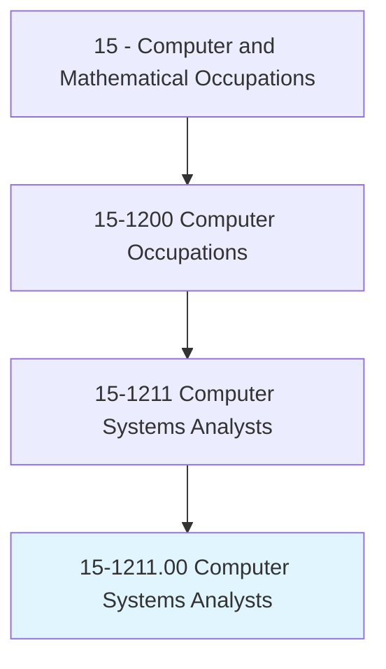
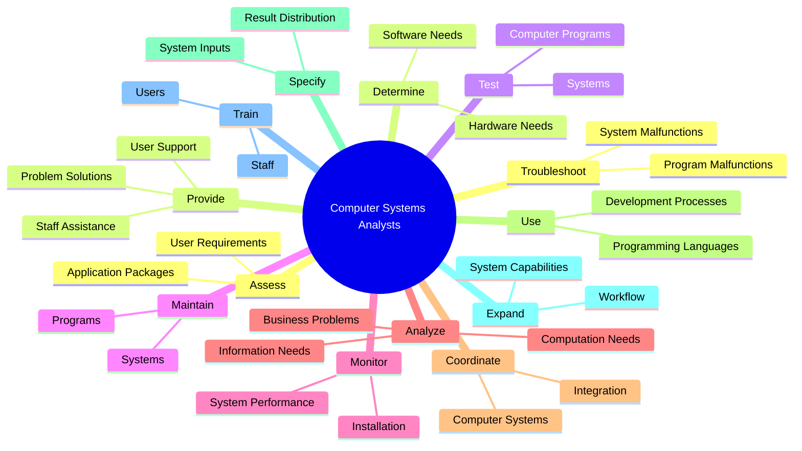
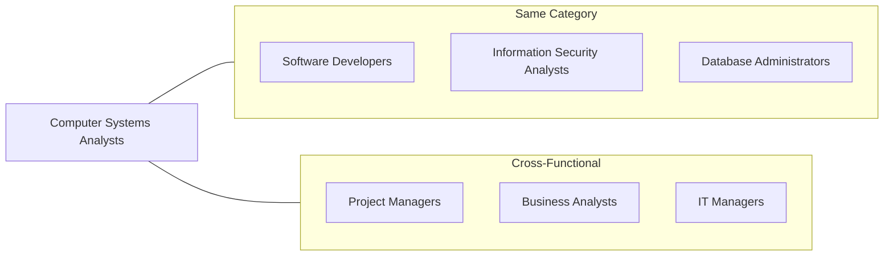
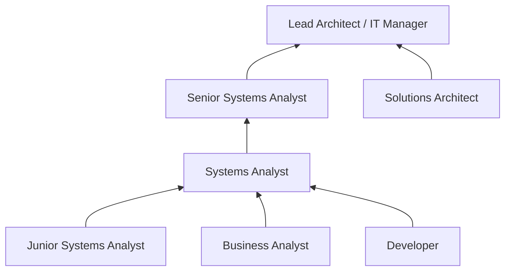

# Computer Systems Analysts

> Analyze science, engineering, business, and other data processing problems to develop and implement solutions to complex applications problems, system administration issues, or network concerns. Perform systems management and integration functions, improve existing computer systems, and review computer system capabilities, workflow, and schedule limitations.

## Overview

Computer Systems Analysts serve as the bridge between business needs and technology solutions, analyzing organizational requirements and designing computer systems that improve efficiency and productivity. They work closely with stakeholders to understand workflows, evaluate existing systems, and recommend improvements or new solutions. This role requires a blend of technical expertise and business acumen to translate complex requirements into effective system designs.

## Classification Hierarchy

## Key Statistics

| Metric | Value |
|--------|-------|
| SOC Code | 15-1211.00 |
| Job Zone | 4 (Considerable Preparation) |
| Category | [Computer and Mathematical](/occupations/ComputerAndMathematical) |
| Core Tasks | 14+ |
| Source | O*NET |

## Core Tasks

### troubleshoot.ProgramMalfunctions

Computer Systems Analysts diagnose and resolve system issues to maintain operational continuity.

**Actions:**
- `troubleshoot.ProgramMalfunctions.to.restore.NormalFunctioning` - Diagnose and fix software issues
- `troubleshoot.SystemMalfunctions.to.restore.NormalFunctioning` - Resolve hardware and system-level problems

### provide.Staff

Computer Systems Analysts support users and staff with technical assistance.

**Actions:**
- `provide.Staff.with.AssistanceSolvingComputerRelatedProblems` - Offer hands-on technical support
- `provide.Staff.with.Malfunctions` - Address equipment and software issues
- `provide.Users.with.AssistanceSolvingComputerRelatedProblems` - Help end users with system issues

### test.ComputerPrograms

Computer Systems Analysts validate system functionality through testing and maintenance.

**Actions:**
- `test.ComputerProgramsIncludingCoordinatingInstallation.of.ComputerPrograms` - Execute program testing protocols
- `test.SystemsIncludingCoordinatingInstallation.of.Systems` - Validate system deployments
- `maintain.ComputerProgramsIncludingCoordinatingInstallation.of.ComputerPrograms` - Ensure ongoing program health
- `monitor.SystemsIncludingCoordinatingInstallation.of.Systems` - Track system performance metrics

### use.Computer

Computer Systems Analysts apply technical tools to solve business challenges.

**Actions:**
- `use.Computer.in.Analysis.of.BusinessProblems` - Leverage technology for business analysis
- `use.Computer.in.Solution.of.BusinessProblems` - Develop technical solutions to business needs
- `use.Computer.in.Development.of.IntegratedProduction` - Build integrated production systems
- `use.Computer.in.InventoryControl` - Implement inventory management solutions
- `use.Computer.in.CostAnalysisSystems` - Create cost analysis applications

### coordinate.ComputerSystems

Computer Systems Analysts ensure system compatibility across the organization.

**Actions:**
- `coordinate.ComputerSystems.within.Organization.to.increase.CompatibilitySoInformationCanBeShared` - Enable cross-system integration
- `link.ComputerSystems.within.Organization.to.increase.CompatibilitySoInformationCanBeShared` - Connect disparate systems

### analyze.InformationProcessingNeeds

Computer Systems Analysts evaluate requirements using structured methodologies.

**Actions:**
- `analyze.InformationProcessingNeedsPlanDesignComputerSystemsUsingTechniques` - Apply systems analysis methods
- `analyze.ComputationNeedsPlanDesignComputerSystemsUsingTechniques` - Design computation solutions
- `analyze.StructuredAnalysis` - Use structured analysis techniques
- `analyze.InformationEngineering` - Apply information engineering principles

### expand.System

Computer Systems Analysts enhance systems to meet evolving requirements.

**Actions:**
- `expand.System.to.serve.NewPurposes` - Extend system functionality
- `expand.System.to.improve.WorkFlow` - Optimize workflows through system changes
- `modify.System.to.serve.NewPurposes` - Adapt systems for new uses
- `modify.System.to.improve.WorkFlow` - Enhance process efficiency

### train.Staff

Computer Systems Analysts enable users to effectively utilize systems.

**Actions:**
- `train.Staff.to.work.WithComputerSystems` - Educate staff on system usage
- `train.Users.to.work.WithComputerSystems` - Provide end-user training
- `train.Staff.to.programs` - Train on specific applications
- `train.Users.to.programs` - Enable program proficiency

## Skills & Competencies

### Technical Skills
- **Systems Analysis** - Expert
- **Database Management** - Advanced
- **Programming Languages** - Advanced
- **Network Architecture** - Advanced
- **Requirements Gathering** - Expert
- **Object-Oriented Design** - Advanced
- **SQL and Data Modeling** - Advanced

### Soft Skills
- **Analytical Thinking** - Critical
- **Communication** - Critical
- **Problem Solving** - Essential
- **Collaboration** - Essential
- **Documentation** - Essential

## Related Occupations

## Industries

- [Information Technology](/industries/InformationTechnology) - High Employment
- [Finance and Insurance](/industries/FinanceInsurance) - High Employment
- [Professional Services](/industries/ProfessionalServices) - High Employment
- [Healthcare](/industries/Healthcare/index) - Moderate Employment
- [Government](/industries/Government) - Moderate Employment
- [Manufacturing](/industries/Manufacturing/index) - Moderate Employment

## Career Progression

## Education & Training

| Requirement | Details |
|-------------|---------|
| Typical Education | Bachelor's degree in Computer Science, Information Systems, or related field |
| Work Experience | 2-5 years in IT or business analysis |
| On-the-Job Training | Moderate - project-based learning and methodology certifications |
| Common Certifications | CBAP, CSBA, AWS Solutions Architect, TOGAF |

## Departments

This occupation typically works in:
- [Information Technology](/departments/IT)
- [Enterprise Architecture](/departments/EnterpriseArchitecture)
- [Business Analysis](/departments/BusinessAnalysis)
- [Application Development](/departments/AppDev)

---

*Source: O*NET 15-1211.00 - ONETOccupation*
