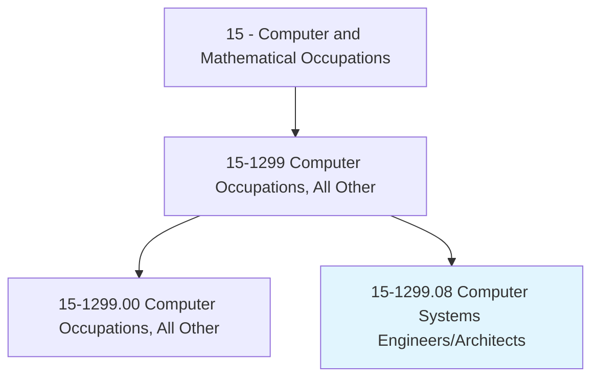
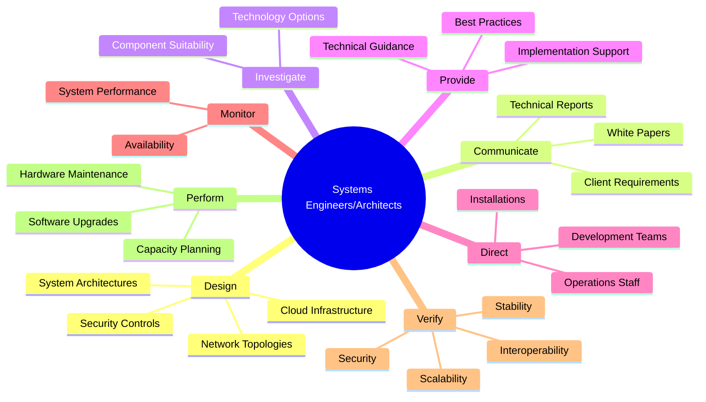
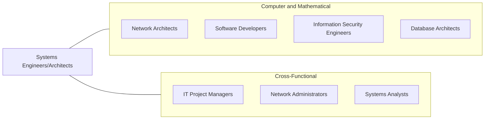
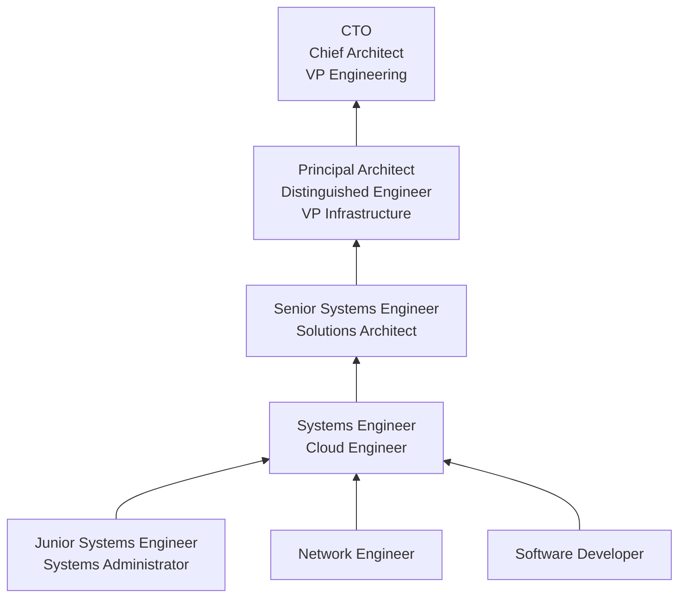

# Computer Systems Engineers/Architects

> Design and develop solutions to complex applications problems, system administration issues, or network concerns. Perform systems management and integration functions.

## Overview

Computer Systems Engineers and Architects design and oversee the implementation of complex computing systems that integrate hardware, software, networks, and cloud infrastructure into cohesive, high-performance solutions. They work at a strategic level, making architectural decisions that affect the scalability, reliability, security, and maintainability of an organization's technology infrastructure.

These professionals serve as the bridge between business requirements and technical implementation. They evaluate existing systems, identify bottlenecks and integration challenges, and design solutions that align technology capabilities with organizational goals. Their work spans on-premises infrastructure, cloud environments, and hybrid architectures, requiring a broad understanding of compute, storage, networking, security, and application design patterns.

The role has become increasingly important as organizations migrate to cloud-native architectures, adopt microservices and containerization, implement zero-trust security models, and navigate multi-cloud strategies. Systems engineers and architects must balance competing concerns -- cost, performance, security, compliance, and operational complexity -- to deliver infrastructure that supports both current operations and future growth.

## Classification Hierarchy

## Key Statistics

| Metric | Value |
|--------|-------|
| SOC Code | 15-1299.08 |
| Job Zone | 4 (Considerable Preparation) |
| Category | [Computer and Mathematical](/occupations/Technology/index) |
| Task Count | 102 |
| Median Salary | $122,000 |
| Employment | ~45,000 |
| Growth Rate | Faster Than Average |
| Source | O*NET |

## Core Tasks

### design.SystemArchitectures

Systems Engineers/Architects create comprehensive technical architectures for complex systems.

**Actions:**
- `design.SystemArchitectures.for.Scalability`
- `design.NetworkTopologies.for.HighAvailability`
- `design.CloudInfrastructure.for.CostOptimization`
- `design.SecurityArchitecture.for.DefenseInDepth`

### communicate.Requirements

Systems Engineers/Architects gather requirements and communicate technical solutions to stakeholders.

**Actions:**
- `communicate.Clients.to.understand.SpecificSystemRequirements`
- `communicate.ProjectInformation.through.Presentations`
- `write.TechnicalReports.for.StakeholderReview`
- `write.WhitePapers.for.TechnologyEvaluation`

### provide.TechnicalGuidance

Systems Engineers/Architects guide teams on implementation and best practices.

**Actions:**
- `provide.TechnicalGuidance.for.Development`
- `provide.CustomersGuidelines.for.ImplementingSecureSystems`
- `provide.InstallationGuidelines.for.Deployment`
- `provide.TechnicalSupport.for.Troubleshooting.of.Systems`

### verify.SystemQualities

Systems Engineers/Architects validate that systems meet quality requirements.

**Actions:**
- `verify.Stability.of.DeployedSystems`
- `verify.Interoperability.across.IntegratedComponents`
- `verify.Security.of.InfrastructureConfigurations`
- `verify.Scalability.under.LoadConditions`

## Tech Stack

### Cloud Platforms
- **AWS** - EC2, S3, Lambda, RDS, EKS, CloudFormation
- **Azure** - VMs, App Service, AKS, ARM Templates
- **Google Cloud** - GCE, GKE, Cloud Run, BigQuery
- **Multi-Cloud** - Terraform, Pulumi

### Infrastructure & DevOps
- **Terraform** - Infrastructure as code
- **Ansible/Puppet/Chef** - Configuration management
- **Docker** - Containerization
- **Kubernetes** - Container orchestration
- **Helm** - Kubernetes package management
- **ArgoCD/Flux** - GitOps deployment

### Networking
- **Cisco** - Enterprise networking
- **Palo Alto/Fortinet** - Firewalls
- **F5/HAProxy** - Load balancing
- **Cloudflare** - CDN and edge
- **VPN/SD-WAN** - Wide area networking

### Monitoring & Observability
- **Datadog** - Full-stack monitoring
- **Prometheus/Grafana** - Metrics and visualization
- **ELK Stack** - Log aggregation
- **PagerDuty** - Incident management
- **New Relic** - Application performance

### Architecture Tools
- **Lucidchart/Draw.io** - Architecture diagrams
- **Confluence** - Documentation
- **TOGAF** - Architecture framework
- **ArchiMate** - Architecture modeling
- **AWS Well-Architected Tool** - Architecture review

## Certifications

| Certification | Provider | Level |
|---------------|----------|-------|
| AWS Solutions Architect | Amazon | Associate/Professional |
| Azure Solutions Architect Expert | Microsoft | Expert |
| Google Cloud Professional Cloud Architect | Google | Professional |
| TOGAF Certified | The Open Group | Professional |
| Certified Kubernetes Administrator (CKA) | CNCF | Professional |
| Cisco Certified Internetwork Expert (CCIE) | Cisco | Expert |

## Skills & Competencies

### Technical Skills
- **Systems Architecture** - Expert
- **Cloud Infrastructure (AWS/Azure/GCP)** - Expert
- **Networking** - Expert
- **Security Architecture** - Advanced
- **Infrastructure as Code** - Advanced
- **Containerization/Orchestration** - Advanced
- **Database Architecture** - Advanced
- **Performance Engineering** - Advanced
- **Disaster Recovery Planning** - Advanced

### Soft Skills
- **Systems Thinking** - Critical
- **Communication** - Critical (translating technical to business)
- **Stakeholder Management** - Essential
- **Problem Solving** - Critical
- **Leadership** - Essential
- **Decision Making** - Critical (high-impact architectural decisions)

## Related Occupations

- [Software Developers](/occupations/Technology/SoftwareDevelopers)
- [Information Security Engineers](/occupations/Technology/InformationSecurityEngineers)
- [Computer Network Architects](/occupations/Technology/ComputerNetworkArchitects)
- [Database Architects](/occupations/Technology/DatabaseArchitects)

## Industry Variations

### Technology / SaaS
- Microservices architecture
- Cloud-native design
- Global scale systems
- CI/CD pipeline architecture

### Financial Services
- Low-latency trading systems
- High-availability architecture (99.999%)
- Regulatory compliance infrastructure
- Disaster recovery and BCP

### Healthcare
- HIPAA-compliant architectures
- EHR system integration
- Health information exchange
- Medical IoT infrastructure

### Government / Defense
- Classified network architecture
- FedRAMP cloud compliance
- Zero-trust security models
- Legacy system modernization

### Manufacturing / IoT
- Edge computing architecture
- SCADA/OT integration
- Real-time data pipelines
- Plant floor connectivity

## Career Progression

## Education & Training

| Requirement | Details |
|-------------|---------|
| Typical Education | Bachelor's in Computer Science, Computer Engineering, or Information Technology |
| Alternative Paths | Strong experience track with certifications (AWS SA Pro, TOGAF) |
| Work Experience | 5-10+ years in systems engineering, infrastructure, or software development |
| Key Knowledge Areas | Networking, cloud platforms, security, distributed systems, capacity planning |
| Continuing Education | Cloud certification renewals, architecture framework training |

## Departments

This occupation typically works in:
- Infrastructure Engineering
- Cloud Operations
- [Information Technology](/departments/Technology)
- [Engineering](/departments/Technology)
- Solutions Architecture

---

*Source: O*NET 15-1299.08 - ONETOccupation*
