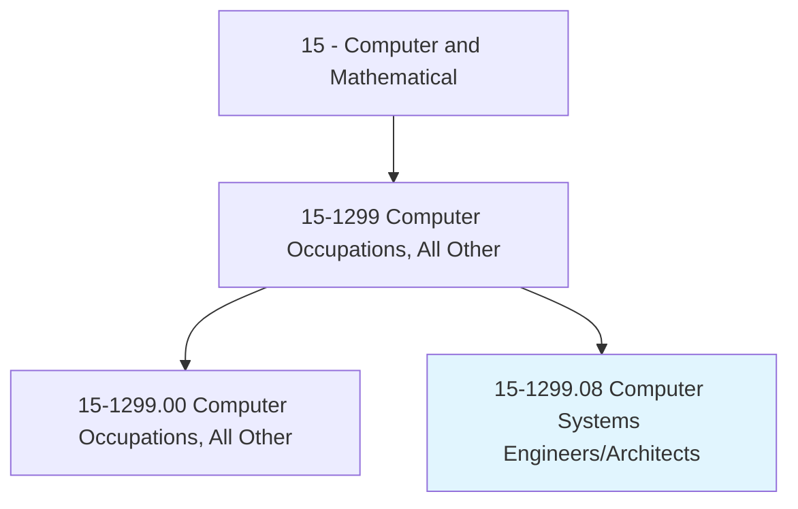
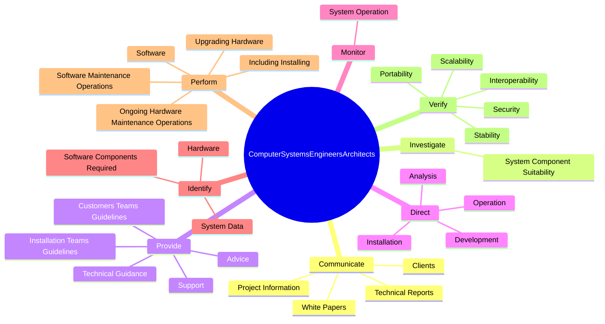

# Computer Systems Engineers/Architects

> Design and develop solutions to complex applications problems, system administration issues, or network concerns. Perform systems management and integration functions.

## Overview

Computer Systems Engineers/Architects is a specialized variant within the Computer and Mathematical category. Design and develop solutions to complex applications problems, system administration issues, or network concerns. 

## Classification Hierarchy

## Key Statistics

| Metric | Value |
|--------|-------|
| SOC Code | 15-1299.08 |
| Category | [Computer and Mathematical](/occupations/Technology) |
| Task Count | 102 |
| Source | O*NET |

## Core Tasks

### communicate.Clients

Computer Systems Engineers/Architects communicate clients as part of their core responsibilities.

**Actions:**
- `communicate.Clients.to.understand.SpecificSystemRequirements`
- `communicate.ProjectInformation.through.Presentations`
- `communicate.TechnicalReports`
- `communicate.WhitePapers`

### investigate.SystemComponentSuitability

Computer Systems Engineers/Architects investigate system component suitability as part of their core responsibilities.

**Actions:**
- `investigate.SystemComponentSuitability.for.SpecifiedPurposes`
- `investigate.SystemComponentSuitability.for.MakeRecommendationsRegardingComponentUse`

### provide.CustomersTeamsGuidelines

Computer Systems Engineers/Architects provide customers teams guidelines as part of their core responsibilities.

**Actions:**
- `provide.CustomersTeamsGuidelines.for.ImplementingSecureSystems`
- `provide.InstallationTeamsGuidelines.for.ImplementingSecureSystems`
- `provide.TechnicalGuidance.for.Development`
- `provide.TechnicalGuidance.for.Troubleshooting.of.Systems`

## Skills & Competencies

### Technical Skills
- **Programming** - Advanced
- **Systems Analysis** - Advanced
- **Database Management** - Advanced

### Soft Skills
- **Communication** - Essential
- **Problem Solving** - Essential
- **Critical Thinking** - Important
- **Teamwork** - Important
- **Adaptability** - Important

## Related Occupations

## Industries

This occupation is found across multiple industries. See [Industries](/industries) for sector-specific employment data.

## Career Progression

---

*Source: O*NET 15-1299.08 - ONETOccupation*
