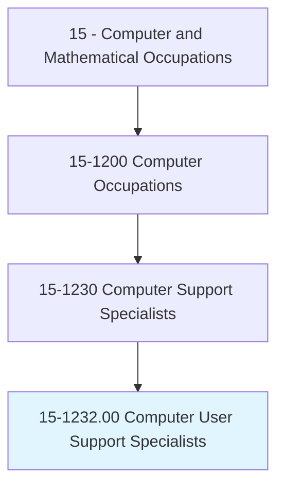
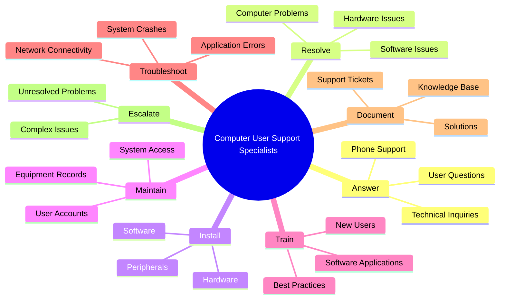
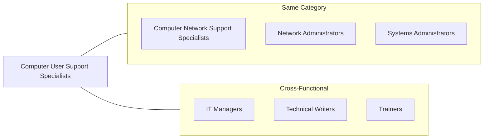
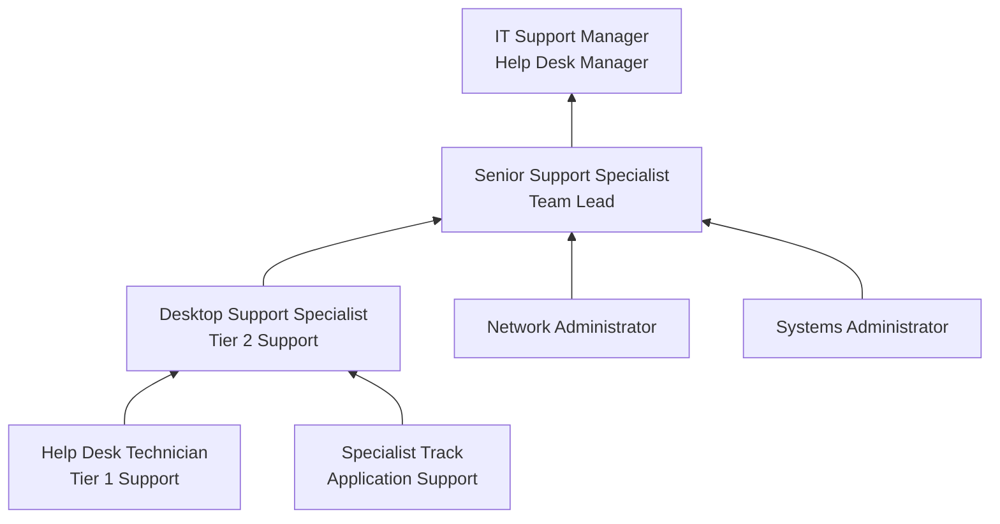

# Computer User Support Specialists

> Provide technical assistance to computer users. Answer questions or resolve computer problems for clients in person, via telephone, or electronically. May provide assistance concerning the use of computer hardware and software, including printing, installation, word processing, electronic mail, and operating systems.

## Overview

Computer User Support Specialists serve as the frontline technical support for organizations, helping users navigate hardware and software issues. They troubleshoot problems, guide users through solutions, and ensure that technology functions smoothly for end users. This role requires strong communication skills to translate technical concepts for non-technical users, patience in handling frustrated customers, and broad knowledge across multiple computing platforms and applications.

## Classification Hierarchy

## Key Statistics

| Metric | Value |
|--------|-------|
| SOC Code | 15-1232.00 |
| Job Zone | 3 (Medium Preparation) |
| Category | [Computer and Mathematical](/occupations/Technology/index) |
| Core Tasks | 10+ |
| Source | O*NET |

## Core Tasks

### answer.Questions

Computer User Support Specialists respond to user inquiries across multiple channels.

**Actions:**
- `answer.Questions.from.Users.about.ComputerHardware` - Provide hardware guidance
- `answer.Questions.from.Users.about.SoftwareUsage` - Explain software functionality
- `resolve.ComputerProblems.for.Clients.via.Telephone` - Deliver phone support
- `resolve.ComputerProblems.for.Clients.via.Electronic` - Provide remote assistance

### provide.Assistance

Computer User Support Specialists help users with various computing needs.

**Actions:**
- `provide.Assistance.concerning.ComputerHardware` - Guide hardware setup and use
- `provide.Assistance.concerning.SoftwareInstallation` - Support software deployment
- `provide.Assistance.concerning.WordProcessing` - Help with document creation
- `provide.Assistance.concerning.ElectronicMail` - Support email configuration

### install.Software

Computer User Support Specialists set up systems and applications.

**Actions:**
- `install.Software.on.UserWorkstations` - Deploy applications
- `install.Hardware.for.UserEnvironments` - Set up physical equipment
- `configure.OperatingSystems.for.Users` - Prepare system settings
- `configure.Applications.for.UserNeeds` - Customize software settings

### troubleshoot.Issues

Computer User Support Specialists diagnose and resolve technical problems.

**Actions:**
- `troubleshoot.HardwareIssues.to.restore.Functionality` - Fix equipment problems
- `troubleshoot.SoftwareIssues.to.restore.Functionality` - Resolve application errors
- `diagnose.NetworkConnectivity.to.identify.Problems` - Analyze connection issues
- `escalate.ComplexIssues.to.HigherTierSupport` - Route difficult problems

## Tech Stack

### Help Desk & Ticketing Systems
- **ServiceNow** - Enterprise IT service management
- **Zendesk** - Customer support platform
- **Freshdesk** - Help desk software
- **Jira Service Management** - IT service desk
- **ConnectWise** - MSP support platform

### Remote Support Tools
- **TeamViewer** - Remote desktop access
- **LogMeIn** - Remote support solutions
- **Bomgar** - Secure remote support
- **AnyDesk** - Remote desktop software
- **Dameware** - Remote IT management

### Diagnostic Tools
- **Sysinternals Suite** - Windows troubleshooting
- **Wireshark** - Network analysis
- **CPU-Z/GPU-Z** - Hardware diagnostics
- **CrystalDiskInfo** - Storage health monitoring
- **MemTest86** - Memory testing

## Certifications

| Certification | Provider | Level |
|---------------|----------|-------|
| CompTIA A+ | CompTIA | Entry |
| CompTIA Network+ | CompTIA | Entry |
| ITIL Foundation | Axelos | Entry |
| Microsoft 365 Certified | Microsoft | Associate |
| Apple Certified Support Professional | Apple | Entry |
| Google IT Support Professional | Google | Entry |
| HDI Desktop Support Technician | HDI | Entry |

## Skills & Competencies

### Technical Skills
- **Operating Systems** - Windows, macOS, Linux proficiency
- **Hardware Troubleshooting** - Intermediate
- **Software Installation** - Advanced
- **Network Basics** - Intermediate
- **Active Directory** - Intermediate
- **Remote Support Tools** - Advanced
- **Ticketing Systems** - Advanced

### Soft Skills
- **Customer Service** - Critical
- **Communication** - Critical
- **Patience** - Essential
- **Problem Solving** - Essential
- **Active Listening** - Essential
- **Time Management** - Important

## Related Occupations

## Industry Variations

### Corporate IT
- Internal help desk for employees
- Focus on enterprise applications (Microsoft 365, SAP, etc.)
- Asset management and lifecycle tracking
- Onboarding/offboarding processes

### Managed Service Providers (MSPs)
- Multi-client support environments
- Remote monitoring and management
- SLA-driven support delivery
- Broader technology exposure

### Healthcare IT
- EHR/EMR application support
- HIPAA compliance awareness
- Clinical workflow understanding
- 24/7 support requirements

### Retail/Point-of-Sale
- POS system troubleshooting
- Peripheral device support (printers, scanners)
- Store network connectivity
- High-pressure environment support

## Career Progression

## Education & Training

| Requirement | Details |
|-------------|---------|
| Typical Education | Associate's degree or some college in IT, Computer Science, or related field |
| Work Experience | 0-2 years; entry-level friendly with certifications |
| On-the-Job Training | Moderate - product-specific training and customer service skills |
| Common Certifications | CompTIA A+, ITIL Foundation, HDI certifications |

## Departments

This occupation typically works in:
- [Information Technology](/departments/Technology)
- Help Desk
- Technical Support
- Customer Service

---

*Source: O*NET 15-1232.00 - ONETOccupation*
