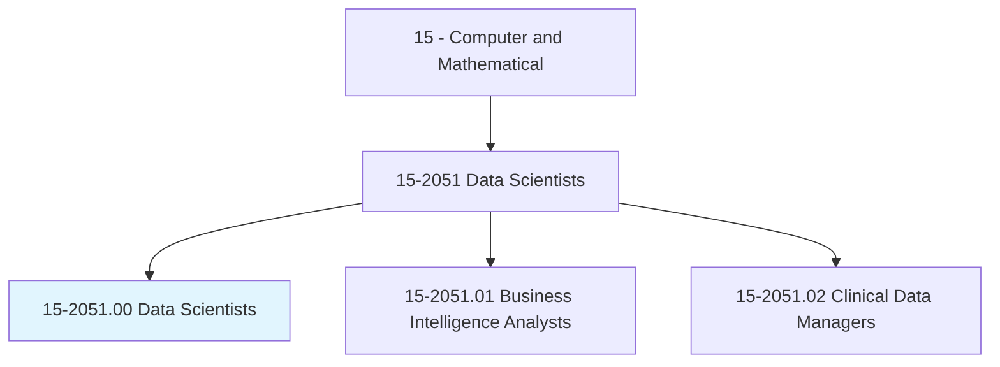
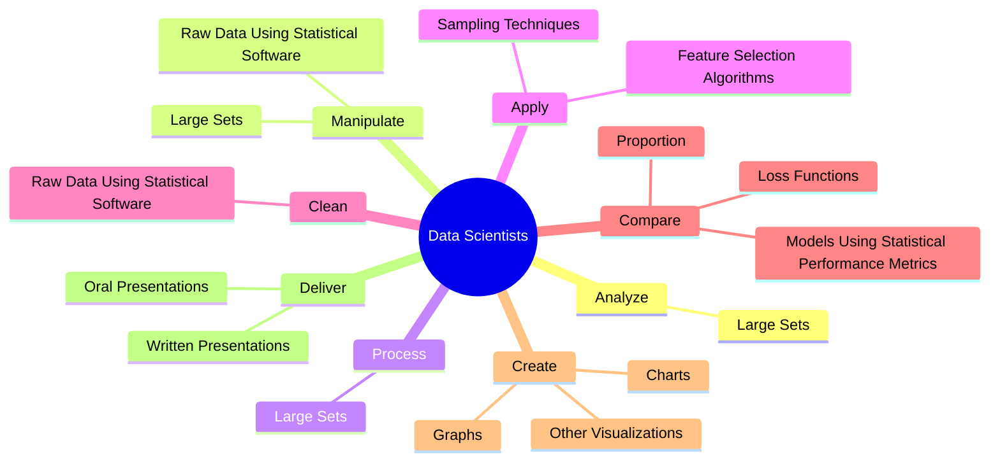
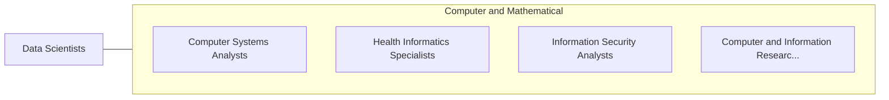

# Data Scientists

> Develop and implement a set of techniques or analytics applications to transform raw data into meaningful information using data-oriented programming languages and visualization software. Apply data mining, data modeling, natural language processing, and machine learning to extract and analyze information from large structured and unstructured datasets. Visualize, interpret, and report data findings. May create dynamic data reports.

## Overview

Data Scientists is an occupation within the Computer and Mathematical category. Develop and implement a set of techniques or analytics applications to transform raw data into meaningful information using data-oriented programming languages and visualization software. Apply data mining, data modeling, natural language processing, and machine learning to extract and analyze information from large structured and unstructured datasets.

## Classification Hierarchy

## Key Statistics

| Metric | Value |
|--------|-------|
| SOC Code | 15-2051.00 |
| Category | [Computer and Mathematical](/occupations/Technology) |
| Task Count | 46 |
| Source | O*NET |

## Core Tasks

### analyze.LargeSets

Data Scientists analyze large sets as part of their core responsibilities.

**Actions:**
- `analyze.LargeSets.of.DataUsingStatisticalSoftware`

### manipulate.LargeSets

Data Scientists manipulate large sets as part of their core responsibilities.

**Actions:**
- `manipulate.LargeSets.of.DataUsingStatisticalSoftware`
- `manipulate.RawDataUsingStatisticalSoftware`

### process.LargeSets

Data Scientists process large sets as part of their core responsibilities.

**Actions:**
- `process.LargeSets.of.DataUsingStatisticalSoftware`

## Skills & Competencies

### Technical Skills
- **Programming** - Advanced
- **Systems Analysis** - Advanced
- **Database Management** - Advanced

### Soft Skills
- **Communication** - Essential
- **Problem Solving** - Essential
- **Critical Thinking** - Important
- **Teamwork** - Important
- **Adaptability** - Important

## Related Occupations

## Industries

This occupation is found across multiple industries. See [Industries](/industries) for sector-specific employment data.

## Career Progression

---

*Source: O*NET 15-2051.00 - ONETOccupation*
