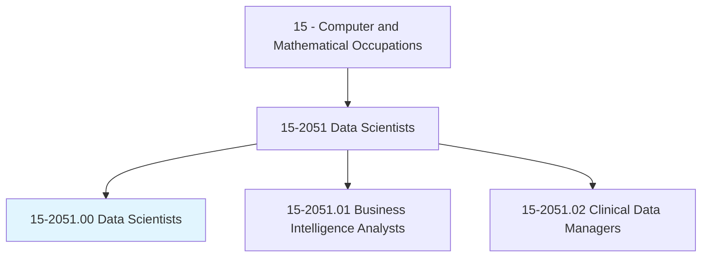
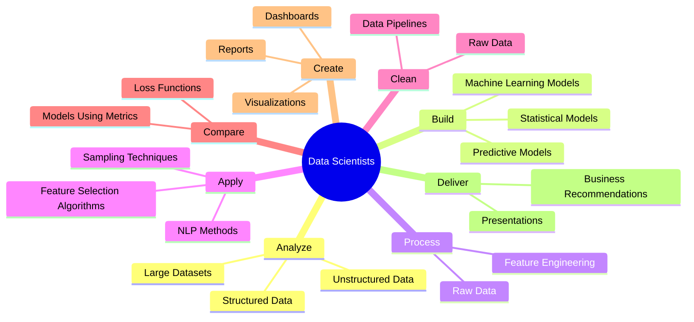
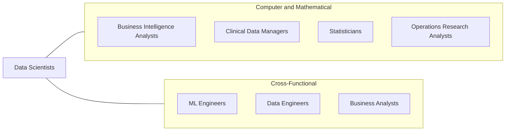
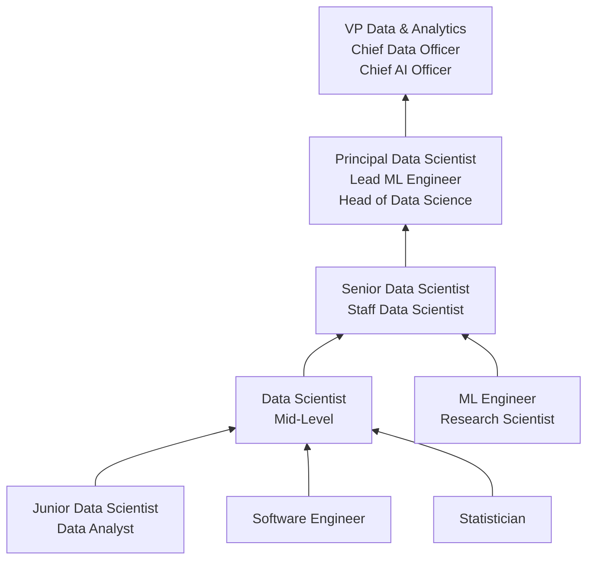

# Data Scientists

> Develop and implement a set of techniques or analytics applications to transform raw data into meaningful information using data-oriented programming languages and visualization software. Apply data mining, data modeling, natural language processing, and machine learning to extract and analyze information from large structured and unstructured datasets. Visualize, interpret, and report data findings. May create dynamic data reports.

## Overview

Data Scientists are analytical experts who use advanced statistical methods, machine learning algorithms, and programming skills to extract meaningful insights from large and complex datasets. They work at the intersection of statistics, computer science, and domain expertise to solve business problems, build predictive models, and drive data-informed decision-making across organizations.

The role has evolved significantly since its emergence in the early 2010s, expanding from purely analytical work to encompass machine learning engineering, MLOps, and AI system design. Modern data scientists are expected to not only build models but also deploy them into production environments, monitor their performance, and communicate findings to stakeholders at all levels. They work with both structured data (databases, spreadsheets) and unstructured data (text, images, sensor data) to uncover patterns and generate actionable intelligence.

Data science has become a core strategic function in virtually every industry, with organizations relying on data scientists to optimize operations, personalize customer experiences, detect fraud, forecast demand, and develop entirely new products and services powered by artificial intelligence.

## Classification Hierarchy

## Key Statistics

| Metric | Value |
|--------|-------|
| SOC Code | 15-2051.00 |
| Job Zone | 4 (Considerable Preparation) |
| Category | [Computer and Mathematical](/occupations/Technology/index) |
| Task Count | 46 |
| Median Salary | $108,020 |
| Employment | ~192,000 |
| Growth Rate | Much Faster Than Average (36%) |
| Source | O*NET |

## Core Tasks

### analyze.LargeDatasets

Data Scientists analyze large structured and unstructured datasets to discover patterns and insights.

**Actions:**
- `analyze.LargeDatasets.using.StatisticalSoftware`
- `analyze.StructuredData.to.identify.Patterns`
- `analyze.UnstructuredData.using.NaturalLanguageProcessing`
- `analyze.DataDistributions.to.inform.ModelSelection`

### build.MachineLearningModels

Data Scientists build and train machine learning models to generate predictions and automate decisions.

**Actions:**
- `build.MachineLearningModels.to.predict.BusinessOutcomes`
- `build.PredictiveModels.using.SupervisedLearning`
- `build.ClusteringModels.using.UnsupervisedLearning`
- `build.DeepLearningModels.for.ComplexPatternRecognition`

### process.RawData

Data Scientists transform raw data into analysis-ready datasets.

**Actions:**
- `process.RawData.using.DataPipelines`
- `clean.DataSets.to.remove.InconsistenciesAndErrors`
- `engineer.Features.to.improve.ModelPerformance`
- `transform.Data.using.ETLProcesses`

### create.Visualizations

Data Scientists create compelling visual representations of data findings.

**Actions:**
- `create.Visualizations.to.communicate.Insights`
- `create.Dashboards.for.StakeholderMonitoring`
- `create.DynamicReports.using.VisualizationSoftware`
- `deliver.Presentations.to.inform.BusinessStrategy`

## Tech Stack

### Programming Languages
- **Python** - Primary language (NumPy, Pandas, Scikit-learn)
- **R** - Statistical computing
- **SQL** - Data querying and manipulation
- **Scala** - Big data processing
- **Julia** - High-performance numerical computing
- **JavaScript** - Visualization (D3.js)

### Machine Learning & AI Frameworks
- **Scikit-learn** - Traditional ML algorithms
- **TensorFlow** - Deep learning
- **PyTorch** - Deep learning research
- **XGBoost/LightGBM** - Gradient boosting
- **Hugging Face** - NLP and transformer models
- **spaCy** - NLP processing
- **Keras** - High-level neural network API

### Data Processing & Engineering
- **Apache Spark** - Distributed computing
- **Apache Airflow** - Workflow orchestration
- **Databricks** - Unified analytics
- **dbt** - Data transformation
- **Kafka** - Stream processing
- **Snowflake** - Cloud data warehouse

### Visualization & BI Tools
- **Tableau** - Business visualization
- **Power BI** - Microsoft BI
- **Matplotlib/Seaborn** - Python plotting
- **Plotly/Dash** - Interactive dashboards
- **Looker** - Data exploration

### Cloud & MLOps
- **AWS SageMaker** - ML platform
- **Google Vertex AI** - ML operations
- **Azure ML** - Microsoft ML platform
- **MLflow** - Experiment tracking
- **Docker/Kubernetes** - Model deployment
- **Weights & Biases** - Experiment tracking

## Certifications

| Certification | Provider | Level |
|---------------|----------|-------|
| AWS Machine Learning Specialty | Amazon | Professional |
| Google Professional Machine Learning Engineer | Google | Professional |
| Azure Data Scientist Associate | Microsoft | Associate |
| TensorFlow Developer Certificate | Google | Professional |
| IBM Data Science Professional | IBM | Professional |
| Databricks Certified ML Professional | Databricks | Professional |

## Skills & Competencies

### Technical Skills
- **Machine Learning** - Expert
- **Statistical Analysis** - Expert
- **Programming (Python/R)** - Expert
- **Data Wrangling** - Expert
- **Deep Learning** - Advanced
- **Natural Language Processing** - Advanced
- **Data Visualization** - Advanced
- **Big Data Technologies** - Advanced
- **SQL & Database Management** - Advanced
- **Cloud Platforms** - Intermediate

### Soft Skills
- **Analytical Thinking** - Critical
- **Communication** - Essential (translating technical to business)
- **Curiosity** - Critical
- **Problem Solving** - Critical
- **Business Acumen** - Essential
- **Collaboration** - Essential

## Related Occupations

- [Business Intelligence Analysts](/occupations/Technology/BusinessIntelligenceAnalysts)
- [Clinical Data Managers](/occupations/Technology/ClinicalDataManagers)
- [Statisticians](/occupations/Technology/Statisticians)
- [Operations Research Analysts](/occupations/Technology/OperationsResearchAnalysts)

## Industry Variations

### Technology / SaaS
- Product analytics and experimentation (A/B testing)
- Recommendation systems
- Search ranking algorithms
- User behavior modeling

### Financial Services
- Credit scoring and risk modeling
- Algorithmic trading strategies
- Fraud detection systems
- Anti-money laundering (AML) analytics

### Healthcare & Pharma
- Clinical trial analysis
- Drug discovery and genomics
- Patient outcome prediction
- Medical imaging analysis

### E-commerce & Retail
- Demand forecasting
- Customer segmentation
- Price optimization
- Supply chain analytics

### Government & Public Sector
- Policy analysis and impact modeling
- Census and demographic analysis
- National security intelligence
- Public health surveillance

## Career Progression

## Education & Training

| Requirement | Details |
|-------------|---------|
| Typical Education | Master's or PhD in Computer Science, Statistics, Mathematics, or related quantitative field |
| Alternative Paths | Bachelor's with bootcamp/portfolio; Self-taught with strong projects |
| Work Experience | 0-2 years entry, 3-5 years mid-level, 7+ years senior |
| On-the-Job Training | Continuous - new frameworks, techniques, and domain knowledge |
| Common Certifications | Cloud ML certifications (AWS, GCP, Azure), Databricks |

## Departments

This occupation typically works in:
- [Data Science & Analytics](/departments/DataScience)
- [Engineering](/departments/Engineering)
- [Product Development](/departments/Product)
- [Research & Development](/departments/RnD)
- [Marketing Analytics](/departments/Marketing)

---

*Source: O*NET 15-2051.00 - ONETOccupation*
