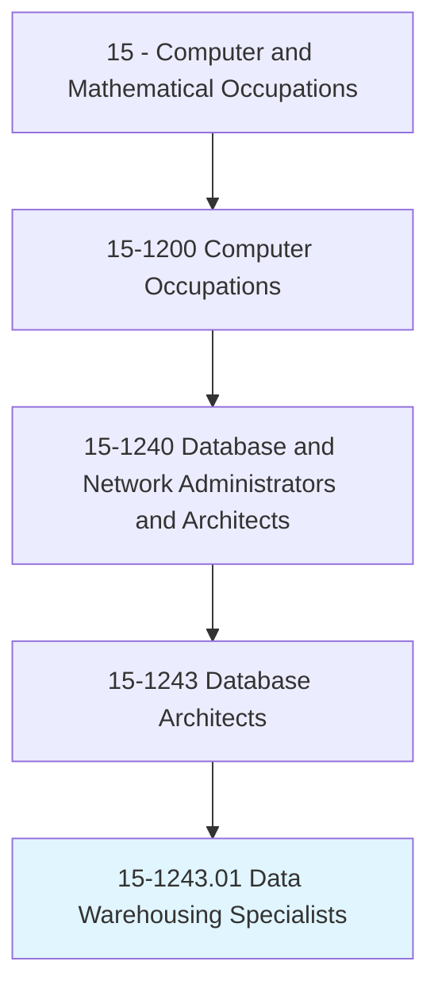
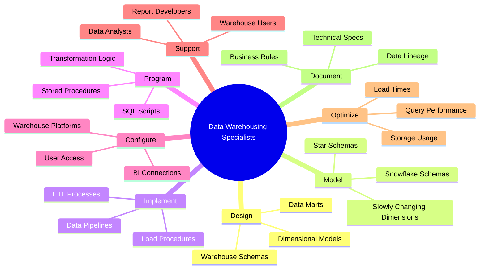
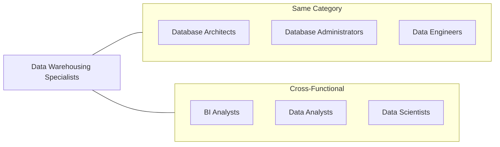
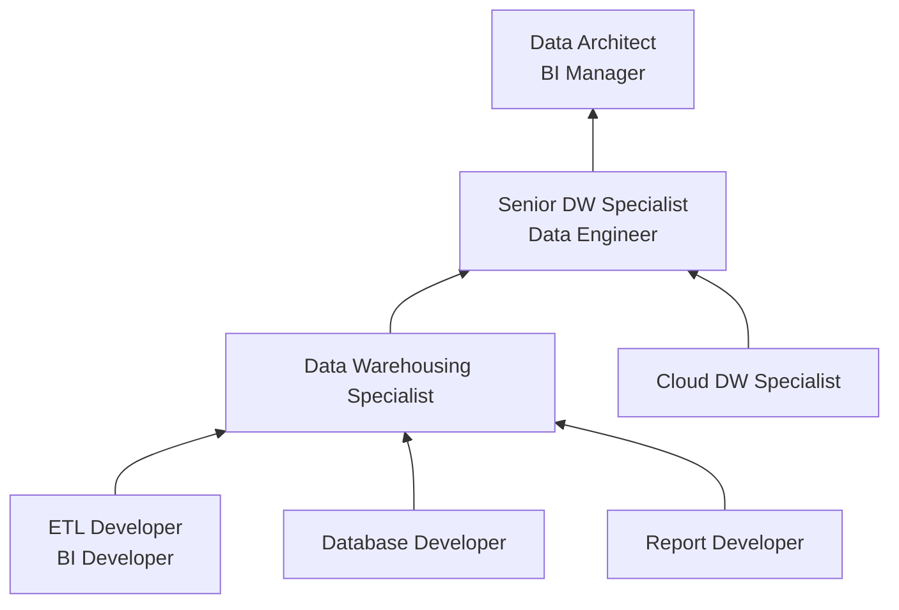

# Data Warehousing Specialists

> Design, model, or implement corporate data warehousing activities. Program and configure warehouses of database information and provide support to warehouse users.

## Overview

Data Warehousing Specialists focus on the design, implementation, and maintenance of data warehouse systems that consolidate organizational data for analysis and reporting. They build ETL (Extract, Transform, Load) processes, create dimensional models, and ensure that business users can access accurate, timely data for decision-making. This role combines database development skills with an understanding of business intelligence requirements, serving as a bridge between raw operational data and actionable business insights.

## Classification Hierarchy

## Key Statistics

| Metric | Value |
|--------|-------|
| SOC Code | 15-1243.01 |
| Job Zone | 4 (Considerable Preparation) |
| Category | [Computer and Mathematical](/occupations/Technology) |
| Core Tasks | 10+ |
| Source | O*NET |

## Core Tasks

### design.DataWarehouses

Data Warehousing Specialists create warehouse architectures and data models.

**Actions:**
- `design.CorporateDataWarehousingActivities.for.Organization` - Plan warehouse initiatives
- `model.DataWarehouseSchemas.for.Analytics` - Create dimensional models
- `design.DataMarts.for.DepartmentalNeeds` - Build focused analytical stores
- `define.BusinessRules.for.DataTransformation` - Specify transformation logic

### implement.ETLProcesses

Data Warehousing Specialists build data integration pipelines.

**Actions:**
- `implement.DataWarehouses.to.consolidate.OrganizationalData` - Deploy warehouse systems
- `program.ETLProcesses.to.extract.SourceData` - Build extraction routines
- `program.ETLProcesses.to.transform.DataQuality` - Implement data cleansing
- `program.ETLProcesses.to.load.WarehouseTables` - Execute load procedures

### configure.Systems

Data Warehousing Specialists set up and maintain warehouse infrastructure.

**Actions:**
- `configure.WarehousesOfDatabaseInformation.for.BusinessUse` - Set up warehouse systems
- `configure.WarehouseConnections.for.BITools` - Enable reporting access
- `program.StoredProcedures.for.DataProcessing` - Create database routines
- `schedule.DataLoads.for.TimelyRefresh` - Automate refresh cycles

### support.Users

Data Warehousing Specialists assist warehouse consumers.

**Actions:**
- `provide.Support.to.WarehouseUsers` - Assist data consumers
- `provide.Support.to.ReportDevelopers` - Help BI developers
- `troubleshoot.DataIssues.for.Users` - Resolve data problems
- `train.Users.on.WarehouseStructure` - Enable self-service analytics

## Tech Stack

### Data Warehouse Platforms
- **Snowflake** - Cloud data platform
- **Amazon Redshift** - AWS data warehouse
- **Google BigQuery** - Serverless analytics
- **Azure Synapse Analytics** - Microsoft cloud warehouse
- **Teradata** - Enterprise data warehouse

### ETL/ELT Tools
- **Informatica PowerCenter** - Enterprise ETL
- **Talend** - Open source integration
- **Apache Airflow** - Workflow orchestration
- **dbt** - Analytics engineering
- **SSIS** - SQL Server Integration Services
- **Fivetran** - Automated pipelines

### Data Modeling
- **Erwin Data Modeler** - Data architecture
- **ER/Studio** - Enterprise modeling
- **SqlDBM** - Cloud modeling
- **LookML** - Semantic modeling
- **dbt Semantic Layer** - Metrics layer

### BI Integration
- **Tableau** - Business intelligence
- **Power BI** - Microsoft analytics
- **Looker** - Data platform
- **Qlik** - Analytics platform
- **MicroStrategy** - Enterprise BI

## Certifications

| Certification | Provider | Level |
|---------------|----------|-------|
| Snowflake SnowPro Core | Snowflake | Professional |
| AWS Certified Data Analytics | Amazon | Specialty |
| Google Professional Data Engineer | Google | Professional |
| Azure Data Engineer Associate | Microsoft | Associate |
| Informatica Developer Specialist | Informatica | Professional |
| dbt Analytics Engineering | dbt Labs | Professional |

## Skills & Competencies

### Technical Skills
- **SQL** - Expert
- **ETL Development** - Expert
- **Dimensional Modeling** - Advanced
- **Data Warehouse Platforms** - Advanced
- **Python/Scripting** - Intermediate
- **Data Quality** - Advanced
- **Performance Tuning** - Advanced

### Soft Skills
- **Analytical Thinking** - Critical
- **Attention to Detail** - Critical
- **Communication** - Essential
- **Problem Solving** - Essential
- **Documentation** - Essential

## Related Occupations

## Industry Variations

### Retail
- Customer transaction warehouses
- Inventory and supply chain data
- Sales and marketing analytics
- E-commerce data integration

### Financial Services
- Regulatory reporting warehouses
- Risk data aggregation
- Customer 360 data stores
- Trading analytics platforms

### Healthcare
- Clinical data warehouses
- Claims and billing analytics
- Quality metrics reporting
- Population health data

### Manufacturing
- Production data warehouses
- Supply chain analytics
- Quality control metrics
- Equipment performance data

## Career Progression

## Education & Training

| Requirement | Details |
|-------------|---------|
| Typical Education | Bachelor's degree in Computer Science, Information Systems, or related field |
| Work Experience | 3-5 years in database development, ETL, or business intelligence |
| On-the-Job Training | Moderate - platform-specific training and BI tool certifications |
| Common Certifications | Snowflake, AWS/Azure/GCP data certifications, dbt |

## Departments

This occupation typically works in:
- [Business Intelligence](/departments/BI)
- [Data Engineering](/departments/DataEngineering)
- [Information Technology](/departments/IT)
- [Analytics](/departments/Analytics)

---

*Source: O*NET 15-1243.01 - ONETOccupation*
