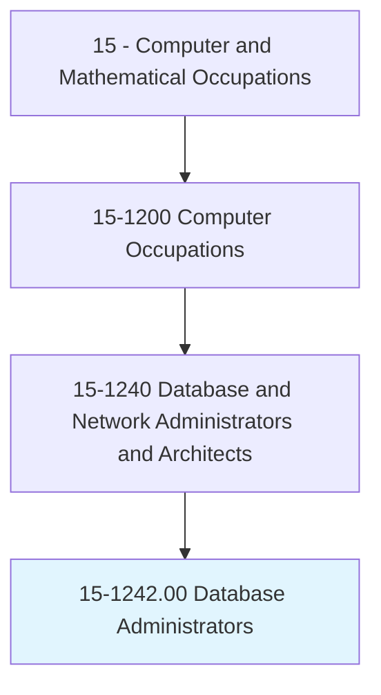
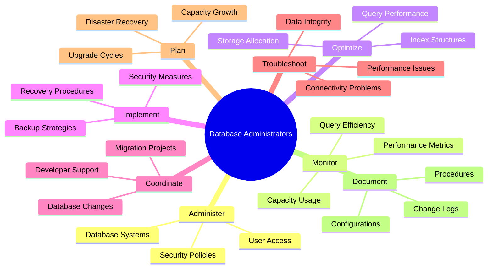
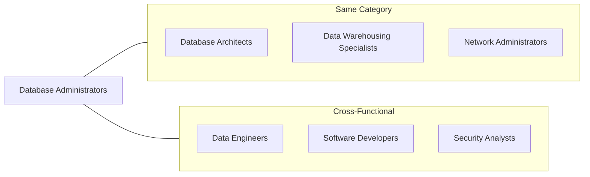
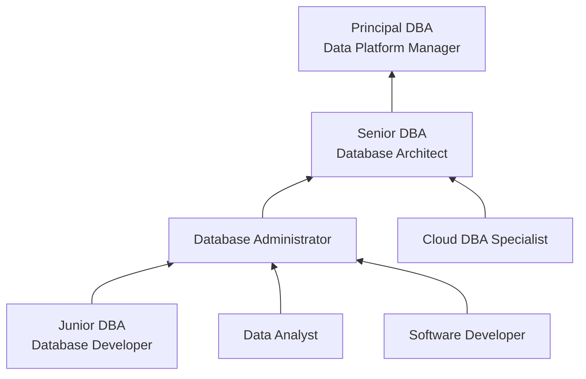

# Database Administrators

> Administer, test, and implement computer databases, applying knowledge of database management systems. Coordinate changes to computer databases. Identify, investigate, and resolve database performance issues, database capacity, and database scalability. May plan, coordinate, and implement security measures to safeguard computer databases.

## Overview

Database Administrators (DBAs) are responsible for the performance, integrity, and security of organizational databases. They ensure that data is available to authorized users while being protected from unauthorized access. DBAs work with database management systems to store, organize, and retrieve data efficiently, implementing backup and recovery strategies to protect against data loss. As organizations increasingly rely on data-driven decision making, DBAs play a crucial role in maintaining the foundation of business intelligence and operations.

## Classification Hierarchy

## Key Statistics

| Metric | Value |
|--------|-------|
| SOC Code | 15-1242.00 |
| Job Zone | 4 (Considerable Preparation) |
| Category | [Computer and Mathematical](/occupations/Technology/index) |
| Core Tasks | 14+ |
| Source | O*NET |

## Core Tasks

### administer.Databases

Database Administrators manage database systems and access controls.

**Actions:**
- `administer.ComputerDatabases.applying.KnowledgeOfDatabaseManagementSystems` - Manage database platforms
- `test.ComputerDatabases.to.verify.Functionality` - Validate database operations
- `implement.ComputerDatabases.for.Applications` - Deploy new database systems
- `coordinate.ChangesToComputerDatabases.with.Teams` - Manage change processes

### monitor.Performance

Database Administrators track and optimize database efficiency.

**Actions:**
- `identify.DatabasePerformanceIssues.to.improve.Efficiency` - Detect performance bottlenecks
- `investigate.DatabasePerformanceIssues.to.determine.Causes` - Analyze slow queries
- `resolve.DatabasePerformanceIssues.to.restore.OptimalOperation` - Fix performance problems
- `monitor.DatabaseCapacity.to.plan.Growth` - Track storage utilization

### implement.Security

Database Administrators protect database assets and ensure compliance.

**Actions:**
- `plan.SecurityMeasures.to.safeguard.ComputerDatabases` - Design security strategies
- `coordinate.SecurityMeasures.with.ITSecurity` - Align with organizational policies
- `implement.SecurityMeasures.to.protect.SensitiveData` - Deploy access controls
- `audit.DatabaseAccess.to.ensure.Compliance` - Monitor security events

### backup.Data

Database Administrators ensure data protection and recovery capabilities.

**Actions:**
- `implement.BackupStrategies.to.protect.Data` - Create backup procedures
- `test.RecoveryProcedures.to.verify.Restoration` - Validate backup integrity
- `plan.DisasterRecovery.for.BusinessContinuity` - Prepare recovery plans
- `restore.Databases.from.Backups` - Execute recovery operations

## Tech Stack

### Relational Database Systems
- **Oracle Database** - Enterprise RDBMS
- **Microsoft SQL Server** - Windows-based RDBMS
- **PostgreSQL** - Open-source RDBMS
- **MySQL** - Popular open-source database
- **IBM Db2** - Enterprise database platform

### NoSQL Databases
- **MongoDB** - Document database
- **Redis** - In-memory data store
- **Cassandra** - Wide-column store
- **Elasticsearch** - Search and analytics
- **DynamoDB** - AWS managed NoSQL

### Cloud Database Services
- **Amazon RDS** - Managed relational databases
- **Azure SQL Database** - Microsoft cloud SQL
- **Google Cloud SQL** - GCP managed databases
- **Snowflake** - Cloud data platform
- **Amazon Aurora** - Cloud-native database

### Administration Tools
- **SQL Server Management Studio** - SSMS
- **Oracle SQL Developer** - Oracle management
- **pgAdmin** - PostgreSQL administration
- **DBeaver** - Universal database tool
- **Redgate SQL Toolbelt** - Database DevOps

### Monitoring & Performance
- **SolarWinds Database Performance Analyzer** - Cross-platform monitoring
- **Oracle Enterprise Manager** - Oracle monitoring
- **Quest Foglight** - Database performance
- **Datadog** - Cloud monitoring
- **New Relic** - Application performance

## Certifications

| Certification | Provider | Level |
|---------------|----------|-------|
| Oracle Database Administrator Certified Professional | Oracle | Professional |
| Microsoft Azure Database Administrator | Microsoft | Associate |
| AWS Certified Database - Specialty | Amazon | Specialty |
| PostgreSQL Administration | EDB | Professional |
| MongoDB DBA Certification | MongoDB | Professional |
| Google Cloud Professional Data Engineer | Google | Professional |

## Skills & Competencies

### Technical Skills
- **SQL** - Expert
- **Database Design** - Expert
- **Performance Tuning** - Advanced
- **Backup & Recovery** - Expert
- **Security Implementation** - Advanced
- **High Availability** - Advanced
- **Scripting (PowerShell, Bash)** - Intermediate

### Soft Skills
- **Attention to Detail** - Critical
- **Problem Solving** - Critical
- **Communication** - Essential
- **Documentation** - Essential
- **Time Management** - Essential

## Related Occupations

## Industry Variations

### Financial Services
- High-transaction volume management
- Regulatory compliance (SOX, PCI-DSS)
- Real-time replication requirements
- Strict audit trail maintenance

### Healthcare
- HIPAA compliance requirements
- Electronic health record databases
- Data integrity critical
- Integration with clinical systems

### E-commerce
- High-availability requirements
- Seasonal scaling challenges
- Product catalog management
- Customer data protection

### Government
- Security clearance requirements
- Legacy system maintenance
- Strict data retention policies
- Multi-agency data sharing

## Career Progression

## Education & Training

| Requirement | Details |
|-------------|---------|
| Typical Education | Bachelor's degree in Computer Science, Information Technology, or related field |
| Work Experience | 2-5 years in database development or administration |
| On-the-Job Training | Moderate - platform-specific training and certifications |
| Common Certifications | Oracle OCP, Microsoft DBA, AWS Database Specialty |

## Departments

This occupation typically works in:
- Database Administration
- [Information Technology](/departments/Technology)
- Data Engineering
- Application Development

---

*Source: O*NET 15-1242.00 - ONETOccupation*
