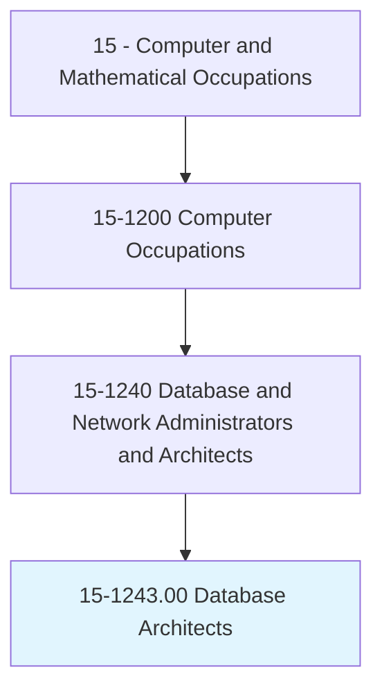
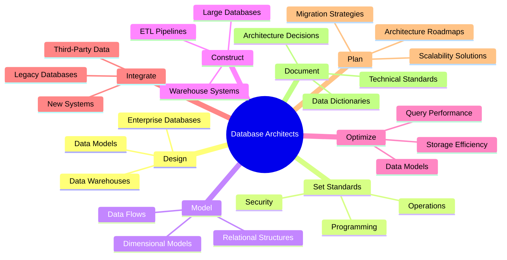
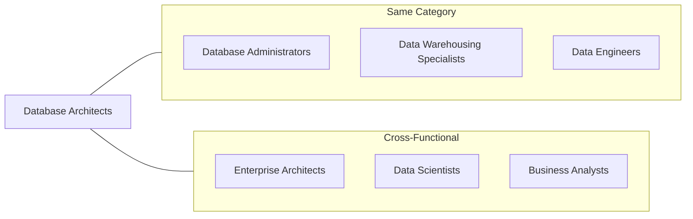
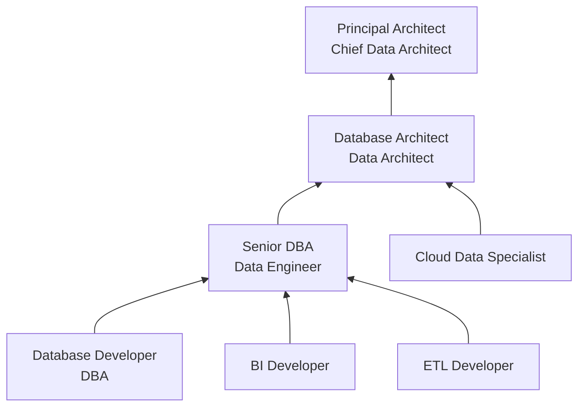

# Database Architects

> Design strategies for enterprise databases, data warehouse systems, and multidimensional networks. Set standards for database operations, programming, query processes, and security. Model, design, and construct large relational databases or data warehouses. Create and optimize data models for warehouse infrastructure and workflow. Integrate new systems with existing warehouse structure and refine system performance and functionality.

## Overview

Database Architects are senior technical professionals who design the overall structure and strategy for enterprise data systems. They create data models, establish standards for database development, and ensure that database infrastructures support current and future business needs. Unlike Database Administrators who focus on day-to-day operations, Database Architects concentrate on strategic planning, system design, and establishing the frameworks within which databases operate. They work at the intersection of business requirements and technical implementation.

## Classification Hierarchy

## Key Statistics

| Metric | Value |
|--------|-------|
| SOC Code | 15-1243.00 |
| Job Zone | 4 (Considerable Preparation) |
| Category | [Computer and Mathematical](/occupations/Technology/index) |
| Core Tasks | 12+ |
| Source | O*NET |

## Core Tasks

### design.EnterpriseStrategies

Database Architects create comprehensive data architecture strategies.

**Actions:**
- `design.Strategies.for.EnterpriseDatabases` - Create enterprise data blueprints
- `design.Strategies.for.DataWarehouseSystems` - Plan analytical data platforms
- `design.Strategies.for.MultidimensionalNetworks` - Architect OLAP solutions
- `plan.DataArchitecture.for.OrganizationalNeeds` - Align architecture with business

### set.Standards

Database Architects establish operational and development standards.

**Actions:**
- `set.Standards.for.DatabaseOperations` - Define operational procedures
- `set.Standards.for.Programming` - Establish coding guidelines
- `set.Standards.for.QueryProcesses` - Standardize query patterns
- `set.Standards.for.Security` - Define security frameworks

### model.DataStructures

Database Architects create and optimize data models.

**Actions:**
- `model.LargeRelationalDatabases.for.Applications` - Design relational schemas
- `design.DataWarehouses.for.Analytics` - Create dimensional models
- `create.DataModels.for.WarehouseInfrastructure` - Build warehouse structures
- `optimize.DataModels.for.Performance` - Refine model efficiency

### integrate.Systems

Database Architects connect new and existing data systems.

**Actions:**
- `integrate.NewSystems.with.ExistingWarehouseStructure` - Connect new data sources
- `refine.SystemPerformance.through.Optimization` - Improve integrated systems
- `refine.SystemFunctionality.to.meet.Requirements` - Enhance system capabilities
- `migrate.LegacySystems.to.ModernPlatforms` - Execute modernization projects

## Tech Stack

### Data Modeling Tools
- **ER/Studio** - Enterprise data modeling
- **Erwin Data Modeler** - Data architecture
- **IBM InfoSphere Data Architect** - Data design
- **Oracle SQL Developer Data Modeler** - Oracle modeling
- **dbdiagram.io** - Lightweight diagramming

### Data Warehouse Platforms
- **Snowflake** - Cloud data warehouse
- **Amazon Redshift** - AWS analytics
- **Google BigQuery** - GCP analytics
- **Azure Synapse Analytics** - Microsoft analytics
- **Teradata** - Enterprise warehouse

### ETL/Data Integration
- **Informatica PowerCenter** - Enterprise ETL
- **Talend** - Data integration
- **Apache Airflow** - Workflow orchestration
- **dbt (data build tool)** - Analytics engineering
- **Fivetran** - Automated data pipelines

### Database Platforms
- **Oracle Exadata** - Engineered systems
- **Microsoft SQL Server** - Enterprise RDBMS
- **PostgreSQL** - Open-source database
- **Apache Hadoop/Hive** - Big data platform
- **Databricks** - Unified analytics

### Architecture Tools
- **Enterprise Architect** - Architecture modeling
- **LucidChart** - Diagramming
- **Confluence** - Documentation
- **Collibra** - Data governance
- **Alation** - Data catalog

## Certifications

| Certification | Provider | Level |
|---------------|----------|-------|
| CDMP (Certified Data Management Professional) | DAMA | Professional |
| AWS Certified Data Analytics | Amazon | Specialty |
| Google Professional Data Engineer | Google | Professional |
| Snowflake SnowPro Core | Snowflake | Professional |
| Oracle Database 19c Administrator | Oracle | Professional |
| TOGAF 9 Certified | The Open Group | Enterprise |

## Skills & Competencies

### Technical Skills
- **Data Modeling** - Expert
- **SQL & Query Optimization** - Expert
- **Data Warehouse Design** - Expert
- **ETL Architecture** - Advanced
- **Cloud Data Platforms** - Advanced
- **Data Governance** - Advanced
- **Performance Engineering** - Advanced

### Soft Skills
- **Strategic Thinking** - Critical
- **Communication** - Critical
- **Stakeholder Management** - Essential
- **Technical Leadership** - Essential
- **Documentation** - Essential

## Related Occupations

## Industry Variations

### Financial Services
- Real-time data processing architectures
- Regulatory data requirements (Basel, MiFID)
- Risk and compliance data marts
- Trading data infrastructure

### Healthcare
- Clinical data warehouses
- HIPAA-compliant data architectures
- Healthcare interoperability (HL7/FHIR)
- Population health analytics platforms

### Retail
- Customer 360 data architectures
- Supply chain data integration
- Real-time inventory systems
- Omnichannel data platforms

### Technology
- Multi-tenant SaaS data architectures
- Big data and streaming platforms
- Machine learning data infrastructure
- Global distributed systems

## Career Progression

## Education & Training

| Requirement | Details |
|-------------|---------|
| Typical Education | Bachelor's or Master's degree in Computer Science, Information Systems, or Data Management |
| Work Experience | 7-10+ years in database development, administration, or data engineering |
| On-the-Job Training | Limited - senior role requires extensive prior experience |
| Common Certifications | CDMP, cloud certifications, TOGAF |

## Departments

This occupation typically works in:
- [Enterprise Architecture](/departments/EnterpriseArchitecture)
- [Data Engineering](/departments/DataEngineering)
- [Information Technology](/departments/IT)
- [Business Intelligence](/departments/BI)

---

*Source: O*NET 15-1243.00 - ONETOccupation*
