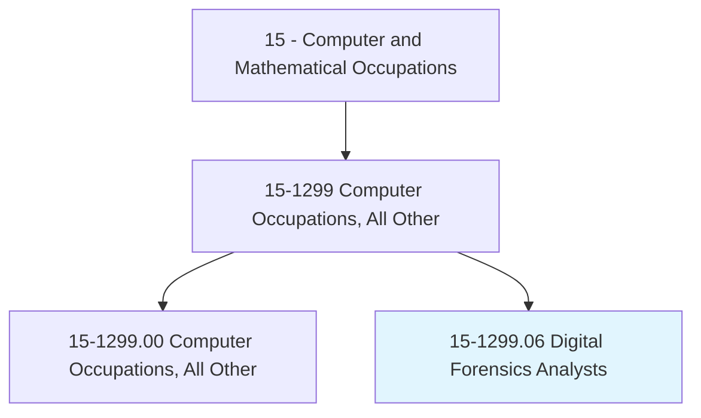
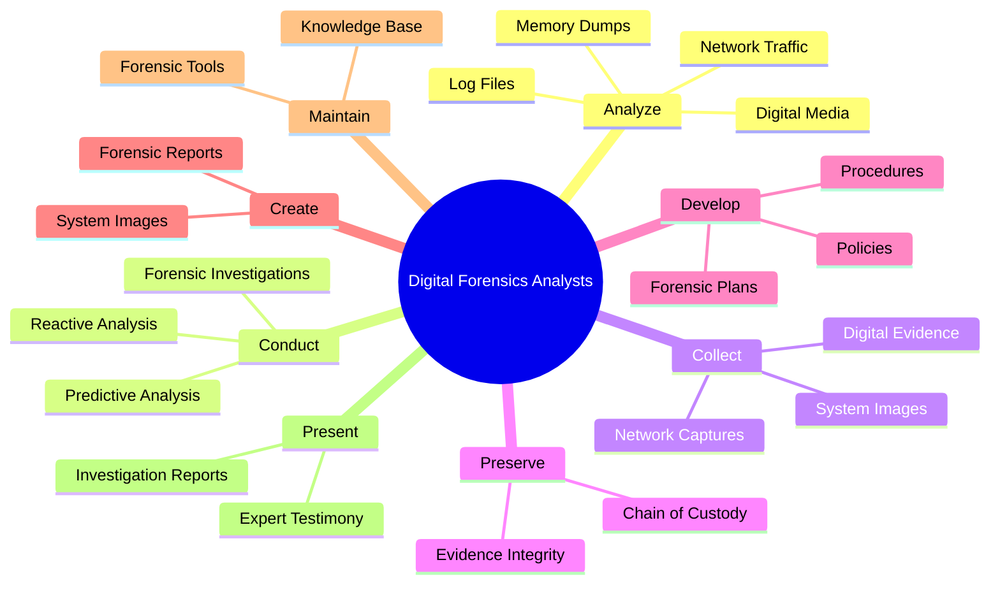
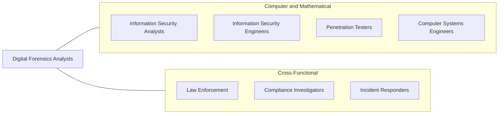
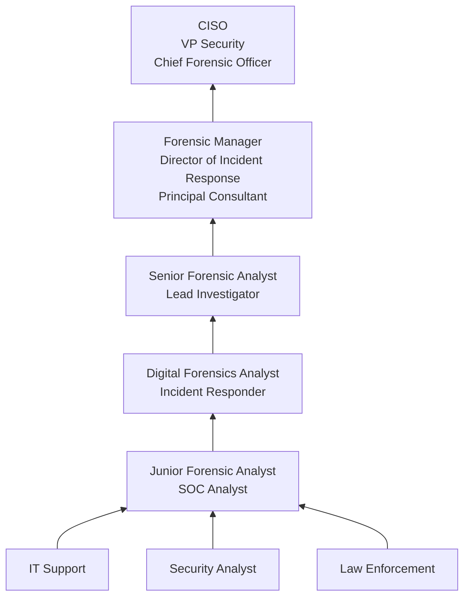

# Digital Forensics Analysts

> Conduct investigations on computer-based crimes establishing documentary or physical evidence, such as digital media and logs associated with cyber intrusion incidents. Analyze digital evidence and investigate computer security incidents to derive information in support of system and network vulnerability mitigation. Preserve and present computer-related evidence in support of criminal, fraud, counterintelligence, or law enforcement investigations.

## Overview

Digital Forensics Analysts investigate cyber crimes, security incidents, and data breaches by collecting, preserving, and analyzing digital evidence from computers, networks, mobile devices, and cloud systems. They apply specialized forensic techniques to recover deleted files, trace network intrusions, identify perpetrators, and reconstruct timelines of malicious activity. Their work supports criminal prosecutions, civil litigation, regulatory investigations, and internal corporate inquiries.

The role requires a unique combination of technical expertise in computer systems, networks, and storage media with an understanding of legal requirements for evidence handling. Digital forensics analysts must follow strict chain-of-custody procedures to ensure that evidence is admissible in court. They create forensic images of storage devices, analyze memory dumps, examine log files, and use specialized tools to uncover hidden or encrypted data.

As cyber attacks grow in sophistication and frequency, digital forensics has become essential to both reactive incident response and proactive threat hunting. Modern forensic analysts work with cloud environments, mobile devices, IoT systems, and encrypted communications, requiring continuous skill development to keep pace with evolving technologies and attack techniques.

## Classification Hierarchy

## Key Statistics

| Metric | Value |
|--------|-------|
| SOC Code | 15-1299.06 |
| Job Zone | 4 (Considerable Preparation) |
| Category | [Computer and Mathematical](/occupations/Technology/index) |
| Task Count | 57 |
| Median Salary | $98,740 |
| Employment | ~19,500 |
| Growth Rate | Much Faster Than Average (33%) |
| Source | O*NET |

## Core Tasks

### analyze.DigitalEvidence

Digital Forensics Analysts examine digital artifacts to reconstruct events and identify perpetrators.

**Actions:**
- `analyze.LogFiles.to.identify.PerpetratorsOfNetworkIntrusions`
- `analyze.DigitalMedia.to.recover.DeletedEvidence`
- `analyze.MemoryDumps.to.identify.MaliciousProcesses`
- `analyze.NetworkTraffic.to.trace.IntrusionPaths`

### conduct.ForensicInvestigations

Digital Forensics Analysts perform comprehensive investigations of cyber incidents.

**Actions:**
- `conduct.PredictiveAnalyses.to.support.CyberSecurityInitiatives`
- `conduct.ReactiveAnalyses.on.SecurityIncidents`
- `conduct.MalwareAnalysis.to.understand.AttackVectors`
- `conduct.IncidentResponse.to.contain.ActiveThreats`

### preserve.EvidenceIntegrity

Digital Forensics Analysts maintain the integrity and admissibility of digital evidence.

**Actions:**
- `preserve.DigitalEvidence.using.ForensicImaging`
- `adhere.ChainOfCustodyProcedures.for.LegalAdmissibility`
- `create.SystemImages.for.ForensicExamination`
- `document.EvidenceHandling.for.CourtProceedings`

### develop.ForensicPolicies

Digital Forensics Analysts develop organizational forensic capabilities and procedures.

**Actions:**
- `develop.ForensicPlans.for.IncidentResponse`
- `develop.Policies.for.DigitalEvidenceHandling`
- `develop.Procedures.for.ForensicAnalysis`
- `maintain.ForensicToolkit.with.CurrentCapabilities`

## Tech Stack

### Forensic Tools
- **EnCase** - Disk and file forensics
- **FTK (Forensic Toolkit)** - Digital forensics
- **Autopsy/Sleuth Kit** - Open-source forensics
- **Cellebrite** - Mobile device forensics
- **X-Ways** - Disk forensics
- **Magnet AXIOM** - Multi-platform forensics

### Network Forensics
- **Wireshark** - Network packet analysis
- **NetworkMiner** - Network forensic analysis
- **Zeek (Bro)** - Network monitoring
- **tcpdump** - Packet capture
- **Moloch/Arkime** - Full packet capture

### Memory & Malware Analysis
- **Volatility** - Memory forensics
- **IDA Pro** - Disassembler
- **Ghidra** - Reverse engineering (NSA)
- **YARA** - Malware pattern matching
- **Cuckoo Sandbox** - Malware analysis
- **REMnux** - Malware analysis distribution

### Incident Response
- **SIEM (Splunk/QRadar/Elastic)** - Log analysis
- **CrowdStrike/Carbon Black** - EDR platforms
- **TheHive** - Incident response platform
- **MISP** - Threat intelligence sharing
- **Cortex XSOAR** - Security orchestration

### Operating Systems
- **Kali Linux** - Security/forensic distribution
- **SANS SIFT** - Forensic workstation
- **Windows/Linux/macOS** - Target systems
- **REMnux** - Malware analysis

## Certifications

| Certification | Provider | Level |
|---------------|----------|-------|
| GIAC Certified Forensic Analyst (GCFA) | SANS/GIAC | Professional |
| GIAC Certified Forensic Examiner (GCFE) | SANS/GIAC | Professional |
| EnCase Certified Examiner (EnCE) | OpenText | Professional |
| Certified Computer Forensics Examiner (CCFE) | IACRB | Professional |
| Certified Forensic Computer Examiner (CFCE) | IACIS | Professional |
| CISSP | ISC2 | Professional |
| CompTIA CySA+ | CompTIA | Intermediate |

## Skills & Competencies

### Technical Skills
- **Disk Forensics** - Expert
- **Network Forensics** - Expert
- **Memory Forensics** - Advanced
- **Malware Analysis** - Advanced
- **Incident Response** - Expert
- **Operating Systems Internals** - Expert
- **File Systems (NTFS/ext/APFS)** - Expert
- **Evidence Handling** - Expert
- **Scripting (Python/PowerShell)** - Advanced
- **Cloud Forensics** - Advanced

### Soft Skills
- **Attention to Detail** - Critical
- **Analytical Thinking** - Critical
- **Written Communication** - Critical (reports for legal proceedings)
- **Integrity** - Critical (evidence handling)
- **Presentation Skills** - Essential (expert testimony)
- **Persistence** - Important

## Related Occupations

- [Information Security Analysts](/occupations/Technology/InformationSecurityAnalysts)
- [Information Security Engineers](/occupations/Technology/InformationSecurityEngineers)
- [Penetration Testers](/occupations/Technology/PenetrationTesters)

## Industry Variations

### Law Enforcement / Government
- Criminal investigation support
- National security / counterintelligence
- Child exploitation cases
- Terrorism and organized crime

### Corporate / Enterprise
- Insider threat investigations
- Data breach response
- Intellectual property theft
- HR/legal investigations

### Consulting / Forensic Firms
- Multi-client case work
- Expert witness services
- Litigation support
- eDiscovery

### Financial Services
- Fraud investigation
- Regulatory compliance
- Trading anomaly investigation
- Anti-money laundering forensics

### Healthcare
- HIPAA breach investigation
- Medical device forensics
- Patient data exposure analysis
- Compliance auditing

## Career Progression

## Education & Training

| Requirement | Details |
|-------------|---------|
| Typical Education | Bachelor's in Cybersecurity, Computer Science, Criminal Justice, or related field |
| Alternative Paths | Law enforcement background + technical certifications |
| Work Experience | 2-4 years in IT/security for entry; 5+ years for senior |
| Key Knowledge Areas | File systems, operating system internals, networking, evidence law |
| Continuing Education | SANS courses, GIAC certifications, conference attendance |

## Departments

This occupation typically works in:
- [Information Security](/departments/Security)
- Incident Response
- [Legal / Compliance](/departments/Legal)
- Internal Audit
- Law Enforcement

---

*Source: O*NET 15-1299.06 - ONETOccupation*
