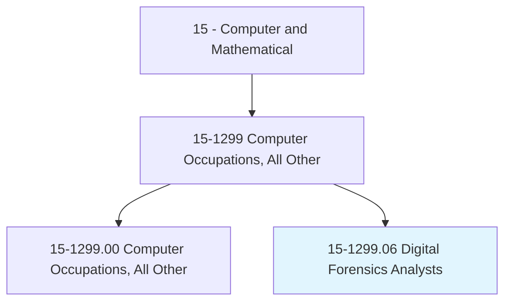
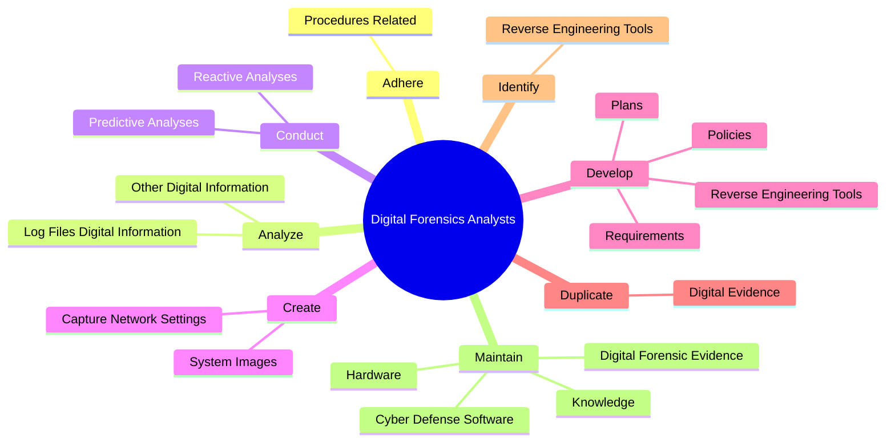
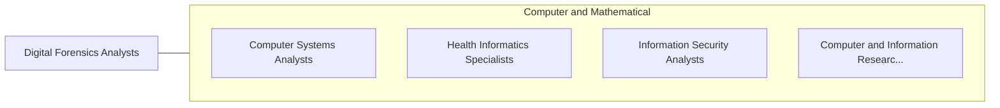

# Digital Forensics Analysts

> Conduct investigations on computer-based crimes establishing documentary or physical evidence, such as digital media and logs associated with cyber intrusion incidents. Analyze digital evidence and investigate computer security incidents to derive information in support of system and network vulnerability mitigation. Preserve and present computer-related evidence in support of criminal, fraud, counterintelligence, or law enforcement investigations.

## Overview

Digital Forensics Analysts is a specialized variant within the Computer and Mathematical category. Conduct investigations on computer-based crimes establishing documentary or physical evidence, such as digital media and logs associated with cyber intrusion incidents. Analyze digital evidence and investigate computer security incidents to derive information in support of system and network vulnerability mitigation.

## Classification Hierarchy

## Key Statistics

| Metric | Value |
|--------|-------|
| SOC Code | 15-1299.06 |
| Category | [Computer and Mathematical](/occupations/Technology/index) |
| Task Count | 57 |
| Source | O*NET |

## Core Tasks

### adhere.ProceduresRelated

Digital Forensics Analysts adhere procedures related as part of their core responsibilities.

**Actions:**
- `adhere.ProceduresRelated.to.HandlingDigitalMedia`

### analyze.LogFilesDigitalInformation

Digital Forensics Analysts analyze log files digital information as part of their core responsibilities.

**Actions:**
- `analyze.LogFilesDigitalInformation.to.identify.PerpetratorsOfNetworkIntrusions`
- `analyze.OtherDigitalInformation.to.identify.PerpetratorsOfNetworkIntrusions`

### conduct.PredictiveAnalyses

Digital Forensics Analysts conduct predictive analyses as part of their core responsibilities.

**Actions:**
- `conduct.PredictiveAnalyses.on.SecurityMeasures.to.support.CyberSecurityInitiatives`
- `conduct.ReactiveAnalyses.on.SecurityMeasures.to.support.CyberSecurityInitiatives`

## Skills & Competencies

### Technical Skills
- **Programming** - Advanced
- **Systems Analysis** - Advanced
- **Database Management** - Advanced

### Soft Skills
- **Communication** - Essential
- **Problem Solving** - Essential
- **Critical Thinking** - Important
- **Teamwork** - Important
- **Adaptability** - Important

## Related Occupations

## Industries

This occupation is found across multiple industries. See [Industries](/industries) for sector-specific employment data.

## Career Progression

---

*Source: O*NET 15-1299.06 - ONETOccupation*
