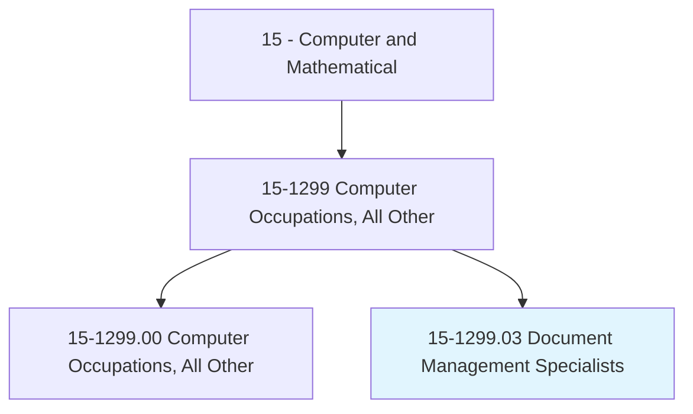
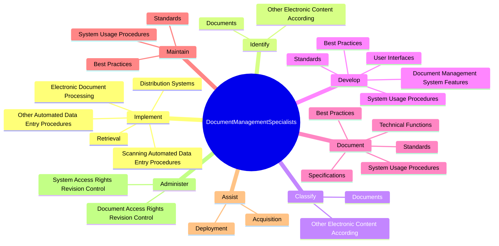
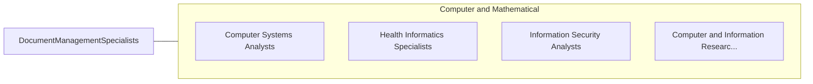

# Document Management Specialists

> Implement and administer enterprise-wide document management systems and related procedures that allow organizations to capture, store, retrieve, share, and destroy electronic records and documents.

## Overview

Document Management Specialists is classified under Computer and Mathematical (SOC 15). Implement and administer enterprise-wide document management systems and related procedures that allow organizations to capture, store, retrieve, share, and destroy electronic records and documents.

## Classification Hierarchy

## Key Statistics

| Metric | Value |
|--------|-------|
| SOC Code | 15-1299.03 |
| Category | [Computer and Mathematical](/occupations/Technology/index) |
| Task Count | 83 |
| Source | O*NET |

## Core Tasks

### implement.ElectronicDocumentProcessing

Document Management Specialists implement electronic document processing as part of their core responsibilities.

**Actions:**
- `implement.ElectronicDocumentProcessing.in.Collaboration.with.OtherInformationTechnologySpecialists`
- `implement.Retrieval.in.Collaboration.with.OtherInformationTechnologySpecialists`
- `implement.DistributionSystems.in.Collaboration.with.OtherInformationTechnologySpecialists`
- `implement.ScanningAutomatedDataEntryProcedures`

### identify.Documents

Document Management Specialists identify documents as part of their core responsibilities.

**Actions:**
- `identify.Documents.to.Characteristics`
- `identify.Documents.to.SecurityLevel`
- `identify.Documents.to.Function`
- `identify.Documents.to.Metadata`

### classify.Documents

Document Management Specialists classify documents as part of their core responsibilities.

**Actions:**
- `classify.Documents.to.Characteristics`
- `classify.Documents.to.SecurityLevel`
- `classify.Documents.to.Function`
- `classify.Documents.to.Metadata`

## Skills & Competencies

### Technical Skills
- **Programming** - Advanced
- **Systems Analysis** - Advanced
- **Database Management** - Advanced

### Soft Skills
- **Communication** - Essential
- **Problem Solving** - Essential
- **Critical Thinking** - Important
- **Teamwork** - Important
- **Adaptability** - Important

## Related Occupations

## Industries

This occupation is found across multiple industries. See [Industries](/industries) for sector-specific employment data.

## Career Progression

---

*Source: O*NET 15-1299.03 - ONETOccupation*
