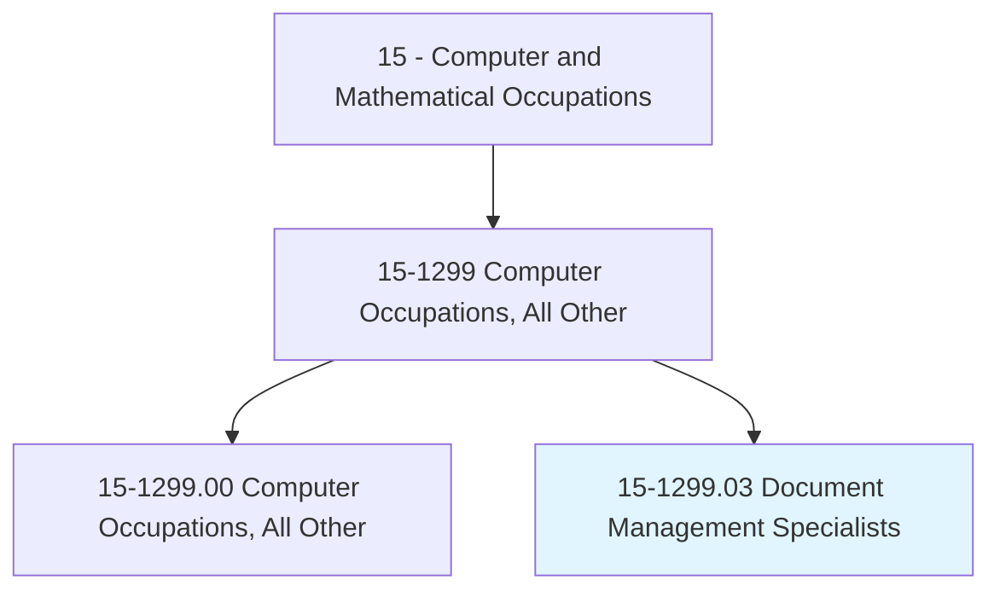
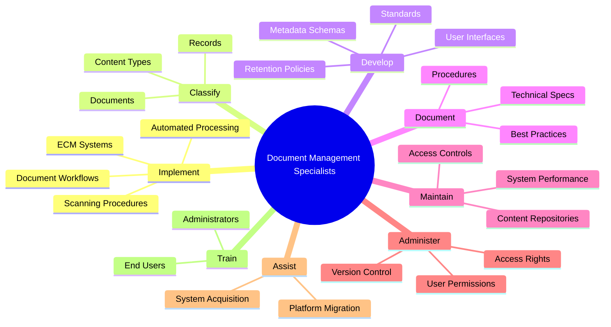
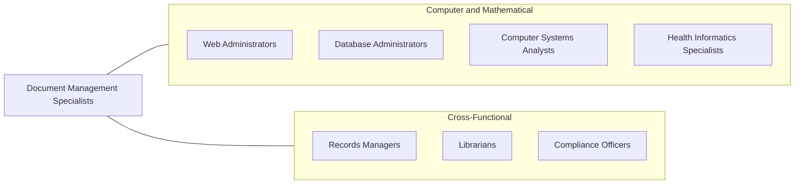
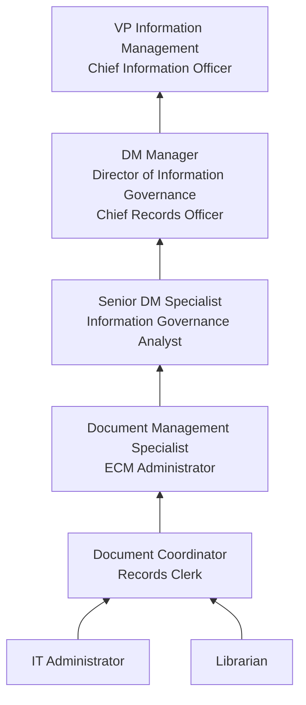

# Document Management Specialists

> Implement and administer enterprise-wide document management systems and related procedures that allow organizations to capture, store, retrieve, share, and destroy electronic records and documents.

## Overview

Document Management Specialists design, implement, and maintain enterprise-wide systems that control the lifecycle of organizational documents and records. They ensure that organizations can efficiently capture, store, retrieve, share, and securely dispose of electronic records and documents in compliance with legal, regulatory, and business requirements. Their work spans content management, records retention, information governance, and digital transformation.

In an era of increasing regulatory scrutiny and information overload, document management specialists play a vital role in helping organizations maintain control over their information assets. They develop taxonomies and metadata schemas that make documents searchable, implement access controls and security classifications, and ensure retention schedules comply with industry regulations (HIPAA, SOX, GDPR, financial regulations). They often lead digital transformation initiatives to convert paper-based processes to electronic workflows.

The field has evolved significantly with the shift to cloud-based content platforms, AI-powered document classification, and intelligent automation. Modern document management specialists work with ECM (Enterprise Content Management) platforms, robotic process automation, and machine learning tools to automate document processing, improve search capabilities, and reduce the cost and risk of managing organizational information.

## Classification Hierarchy

## Key Statistics

| Metric | Value |
|--------|-------|
| SOC Code | 15-1299.03 |
| Job Zone | 4 (Considerable Preparation) |
| Category | [Computer and Mathematical](/occupations/Technology/index) |
| Task Count | 83 |
| Median Salary | $75,890 |
| Employment | ~20,000 |
| Growth Rate | Average |
| Source | O*NET |

## Core Tasks

### implement.DocumentSystems

Document Management Specialists deploy and configure enterprise content management systems.

**Actions:**
- `implement.ElectronicDocumentProcessing.with.ITSpecialists`
- `implement.DocumentWorkflows.for.BusinessProcesses`
- `implement.ScanningProcedures.for.PaperDigitization`
- `implement.AutomatedClassification.using.AITools`

### classify.Documents

Document Management Specialists organize content using taxonomies and metadata.

**Actions:**
- `classify.Documents.by.ContentType`
- `classify.Documents.by.SecurityLevel`
- `classify.Documents.by.RetentionRequirements`
- `classify.Records.by.RegulatoryCategory`

### develop.InformationGovernance

Document Management Specialists create standards and policies for information management.

**Actions:**
- `develop.RetentionPolicies.for.RegulatoryCompliance`
- `develop.MetadataSchemas.for.DocumentDiscovery`
- `develop.NamingConventions.for.ContentOrganization`
- `develop.SecurityClassifications.for.AccessControl`

### administer.AccessControls

Document Management Specialists manage permissions and version control across document systems.

**Actions:**
- `administer.DocumentAccessRights.for.InformationSecurity`
- `administer.VersionControl.for.DocumentIntegrity`
- `administer.UserPermissions.based.on.RoleRequirements`
- `maintain.AuditTrails.for.ComplianceReporting`

## Tech Stack

### ECM / Content Platforms
- **SharePoint** - Microsoft content management
- **OpenText** - Enterprise content management
- **Hyland OnBase** - Content services
- **Box** - Cloud content management
- **Documentum** - Enterprise content platform
- **Alfresco** - Open-source ECM
- **M-Files** - Metadata-driven DMS

### Records Management
- **Iron Mountain** - Records management services
- **Veritas** - Information governance
- **Micro Focus Content Manager** - Records management
- **RecordPoint** - Cloud records management

### Workflow & Automation
- **Microsoft Power Automate** - Workflow automation
- **Nintex** - Process automation
- **UiPath** - Robotic process automation
- **ABBYY** - Document AI and OCR
- **Kofax** - Intelligent automation

### Search & Analytics
- **Elasticsearch** - Enterprise search
- **Microsoft Search** - Unified search
- **Sinequa** - AI-powered search
- **Coveo** - Intelligent search

### Standards & Compliance
- **ISO 15489** - Records management standard
- **ARMA International Standards** - Information governance
- **eDiscovery Tools** - Legal discovery
- **DLP Tools** - Data loss prevention

## Certifications

| Certification | Provider | Level |
|---------------|----------|-------|
| Certified Records Manager (CRM) | ICRM | Professional |
| Certified Information Professional (CIP) | AIIM | Professional |
| Information Governance Professional (IGP) | ARMA | Professional |
| SharePoint Administrator | Microsoft | Associate |
| Certified Document Imaging Architect (CDIA+) | CompTIA | Professional |

## Skills & Competencies

### Technical Skills
- **ECM Platform Administration** - Expert
- **Records Management** - Expert
- **Metadata & Taxonomy Design** - Expert
- **Workflow Automation** - Advanced
- **Database Management** - Advanced
- **Information Security** - Advanced
- **OCR/Document Capture** - Advanced
- **Compliance & Regulatory Knowledge** - Advanced
- **Search Configuration** - Advanced

### Soft Skills
- **Organizational Skills** - Critical
- **Attention to Detail** - Critical
- **Communication** - Essential (training users, writing policies)
- **Analytical Thinking** - Essential
- **Project Management** - Important
- **Change Management** - Important

## Related Occupations

- [Web Administrators](/occupations/Technology/WebAdministrators)
- [Database Administrators](/occupations/Technology/DatabaseAdministrators)
- [Health Informatics Specialists](/occupations/Technology/HealthInformaticsSpecialists)

## Industry Variations

### Legal
- eDiscovery and litigation hold
- Case document management
- Client confidentiality controls
- Retention compliance

### Healthcare
- Medical records management
- HIPAA-compliant document handling
- Clinical document workflows
- Patient consent management

### Financial Services
- Regulatory document retention (SEC, FINRA)
- Audit trail maintenance
- Client document management
- SOX compliance

### Government
- FOIA request processing
- Classified document management
- Public records administration
- NARA compliance

### Manufacturing
- Quality documentation (ISO 9001)
- Engineering change management
- Standard operating procedures
- Regulatory submissions (FDA, EPA)

## Career Progression

## Education & Training

| Requirement | Details |
|-------------|---------|
| Typical Education | Bachelor's in Information Science, Library Science, Computer Science, or related field |
| Alternative Paths | IT background with records management training |
| Work Experience | 0-2 years entry, 3-5 years mid, 7+ years senior |
| Key Knowledge Areas | Records management, information governance, ECM platforms, regulatory compliance |
| Continuing Education | AIIM/ARMA conferences, platform-specific training |

## Departments

This occupation typically works in:
- Information Management
- [Information Technology](/departments/Technology)
- [Legal / Compliance](/departments/Legal)
- Records Management
- [Operations](/departments/Operations)

---

*Source: O*NET 15-1299.03 - ONETOccupation*
