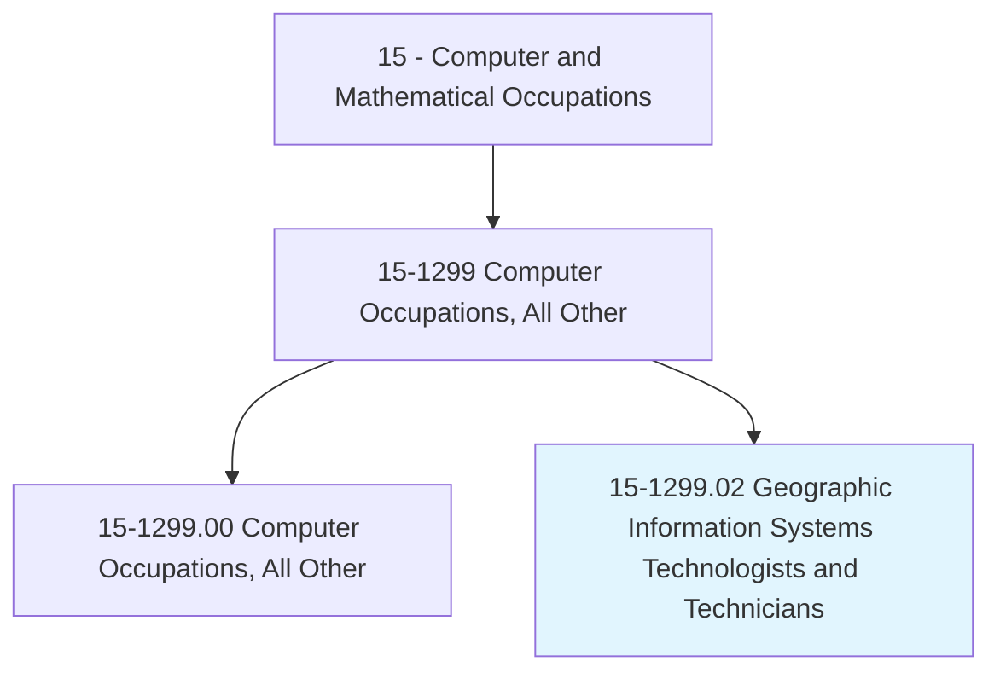
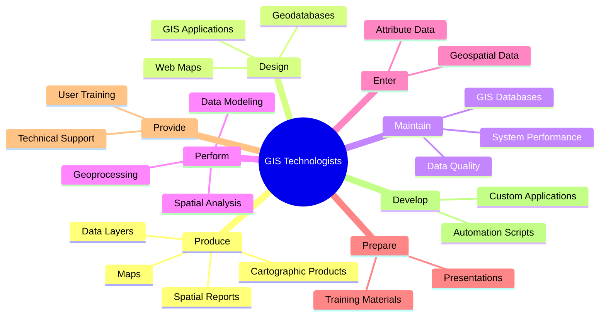
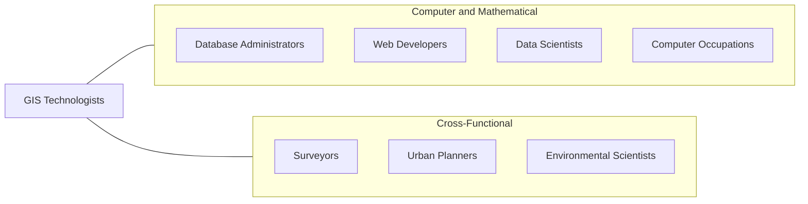
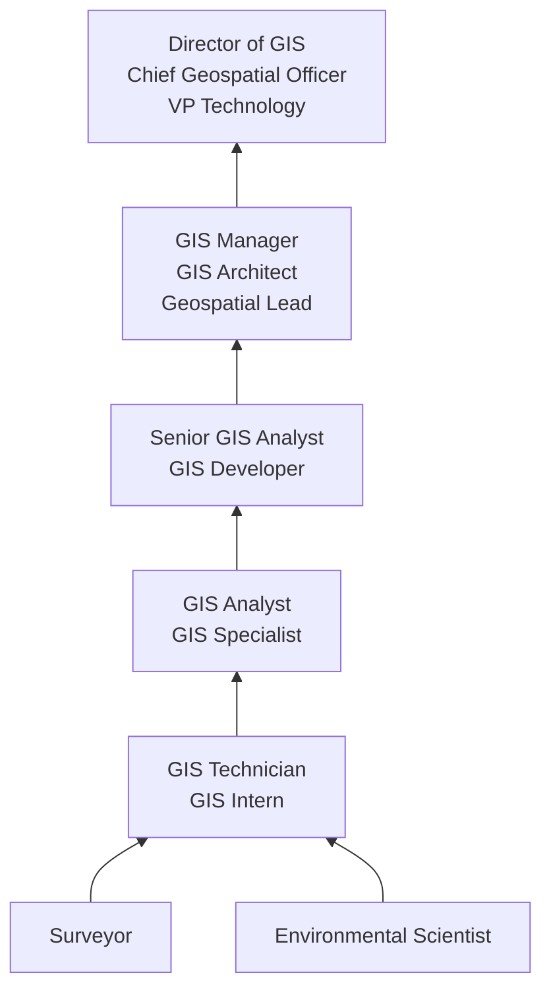

# Geographic Information Systems Technologists and Technicians

> Assist scientists or related professionals in building, maintaining, modifying, or using geographic information systems (GIS) databases. May also perform some custom application development or provide user support.

## Overview

GIS Technologists and Technicians build, maintain, and analyze geographic information systems that capture, store, manipulate, and visualize spatial data. They create maps, perform spatial analyses, and develop GIS applications that help organizations make location-informed decisions in areas such as urban planning, environmental management, transportation, utilities, emergency response, and real estate.

GIS professionals work with a combination of geospatial data (satellite imagery, GPS coordinates, LiDAR point clouds, aerial photography) and attribute data (demographics, environmental measurements, infrastructure records) to create layered maps and perform spatial analyses. They may build web mapping applications, automate geoprocessing workflows, design geodatabases, and produce cartographic products for diverse audiences ranging from city planners to emergency responders.

The field has been transformed by cloud-based GIS platforms, real-time data streams, machine learning for feature extraction, and the proliferation of location-enabled devices. Modern GIS professionals increasingly work with big geospatial data, drone-captured imagery, 3D modeling, and location analytics that integrate with broader enterprise data ecosystems.

## Classification Hierarchy

## Key Statistics

| Metric | Value |
|--------|-------|
| SOC Code | 15-1299.02 |
| Job Zone | 4 (Considerable Preparation) |
| Category | [Computer and Mathematical](/occupations/Technology/index) |
| Task Count | 165 |
| Median Salary | $74,160 |
| Employment | ~31,000 |
| Growth Rate | Average |
| Source | O*NET |

## Core Tasks

### produce.Maps

GIS Technologists create maps, data layers, and spatial reports using analytical procedures.

**Actions:**
- `produce.DataLayers.using.SpatialAnalysisProcedures`
- `produce.Maps.for.DecisionSupport`
- `produce.CartographicProducts.for.Publication`
- `produce.Reports.from.SpatialAnalysis`

### design.GISApplications

GIS Technologists design and build GIS solutions and web mapping applications.

**Actions:**
- `design.GISApplications.for.OrganizationalNeeds`
- `design.WebMappingSolutions.for.PublicAccess`
- `design.Geodatabases.for.SpatialDataStorage`
- `design.DataModels.for.SpatialAnalysis`

### perform.SpatialAnalysis

GIS Technologists conduct spatial analyses to support planning and decision-making.

**Actions:**
- `perform.SpatialAnalysis.for.UrbanPlanning`
- `perform.GeospatialDataModeling.for.EnvironmentalAssessment`
- `perform.NetworkAnalysis.for.TransportationPlanning`
- `perform.SuitabilityAnalysis.for.SiteSelection`

### maintain.GISDatabases

GIS Technologists manage and maintain geographic data and systems.

**Actions:**
- `maintain.ExistingGIS.for.DataAccuracy`
- `modify.GISDatabases.to.incorporate.NewData`
- `enter.Data.using.CoordinateGeometry`
- `validate.Data.to.ensure.SpatialIntegrity`

## Tech Stack

### GIS Software
- **ArcGIS Pro** - Desktop GIS (Esri)
- **ArcGIS Online** - Cloud GIS platform
- **QGIS** - Open-source desktop GIS
- **MapInfo** - Desktop GIS
- **Google Earth Engine** - Cloud geospatial analysis
- **GRASS GIS** - Open-source analysis

### Web GIS & Mapping
- **ArcGIS JavaScript API** - Web mapping
- **Leaflet** - Open-source web maps
- **Mapbox** - Map platform
- **OpenLayers** - Open-source web mapping
- **GeoServer** - Open-source map server
- **PostGIS** - Spatial database

### Remote Sensing
- **ERDAS IMAGINE** - Image analysis
- **ENVI** - Remote sensing analysis
- **Google Earth Engine** - Satellite analysis
- **Pix4D** - Drone mapping
- **DroneDeploy** - Drone data processing

### Programming & Data
- **Python (ArcPy/GeoPandas)** - GIS scripting
- **R (sf/terra)** - Spatial statistics
- **SQL/PostGIS** - Spatial queries
- **JavaScript** - Web mapping
- **FME** - Data transformation

### Data Collection
- **Trimble GPS** - Survey-grade GPS
- **Collector/Field Maps** - Mobile data collection
- **Survey123** - Form-based collection
- **LiDAR Processing** - Point cloud analysis

## Certifications

| Certification | Provider | Level |
|---------------|----------|-------|
| GISP (GIS Professional) | GISCI | Professional |
| Esri Technical Certification (Desktop) | Esri | Associate/Professional |
| Esri Technical Certification (Developer) | Esri | Associate/Professional |
| CompTIA GIS+ | CompTIA | Foundation |
| ASPRS Certification (Photogrammetry) | ASPRS | Professional |

## Skills & Competencies

### Technical Skills
- **GIS Software (ArcGIS/QGIS)** - Expert
- **Spatial Analysis** - Expert
- **Cartography** - Expert
- **Geodatabase Design** - Advanced
- **Python/GIS Scripting** - Advanced
- **Remote Sensing** - Advanced
- **Web GIS Development** - Advanced
- **GPS/Survey Technology** - Advanced
- **SQL/Spatial Databases** - Advanced

### Soft Skills
- **Spatial Thinking** - Critical
- **Attention to Detail** - Critical
- **Communication** - Essential (visual and written)
- **Problem Solving** - Essential
- **Collaboration** - Important
- **Project Management** - Important

## Related Occupations

- [Database Administrators](/occupations/Technology/DatabaseAdministrators)
- [Web Developers](/occupations/Technology/WebDevelopers)
- [Data Scientists](/occupations/Technology/DataScientists)

## Industry Variations

### Government / Municipal
- Land use planning and zoning
- Tax parcel management
- Infrastructure asset management
- Emergency management and 911

### Environmental / Conservation
- Habitat mapping and monitoring
- Environmental impact assessment
- Climate change analysis
- Natural resource management

### Utilities
- Asset management (electric, gas, water, telecom)
- Network analysis and routing
- Outage management
- Capital planning

### Transportation
- Road network analysis
- Transit planning
- Traffic analysis
- Autonomous vehicle mapping

### Real Estate / Development
- Site selection analysis
- Market area analysis
- Property mapping
- Development impact analysis

## Career Progression

## Education & Training

| Requirement | Details |
|-------------|---------|
| Typical Education | Bachelor's in Geography, GIS, Environmental Science, Computer Science, or related field |
| Alternative Paths | Certificate programs in GIS, Esri certifications |
| Work Experience | 0-2 years entry, 3-5 years mid, 7+ years senior |
| Key Knowledge Areas | Spatial analysis, cartography, geodatabase design, remote sensing, programming |
| Continuing Education | Esri User Conference, URISA GIS-Pro, GISP maintenance |

## Departments

This occupation typically works in:
- [GIS / Geospatial](/departments/GIS)
- [Planning & Development](/departments/Planning)
- [Engineering](/departments/Engineering)
- [Environmental Services](/departments/Environmental)
- [Information Technology](/departments/IT)

---

*Source: O*NET 15-1299.02 - ONETOccupation*
