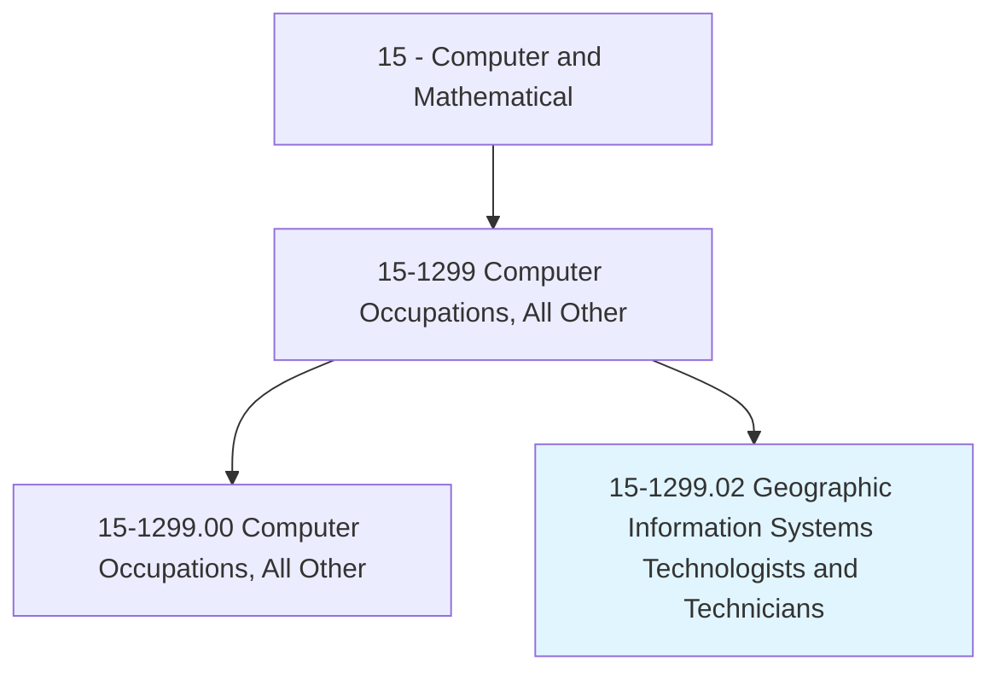
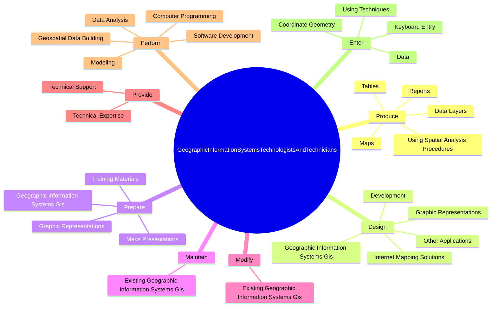
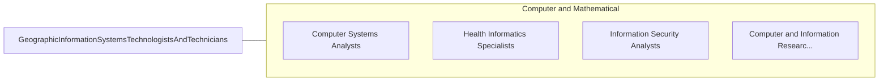

# Geographic Information Systems Technologists and Technicians

> Assist scientists or related professionals in building, maintaining, modifying, or using geographic information systems (GIS) databases. May also perform some custom application development or provide user support.

## Overview

Geographic Information Systems Technologists and Technicians is a specialized variant within the Computer and Mathematical category. Assist scientists or related professionals in building, maintaining, modifying, or using geographic information systems (GIS) databases. 

## Classification Hierarchy

## Key Statistics

| Metric | Value |
|--------|-------|
| SOC Code | 15-1299.02 |
| Category | [Computer and Mathematical](/occupations/Technology) |
| Task Count | 165 |
| Source | O*NET |

## Core Tasks

### produce.DataLayers

Geographic Information Systems Technologists and Technicians produce data layers as part of their core responsibilities.

**Actions:**
- `produce.DataLayers`
- `produce.Maps`
- `produce.Tables`
- `produce.Reports`

### design.GraphicRepresentations

Geographic Information Systems Technologists and Technicians design graphic representations as part of their core responsibilities.

**Actions:**
- `design.GraphicRepresentations.of.GeographicInformationSystemsGis`
- `design.GraphicRepresentations.of.UsingGisHardware`
- `design.GraphicRepresentations.of.SoftwareApplications`
- `design.Development.of.IntegratedGeographicInformationSystemsGis`

### prepare.GraphicRepresentations

Geographic Information Systems Technologists and Technicians prepare graphic representations as part of their core responsibilities.

**Actions:**
- `prepare.GraphicRepresentations.of.GeographicInformationSystemsGis`
- `prepare.GraphicRepresentations.of.UsingGisHardware`
- `prepare.GraphicRepresentations.of.SoftwareApplications`
- `prepare.TrainingMaterials.for`

## Skills & Competencies

### Technical Skills
- **Programming** - Advanced
- **Systems Analysis** - Advanced
- **Database Management** - Advanced

### Soft Skills
- **Communication** - Essential
- **Problem Solving** - Essential
- **Critical Thinking** - Important
- **Teamwork** - Important
- **Adaptability** - Important

## Related Occupations

## Industries

This occupation is found across multiple industries. See [Industries](/industries) for sector-specific employment data.

## Career Progression

---

*Source: O*NET 15-1299.02 - ONETOccupation*
