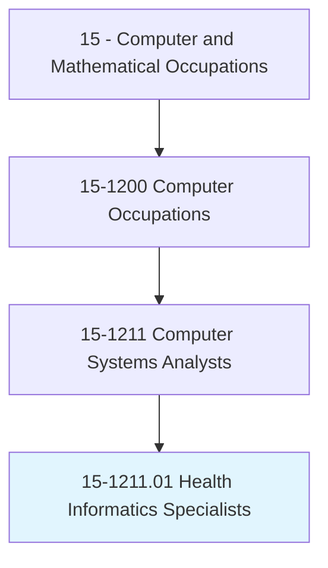
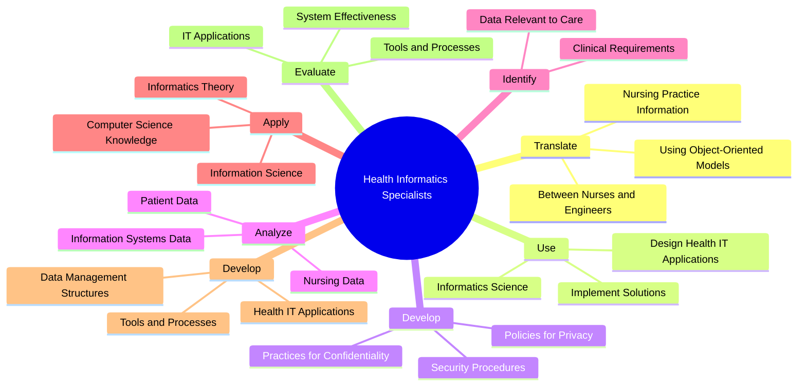
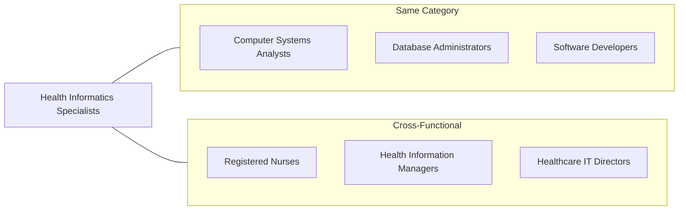
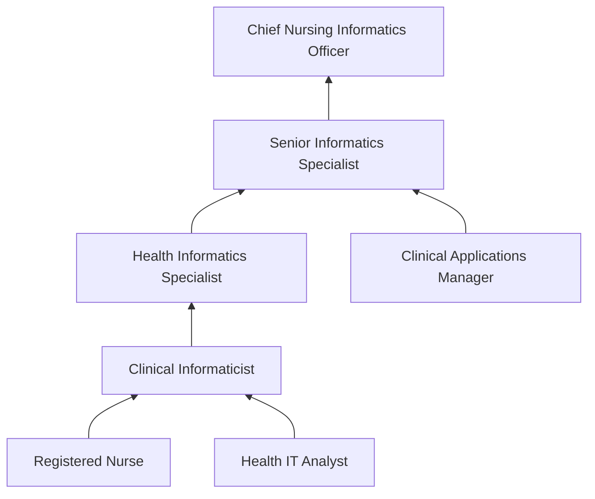

# Health Informatics Specialists

> Apply knowledge of nursing and informatics to assist in the design, development, and ongoing modification of computerized health care systems. May educate staff and assist in problem solving to promote the implementation of the health care system.

## Overview

Health Informatics Specialists bridge the gap between healthcare practice and information technology. They combine clinical knowledge with technical expertise to design, implement, and optimize health information systems that improve patient care and operational efficiency. These professionals translate nursing and clinical workflows into system requirements, ensure data privacy compliance, and train healthcare staff on technology solutions. As healthcare becomes increasingly digital, Health Informatics Specialists play a vital role in ensuring technology serves both patients and providers effectively.

## Classification Hierarchy

## Key Statistics

| Metric | Value |
|--------|-------|
| SOC Code | 15-1211.01 |
| Job Zone | 4 (Considerable Preparation) |
| Category | [Computer and Mathematical](/occupations/Technology) |
| Core Tasks | 15+ |
| Source | O*NET |

## Core Tasks

### translate.NursingPracticeInformation

Health Informatics Specialists serve as translators between clinical staff and technical teams.

**Actions:**
- `translate.NursingPracticeInformation.between.NursesEngineers` - Bridge clinical and technical communication
- `translate.NursingPracticeInformation.to.SystemsEngineers` - Convey clinical requirements to developers
- `translate.NursingPracticeInformation.to.Analysts` - Support system analysis with clinical context
- `translate.NursingPracticeInformation.to.Designers` - Guide UI/UX for clinical workflows
- `translate.UsingObjectOrientedModels.to.DocumentRequirements` - Create technical specifications from clinical needs

### use.InformaticsScience

Health Informatics Specialists leverage informatics to solve healthcare problems.

**Actions:**
- `use.InformaticsScience.to.design.HealthInformationTechnologyApplications` - Create healthcare software solutions
- `use.InformaticsScience.to.implement.HealthInformationTechnologyApplications` - Deploy clinical systems
- `use.InformaticsScience.to.resolve.ClinicalProblems` - Address workflow issues with technology
- `use.InformaticsScience.to.resolve.HealthCareAdministrativeProblems` - Improve operational efficiency

### develop.Policies

Health Informatics Specialists establish information governance practices.

**Actions:**
- `develop.Policies.to.ensure.Privacy` - Create patient privacy protocols
- `develop.Policies.to.ensure.Confidentiality` - Establish confidentiality standards
- `develop.Policies.to.ensure.SecurityOfPatientInformation` - Design security frameworks
- `implement.Policies.to.ensure.HIPAACompliance` - Deploy regulatory compliance measures
- `develop.Practices.to.ensure.DataIntegrity` - Maintain data quality standards

### analyze.PatientData

Health Informatics Specialists derive insights from healthcare data.

**Actions:**
- `analyze.PatientData.to.improve.NursingServices` - Enhance care quality through data analysis
- `analyze.NursingData.to.improve.ClinicalOutcomes` - Optimize clinical processes
- `analyze.InformationSystemsData.to.improve.SystemPerformance` - Monitor and enhance system efficiency
- `interpret.ClinicalData.to.inform.CareDecisions` - Support evidence-based practice

### identify.DataRelevant

Health Informatics Specialists determine data requirements for clinical care.

**Actions:**
- `identify.DataRelevant.to.NursingCareOfPatients` - Define essential data elements
- `collect.DataRelevant.to.QualityImprovement` - Gather metrics for care improvement
- `record.DataRelevant.to.ClinicalDocumentation` - Ensure comprehensive record-keeping
- `analyze.DataRelevant.to.PopulationHealth` - Support population health initiatives

### apply.Knowledge

Health Informatics Specialists integrate multiple disciplines in their work.

**Actions:**
- `apply.Knowledge.of.ComputerScience` - Leverage technical expertise
- `apply.Knowledge.of.InformationScience` - Apply data management principles
- `apply.Knowledge.of.Nursing` - Incorporate clinical understanding
- `apply.Knowledge.of.InformaticsTheory` - Use informatics frameworks
- `collaborate.with.HealthInformaticsSpecialists` - Partner with interdisciplinary teams

### develop.HealthInformationTechnologyApplications

Health Informatics Specialists create tools for clinical staff.

**Actions:**
- `develop.HealthInformationTechnologyApplications.to.assist.NursesWithDataManagement` - Build nursing informatics tools
- `develop.Tools.to.assist.ClinicalDecisionSupport` - Create decision support systems
- `develop.Processes.to.assist.WorkflowOptimization` - Design efficient workflows
- `implement.Structures.to.assist.DataIntegration` - Enable interoperability

### evaluate.HealthInformationTechnologyApplications

Health Informatics Specialists assess system effectiveness.

**Actions:**
- `evaluate.HealthInformationTechnologyApplications.to.assess.Usability` - Test user experience
- `evaluate.Tools.to.assess.ClinicalEffectiveness` - Measure clinical impact
- `evaluate.Processes.to.assess.OperationalEfficiency` - Analyze workflow improvements
- `evaluate.Structures.to.assess.DataQuality` - Verify data integrity

## Skills & Competencies

### Technical Skills
- **Electronic Health Records (EHR)** - Expert
- **Clinical Decision Support Systems** - Advanced
- **Health Information Exchange (HIE)** - Advanced
- **Database Management** - Advanced
- **Data Analytics** - Advanced
- **HIPAA Compliance** - Expert
- **HL7/FHIR Standards** - Advanced

### Soft Skills
- **Clinical Communication** - Critical
- **Cross-functional Collaboration** - Critical
- **Problem Solving** - Essential
- **Training and Education** - Essential
- **Change Management** - Essential

## Related Occupations

## Industries

- [Healthcare](/industries/Healthcare) - Primary employment sector
- [Hospitals](/industries/Hospitals) - Acute care settings
- [Health Insurance](/industries/HealthInsurance) - Payer organizations
- [Health IT Vendors](/industries/HealthIT) - Software development companies
- [Government](/industries/Government) - Public health agencies
- [Research Institutions](/industries/Research) - Clinical research organizations

## Career Progression

## Education & Training

| Requirement | Details |
|-------------|---------|
| Typical Education | Bachelor's degree in Nursing or Health Informatics; Master's preferred |
| Clinical Background | RN license or clinical experience often required |
| Work Experience | 2-5 years in clinical or health IT roles |
| On-the-Job Training | EHR certification and ongoing regulatory training |
| Common Certifications | ANCC Informatics Nursing, CPHIMS, CAHIMS |

## Departments

This occupation typically works in:
- [Health Information Management](/departments/HIM)
- [Clinical Informatics](/departments/ClinicalInformatics)
- [Information Technology](/departments/IT)
- [Quality Improvement](/departments/QualityImprovement)
- [Nursing Administration](/departments/Nursing)

---

*Source: O*NET 15-1211.01 - ONETOccupation*
