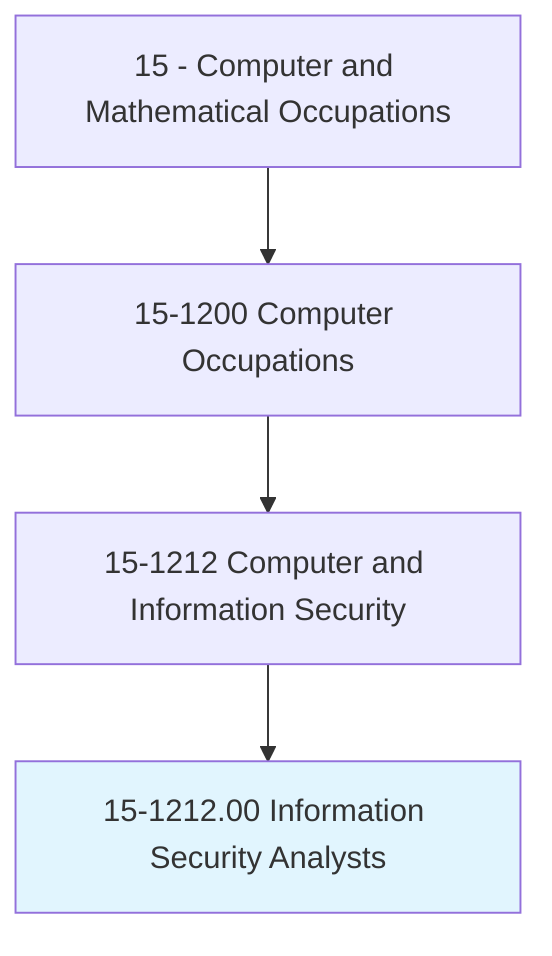
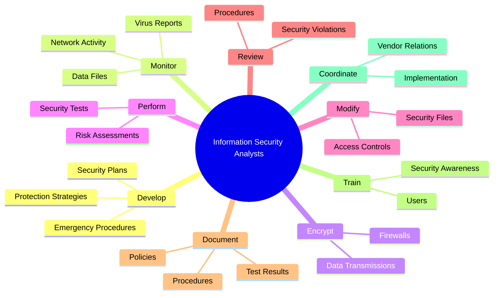
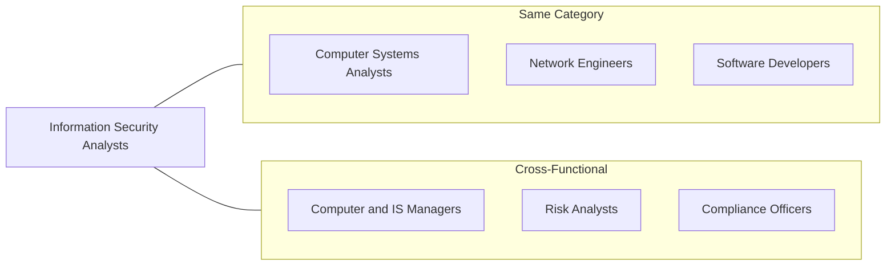
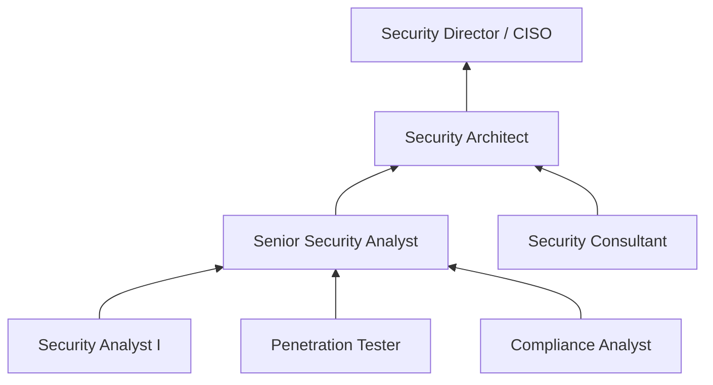

# Information Security Analysts

> Plan, implement, upgrade, or monitor security measures for the protection of computer networks and information. Assess system vulnerabilities for security risks and propose and implement risk mitigation strategies. May ensure appropriate security controls are in place to safeguard digital files and electronic infrastructure.

## Overview

Information Security Analysts are the guardians of organizational digital assets, responsible for protecting computer systems and networks from cyber threats. They develop security strategies, monitor for breaches, respond to incidents, and ensure compliance with security regulations. As cyber threats become increasingly sophisticated, these professionals play a critical role in maintaining business continuity and protecting sensitive data across all industries.

## Classification Hierarchy

## Key Statistics

| Metric | Value |
|--------|-------|
| SOC Code | 15-1212.00 |
| Job Zone | 4 (Considerable Preparation) |
| Category | [Computer and Mathematical](/occupations/ComputerAndMathematical) |
| Core Tasks | 12+ |
| Source | O*NET |

## Core Tasks

### develop.Plans

Information Security Analysts create comprehensive plans to protect organizational data and systems.

**Actions:**
- `develop.Plans.to.SafeguardComputerFilesAgainstAccidentalModification` - Create data protection strategies
- `develop.Plans.to.UnauthorizedModification` - Prevent unauthorized access and changes
- `develop.Plans.to.Destruction` - Protect against data destruction threats
- `develop.Plans.to.DisclosureMeetEmergencyDataProcessingNeeds` - Ensure business continuity

### monitor.CurrentReports

Information Security Analysts stay current on emerging threats to maintain effective defenses.

**Actions:**
- `monitor.CurrentReports.of.ComputerViruses.to.determine.WhenToUpdateVirusProtectionSystems` - Track threat intelligence for timely updates
- `monitor.Use.of.DataFiles` - Oversee data access patterns for anomalies
- `monitor.Use.of.RegulateAccessToSafeguardInformationInComputerFiles` - Control and audit file access

### encrypt.DataTransmissions

Information Security Analysts implement encryption to protect data in transit and at rest.

**Actions:**
- `encrypt.DataTransmissions.to.conceal.ConfidentialInformationAsItIsBeingTransmitted` - Secure data during transmission
- `encrypt.DataTransmissions.to.ToKeepOutTaintedDigitalTransfers` - Block malicious data transfers
- `encrypt.ErectFirewalls.to.conceal.ConfidentialInformationAsItIsBeingTransmitted` - Deploy firewall protections

### perform.RiskAssessments

Information Security Analysts evaluate system vulnerabilities and test security measures.

**Actions:**
- `perform.RiskAssessments.of.DataProcessingSystem.to.ensure.FunctioningOfDataProcessingActivitiesMeasures` - Assess data processing security
- `perform.RiskAssessments.of.SecurityMeasures` - Evaluate effectiveness of security controls
- `perform.ExecuteTests.of.DataProcessingSystem.to.ensure.FunctioningOfDataProcessingActivitiesMeasures` - Conduct penetration testing

### modify.ComputerSecurityFiles

Information Security Analysts maintain and update security configurations.

**Actions:**
- `modify.ComputerSecurityFiles.to.incorporate.NewSoftware` - Integrate new security tools
- `modify.ComputerSecurityFiles.to.correct.Errors` - Fix security configuration issues
- `modify.ComputerSecurityFiles.to.change.IndividualAccessStatus` - Manage user access permissions

### train.Users

Information Security Analysts educate staff on security best practices.

**Actions:**
- `train.Users.to.ensure.SystemSecurityImproveServerNetworkEfficiency` - Conduct security awareness training
- `train.PromoteSecurityAwareness.to.ensure.SystemSecurityImproveServerNetworkEfficiency` - Foster security-conscious culture

## Skills & Competencies

### Technical Skills
- **Network Security** - Expert
- **Cryptography** - Advanced
- **Penetration Testing** - Advanced
- **Security Information and Event Management (SIEM)** - Advanced
- **Incident Response** - Advanced
- **Firewall Management** - Advanced
- **Vulnerability Assessment** - Expert

### Soft Skills
- **Analytical Thinking** - Critical
- **Problem Solving** - Critical
- **Attention to Detail** - Essential
- **Communication** - Essential
- **Continuous Learning** - Essential

## Related Occupations

## Industries

- [Finance and Insurance](/industries/FinanceInsurance) - High Employment
- [Information Technology](/industries/InformationTechnology) - High Employment
- [Professional Services](/industries/ProfessionalServices) - High Employment
- [Healthcare](/industries/Healthcare/index) - Growing Employment
- [Government](/industries/Government) - High Employment
- [Defense](/industries/Defense) - Critical Employment

## Career Progression

## Education & Training

| Requirement | Details |
|-------------|---------|
| Typical Education | Bachelor's degree in Computer Science, Cybersecurity, or related field |
| Work Experience | 1-5 years in IT security or related role |
| On-the-Job Training | Moderate - security tool certifications and ongoing threat training |
| Common Certifications | CISSP, CEH, CompTIA Security+, CISM, OSCP |

## Departments

This occupation typically works in:
- [Information Technology](/departments/IT)
- [Cybersecurity](/departments/Cybersecurity)
- [Risk Management](/departments/RiskManagement)
- [Compliance](/departments/Compliance)

---

*Source: O*NET 15-1212.00 - ONETOccupation*
