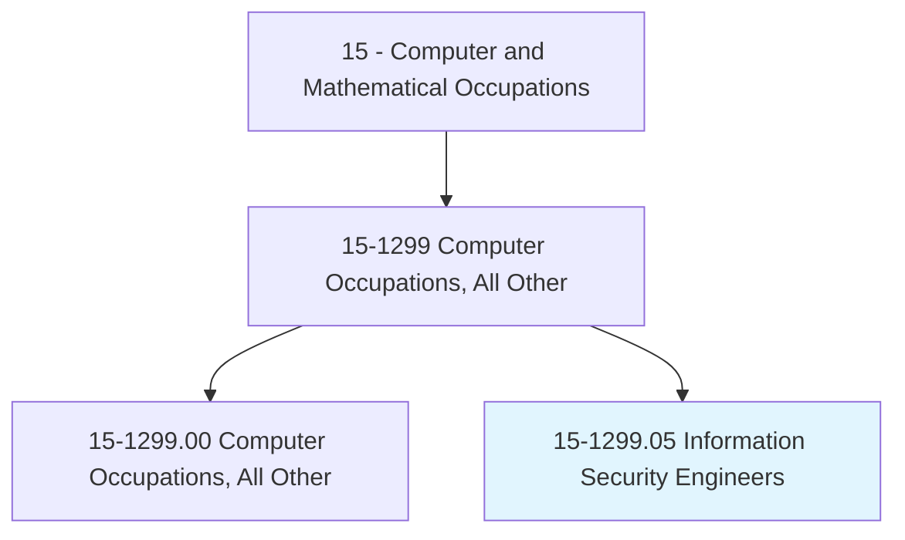
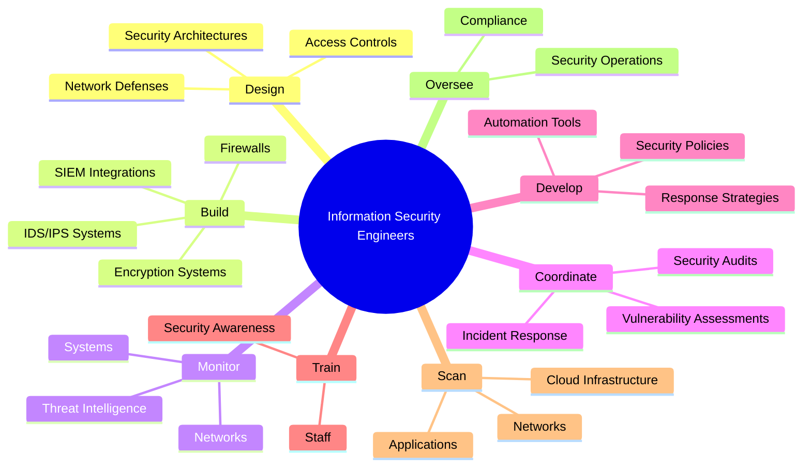
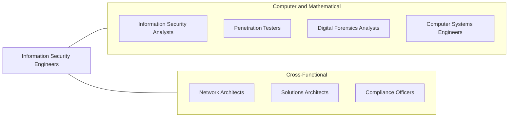
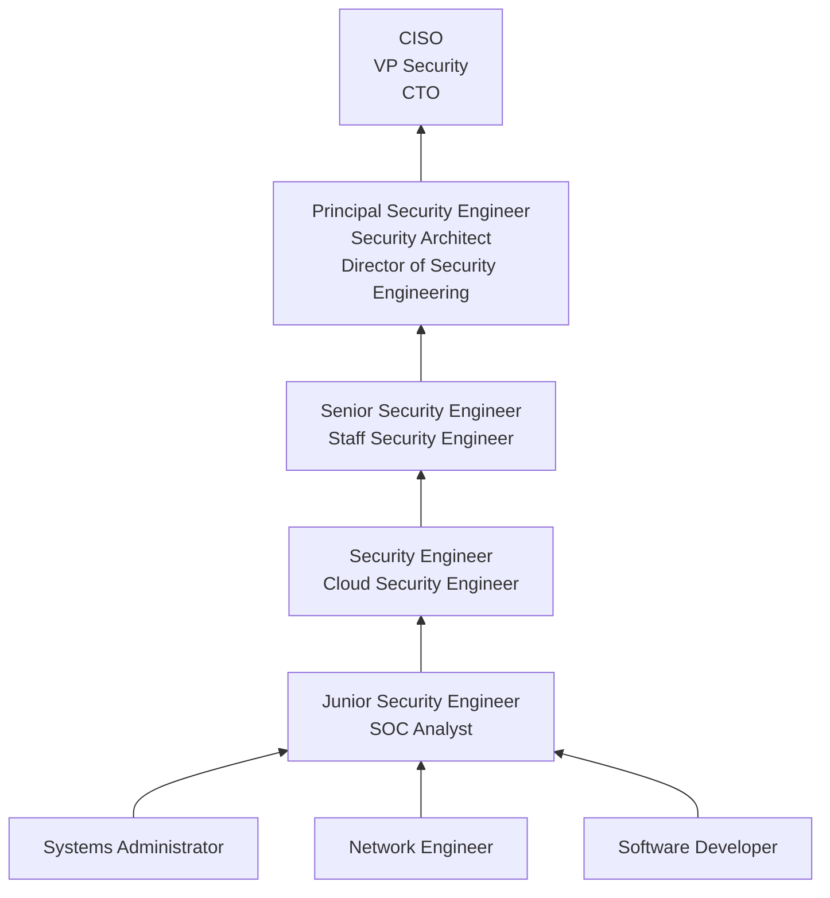

# Information Security Engineers

> Develop and oversee the implementation of information security procedures and policies. Build, maintain and upgrade security technology, such as firewalls, for the safe use of computer networks and the transmission and retrieval of information. Design and implement appropriate security controls to identify vulnerabilities and protect digital files and electronic infrastructures. Monitor and respond to computer security breaches, viruses, and intrusions, and perform forensic investigation. May oversee the assessment of information security systems.

## Overview

Information Security Engineers design, build, and maintain the technical security infrastructure that protects an organization's digital assets, networks, and data from cyber threats. They implement firewalls, intrusion detection systems, encryption, identity and access management solutions, and other security controls to create layered defenses against attacks. Unlike security analysts who primarily monitor and respond, security engineers build the systems and tools that make monitoring and defense possible.

The role requires deep technical expertise across networking, operating systems, application security, cloud platforms, and cryptography. Information security engineers work proactively to design security architectures, automate security processes, and integrate security into the software development lifecycle (DevSecOps). They evaluate emerging threats, research new attack vectors, and continuously evolve their organization's security posture to stay ahead of sophisticated adversaries.

With the explosion of cloud computing, remote work, and interconnected systems, the attack surface for most organizations has expanded dramatically. Security engineers must now secure hybrid cloud environments, zero-trust network architectures, containerized applications, APIs, and an increasingly complex web of third-party integrations, making the role more critical and technically demanding than ever.

## Classification Hierarchy

## Key Statistics

| Metric | Value |
|--------|-------|
| SOC Code | 15-1299.05 |
| Job Zone | 4 (Considerable Preparation) |
| Category | [Computer and Mathematical](/occupations/Technology/index) |
| Task Count | 53 |
| Median Salary | $120,360 |
| Employment | ~32,000 |
| Growth Rate | Much Faster Than Average (35%) |
| Source | O*NET |

## Core Tasks

### design.SecurityArchitectures

Information Security Engineers design comprehensive security solutions for organizations.

**Actions:**
- `design.SecurityArchitectures.for.DefenseInDepth`
- `design.NetworkDefenses.using.ZeroTrustPrinciples`
- `design.AccessControls.for.LeastPrivilegeAccess`
- `design.EncryptionSchemes.for.DataProtection`

### build.SecurityInfrastructure

Information Security Engineers implement and maintain security technology.

**Actions:**
- `build.Firewalls.for.NetworkProtection`
- `build.IntrusionDetectionSystems.for.ThreatDetection`
- `build.SIEMIntegrations.for.SecurityMonitoring`
- `develop.SecurityAutomation.for.IncidentResponse`

### coordinate.SecurityOperations

Information Security Engineers oversee vulnerability management and security assessments.

**Actions:**
- `coordinate.Monitoring.of.Networks.for.SecurityBreaches`
- `coordinate.VulnerabilityAssessments.of.InformationSystems`
- `coordinate.IncidentResponse.for.SecurityEvents`
- `assess.Quality.of.SecurityControls`

### train.SecurityAwareness

Information Security Engineers build security culture across the organization.

**Actions:**
- `train.Staff.on.SecurityBestPractices`
- `develop.SecurityPolicies.for.OrganizationalCompliance`
- `oversee.SecurityAwarenessPrograms.for.AllEmployees`
- `enforce.SecurityStandards.across.AllSystems`

## Tech Stack

### Network Security
- **Palo Alto Networks** - Next-gen firewalls
- **Fortinet** - Network security
- **Cisco ASA/Firepower** - Firewalls and IPS
- **Snort/Suricata** - Open-source IDS
- **Cloudflare** - WAF and DDoS protection
- **Zscaler** - Cloud security

### Identity & Access Management
- **Okta** - Identity platform
- **Azure AD/Entra ID** - Microsoft identity
- **CyberArk** - Privileged access
- **Ping Identity** - SSO and MFA
- **HashiCorp Vault** - Secrets management

### SIEM & Monitoring
- **Splunk** - SIEM platform
- **Microsoft Sentinel** - Cloud SIEM
- **Elastic Security** - Open-source SIEM
- **QRadar** - IBM SIEM
- **CrowdStrike/SentinelOne** - EDR
- **Datadog Security** - Cloud security monitoring

### Vulnerability Management
- **Nessus/Tenable** - Vulnerability scanning
- **Qualys** - Cloud vulnerability management
- **Rapid7 InsightVM** - Vulnerability management
- **Snyk** - Application security
- **Wiz/Orca** - Cloud security posture

### Cloud Security
- **AWS Security Hub** - AWS security
- **Azure Defender** - Azure security
- **Google Security Command Center** - GCP security
- **Prisma Cloud** - Multi-cloud security
- **Terraform/OPA** - Policy as code

### Scripting & Automation
- **Python** - Security automation
- **PowerShell** - Windows security scripting
- **Bash** - Linux security scripting
- **SOAR Platforms** - Security orchestration

## Certifications

| Certification | Provider | Level |
|---------------|----------|-------|
| CISSP | ISC2 | Professional |
| CCSP (Cloud Security) | ISC2 | Professional |
| GIAC Security Essentials (GSEC) | SANS/GIAC | Professional |
| GIAC Certified Enterprise Defender (GCED) | SANS/GIAC | Professional |
| Certified Ethical Hacker (CEH) | EC-Council | Intermediate |
| AWS Security Specialty | Amazon | Professional |
| CompTIA Security+ | CompTIA | Foundation |
| OSCP | Offensive Security | Professional |

## Skills & Competencies

### Technical Skills
- **Network Security** - Expert
- **Cloud Security (AWS/Azure/GCP)** - Expert
- **Firewalls & IDS/IPS** - Expert
- **SIEM & Log Analysis** - Expert
- **Identity & Access Management** - Advanced
- **Encryption & PKI** - Advanced
- **Vulnerability Management** - Expert
- **Security Automation** - Advanced
- **Incident Response** - Advanced
- **Application Security** - Advanced

### Soft Skills
- **Security Mindset** - Critical
- **Analytical Thinking** - Critical
- **Communication** - Essential (security policy, executive briefings)
- **Problem Solving** - Critical
- **Continuous Learning** - Essential (threat landscape evolves constantly)
- **Leadership** - Important

## Related Occupations

- [Information Security Analysts](/occupations/Technology/InformationSecurityAnalysts)
- [Penetration Testers](/occupations/Technology/PenetrationTesters)
- [Digital Forensics Analysts](/occupations/Technology/DigitalForensicsAnalysts)
- [Computer Systems Engineers/Architects](/occupations/Technology/ComputerSystemsEngineersArchitects)

## Industry Variations

### Technology / SaaS
- Application security engineering
- DevSecOps pipeline integration
- Cloud-native security
- Product security teams

### Financial Services
- Trading system security
- PCI-DSS compliance
- Fraud prevention infrastructure
- Regulatory security requirements

### Healthcare
- HIPAA security controls
- Medical device security
- EHR protection
- Patient data encryption

### Government / Defense
- Classified network security (SIPR/JWICS)
- FedRAMP implementation
- NIST framework compliance
- Zero-trust architecture

### Critical Infrastructure
- SCADA/ICS security
- OT/IT convergence
- Physical-cyber security integration
- NERC CIP compliance

## Career Progression

## Education & Training

| Requirement | Details |
|-------------|---------|
| Typical Education | Bachelor's in Computer Science, Cybersecurity, Information Technology, or related field |
| Alternative Paths | IT experience + security certifications (CISSP, OSCP) |
| Work Experience | 3-5 years in IT/security for entry-level security engineering |
| Key Knowledge Areas | Networking, cryptography, operating systems, cloud platforms, application security |
| Continuing Education | SANS training, security conferences (DEF CON, Black Hat, RSA) |

## Departments

This occupation typically works in:
- [Information Security](/departments/Security)
- [Engineering](/departments/Technology)
- Infrastructure
- Cloud Operations
- Compliance

---

*Source: O*NET 15-1299.05 - ONETOccupation*
