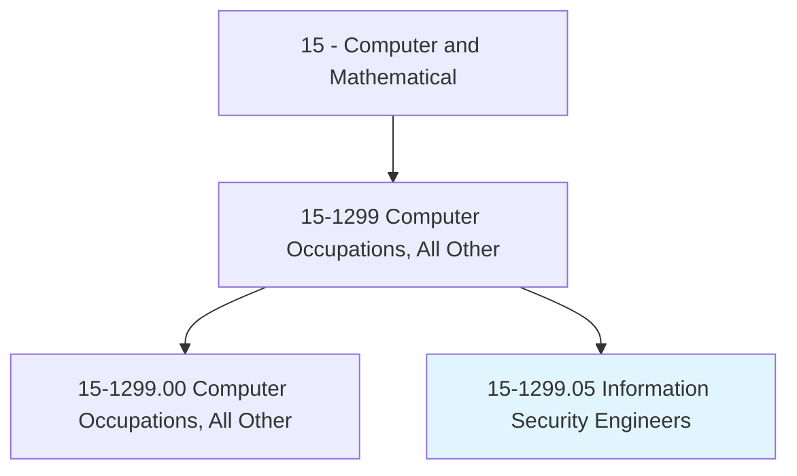
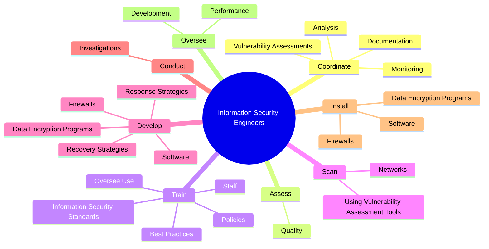
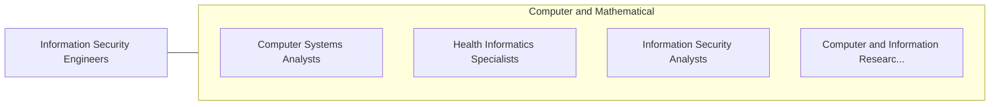

# Information Security Engineers

> Develop and oversee the implementation of information security procedures and policies. Build, maintain and upgrade security technology, such as firewalls, for the safe use of computer networks and the transmission and retrieval of information. Design and implement appropriate security controls to identify vulnerabilities and protect digital files and electronic infrastructures. Monitor and respond to computer security breaches, viruses, and intrusions, and perform forensic investigation. May oversee the assessment of information security systems.

## Overview

Information Security Engineers is a specialized variant within the Computer and Mathematical category. Develop and oversee the implementation of information security procedures and policies. Build, maintain and upgrade security technology, such as firewalls, for the safe use of computer networks and the transmission and retrieval of information.

## Classification Hierarchy

## Key Statistics

| Metric | Value |
|--------|-------|
| SOC Code | 15-1299.05 |
| Category | [Computer and Mathematical](/occupations/Technology/index) |
| Task Count | 53 |
| Source | O*NET |

## Core Tasks

### coordinate.Monitoring

Information Security Engineers coordinate monitoring as part of their core responsibilities.

**Actions:**
- `coordinate.Monitoring.of.Networks.for.SecurityBreachesIntrusions`
- `coordinate.Monitoring.of.Systems.for.SecurityBreachesIntrusions`
- `coordinate.VulnerabilityAssessments.of.InformationSecuritySystems`
- `coordinate.Analysis.of.InformationSecuritySystems`

### assess.Quality

Information Security Engineers assess quality as part of their core responsibilities.

**Actions:**
- `assess.Quality.of.SecurityControls`
- `assess.Quality.of.UsingPerformanceIndicators`

### train.Staff

Information Security Engineers train staff as part of their core responsibilities.

**Actions:**
- `train.Staff.on`
- `train.OverseeUse.of`
- `train.InformationSecurityStandards`
- `train.Policies`

## Skills & Competencies

### Technical Skills
- **Programming** - Advanced
- **Systems Analysis** - Advanced
- **Database Management** - Advanced

### Soft Skills
- **Communication** - Essential
- **Problem Solving** - Essential
- **Critical Thinking** - Important
- **Teamwork** - Important
- **Adaptability** - Important

## Related Occupations

## Industries

This occupation is found across multiple industries. See [Industries](/industries) for sector-specific employment data.

## Career Progression

---

*Source: O*NET 15-1299.05 - ONETOccupation*
