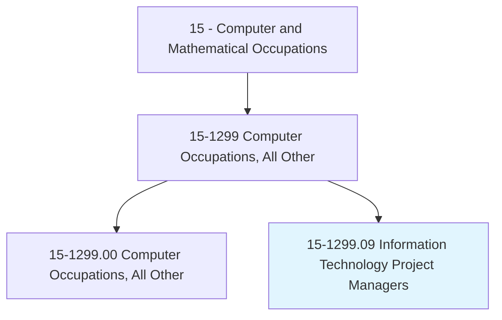
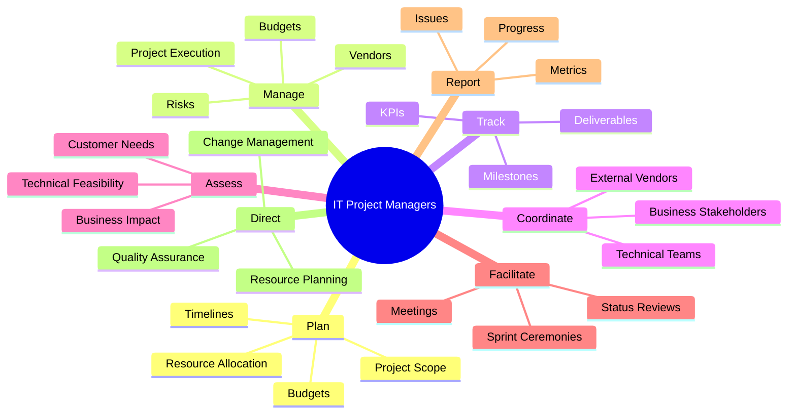
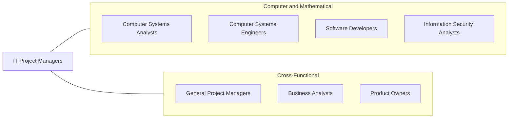
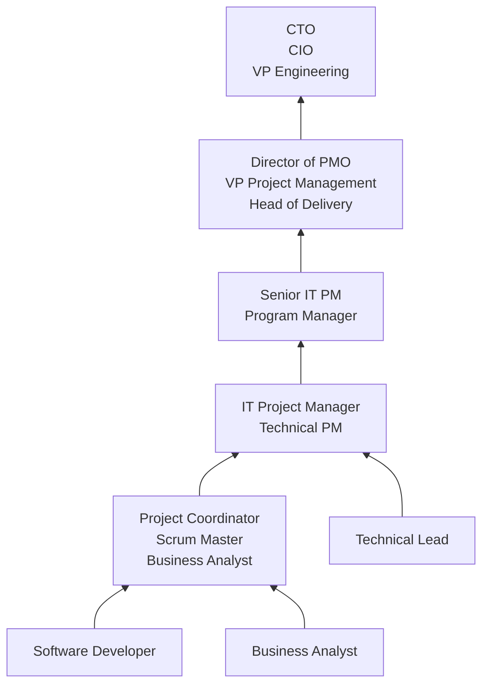

# Information Technology Project Managers

> Plan, initiate, and manage information technology (IT) projects. Lead and guide the work of technical staff. Serve as liaison between business and technical aspects of projects. Plan project stages and assess business implications for each stage. Monitor progress to assure deadlines, standards, and cost targets are met.

## Overview

Information Technology Project Managers plan, execute, and deliver technology projects on time, within budget, and to specification. They serve as the critical link between business stakeholders who define requirements and technical teams who build solutions. IT PMs manage everything from enterprise system implementations and cloud migrations to software product launches and infrastructure upgrades, coordinating cross-functional teams of developers, engineers, designers, and business analysts.

The role demands a combination of technical literacy, organizational skills, and interpersonal abilities. IT Project Managers must understand enough about technology to make informed decisions, estimate effort accurately, identify risks early, and communicate effectively with both technical and non-technical audiences. They use methodologies ranging from traditional waterfall approaches for large infrastructure projects to agile and hybrid frameworks for software development initiatives.

As technology projects grow in complexity -- spanning cloud platforms, distributed teams, multiple vendors, and tight regulatory requirements -- the need for skilled IT project managers has intensified. Modern IT PMs are expected to be comfortable with agile ceremonies, DevOps practices, cloud architectures, and data-driven project metrics, while also navigating organizational politics, managing stakeholder expectations, and driving change management.

## Classification Hierarchy

## Key Statistics

| Metric | Value |
|--------|-------|
| SOC Code | 15-1299.09 |
| Job Zone | 4 (Considerable Preparation) |
| Category | [Computer and Mathematical](/occupations/Technology/index) |
| Task Count | 58 |
| Median Salary | $98,420 |
| Employment | ~90,000 |
| Growth Rate | Faster Than Average |
| Source | O*NET |

## Core Tasks

### manage.ProjectExecution

IT Project Managers oversee the end-to-end delivery of technology projects.

**Actions:**
- `manage.ProjectExecution.to.ensure.AdherenceToBudget`
- `manage.ProjectExecution.to.ensure.TimelineCompliance`
- `manage.ProjectScope.to.prevent.ScopeCreep`
- `manage.AnnualBudgets.for.InformationTechnologyProjects`

### track.ProjectProgress

IT Project Managers monitor project health and milestone completion.

**Actions:**
- `track.ProjectMilestones.against.BaselineSchedule`
- `track.Deliverables.for.QualityCompliance`
- `track.BudgetSpend.against.ForecastedCosts`
- `report.ProjectStatus.to.ExecutiveStakeholders`

### coordinate.Teams

IT Project Managers coordinate cross-functional teams and manage stakeholder relationships.

**Actions:**
- `coordinate.TechnicalTeams.for.IntegratedDelivery`
- `coordinate.BusinessStakeholders.for.RequirementsAlignment`
- `facilitate.SprintPlanning.for.AgileDevelopment`
- `manage.VendorRelationships.for.ExternalDeliverables`

### assess.ProjectRisks

IT Project Managers identify and mitigate project risks proactively.

**Actions:**
- `assess.TechnicalFeasibility.for.ProposedSolutions`
- `assess.BusinessImpact.for.EachProjectStage`
- `identify.Risks.to.develop.MitigationStrategies`
- `initiate.Modifications.to.address.ChangingRequirements`

## Tech Stack

### Project Management Tools
- **Jira** - Agile project management
- **Azure DevOps** - Microsoft PM platform
- **Asana** - Work management
- **Monday.com** - Project tracking
- **Smartsheet** - Project and portfolio management
- **Microsoft Project** - Traditional PM
- **Trello** - Kanban boards
- **Linear** - Modern issue tracking

### Collaboration
- **Confluence** - Documentation and wiki
- **Slack/Teams** - Team communication
- **Miro/Mural** - Visual collaboration
- **Notion** - Knowledge management
- **Google Workspace** - Collaborative productivity

### Reporting & Analytics
- **Power BI** - Project dashboards
- **Tableau** - Data visualization
- **Excel** - Reporting and analysis
- **Looker** - Business analytics

### Methodologies & Frameworks
- **Agile/Scrum** - Iterative development
- **SAFe** - Scaled Agile Framework
- **Kanban** - Flow-based management
- **Waterfall** - Sequential planning
- **PRINCE2** - Structured PM
- **PMBOK** - PM body of knowledge

### DevOps & Technical Awareness
- **Git/GitHub** - Version control understanding
- **CI/CD Concepts** - Deployment pipelines
- **Cloud Platforms** - AWS/Azure/GCP basics
- **Confluence/Wiki** - Technical documentation

## Certifications

| Certification | Provider | Level |
|---------------|----------|-------|
| Project Management Professional (PMP) | PMI | Professional |
| Certified Scrum Master (CSM) | Scrum Alliance | Foundation |
| Professional Scrum Master (PSM) | Scrum.org | Foundation/Advanced |
| SAFe Agilist | Scaled Agile | Professional |
| PRINCE2 Practitioner | Axelos | Professional |
| Certified Associate in Project Management (CAPM) | PMI | Associate |
| AWS Cloud Practitioner | Amazon | Foundation |
| ITIL Foundation | Axelos | Foundation |

## Skills & Competencies

### Technical Skills
- **Project Management Methodologies** - Expert
- **Agile/Scrum** - Expert
- **Budget Management** - Advanced
- **Risk Management** - Advanced
- **Vendor Management** - Advanced
- **Technical Literacy** - Advanced (enough to guide technical teams)
- **Requirements Analysis** - Advanced
- **Quality Assurance** - Advanced

### Soft Skills
- **Leadership** - Critical
- **Communication** - Critical (all stakeholder levels)
- **Negotiation** - Essential
- **Conflict Resolution** - Essential
- **Stakeholder Management** - Critical
- **Time Management** - Critical
- **Decision Making** - Essential
- **Adaptability** - Important

## Related Occupations

- [Computer Systems Analysts](/occupations/Technology/ComputerSystemsAnalysts)
- [Computer Systems Engineers/Architects](/occupations/Technology/ComputerSystemsEngineersArchitects)
- [Software Developers](/occupations/Technology/SoftwareDevelopers)

## Industry Variations

### Technology / Software
- Agile/Scrum methodology focus
- Product-centric delivery
- Continuous deployment management
- Sprint and release planning

### Financial Services
- Regulatory compliance projects
- Legacy system modernization
- Vendor management emphasis
- Change management rigor

### Healthcare
- EHR implementations
- HIPAA-compliant project management
- Clinical system integrations
- Validation and qualification protocols

### Government
- Federal procurement processes
- FedRAMP/Authority to Operate
- NIST compliance projects
- Large-scale IT modernization

### Consulting
- Multi-client project management
- Statement of work management
- Utilization and resource optimization
- Client relationship management

## Career Progression

## Education & Training

| Requirement | Details |
|-------------|---------|
| Typical Education | Bachelor's in Computer Science, Business, Information Systems, or related field |
| Alternative Paths | Technical background + PMP or CSM certification |
| Work Experience | 3-5 years in IT or project coordination for entry; 7+ years for senior |
| Key Knowledge Areas | Project management, agile methodologies, budgeting, risk management, IT fundamentals |
| Continuing Education | PDUs for PMP maintenance, new methodology training |

## Departments

This occupation typically works in:
- [Project Management Office (PMO)](/departments/Operations)
- [Information Technology](/departments/Technology)
- [Engineering](/departments/Technology)
- Digital Transformation
- [Operations](/departments/Operations)

---

*Source: O*NET 15-1299.09 - ONETOccupation*
