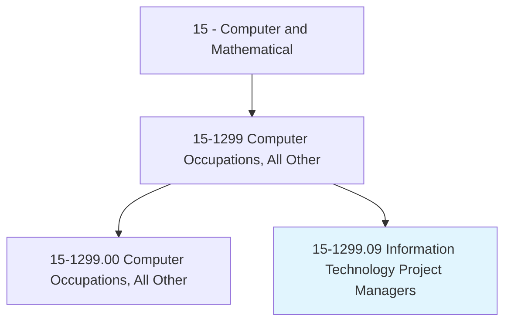
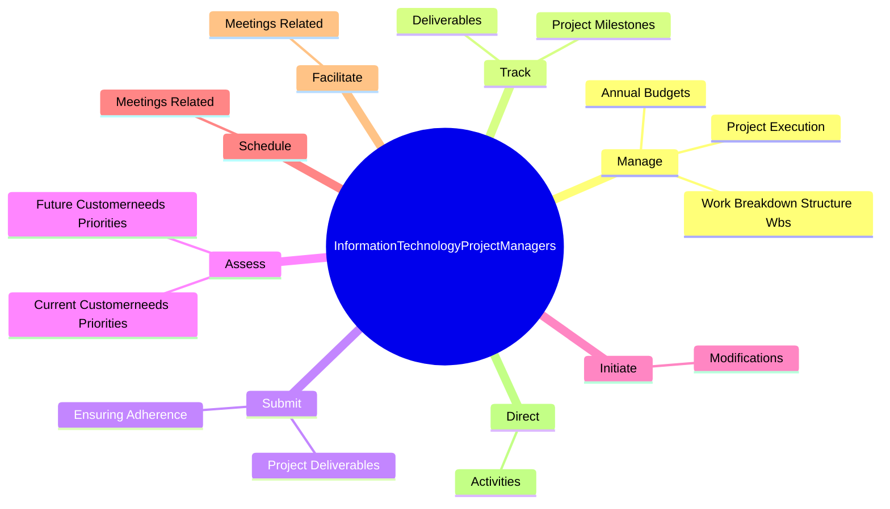

# Information Technology Project Managers

> Plan, initiate, and manage information technology (IT) projects. Lead and guide the work of technical staff. Serve as liaison between business and technical aspects of projects. Plan project stages and assess business implications for each stage. Monitor progress to assure deadlines, standards, and cost targets are met.

## Overview

Information Technology Project Managers is a specialized variant within the Computer and Mathematical category. Plan, initiate, and manage information technology (IT) projects. Lead and guide the work of technical staff.

## Classification Hierarchy

## Key Statistics

| Metric | Value |
|--------|-------|
| SOC Code | 15-1299.09 |
| Category | [Computer and Mathematical](/occupations/Technology) |
| Task Count | 58 |
| Source | O*NET |

## Core Tasks

### manage.ProjectExecution

Information Technology Project Managers manage project execution as part of their core responsibilities.

**Actions:**
- `manage.ProjectExecution.to.ensure.AdherenceToBudget`
- `manage.ProjectExecution.to.schedule`
- `manage.ProjectExecution.to.scope`
- `manage.AnnualBudgets.for.InformationTechnologyProjects`

### track.ProjectMilestones

Information Technology Project Managers track project milestones as part of their core responsibilities.

**Actions:**
- `track.ProjectMilestones`
- `track.Deliverables`

### submit.ProjectDeliverables

Information Technology Project Managers submit project deliverables as part of their core responsibilities.

**Actions:**
- `submit.ProjectDeliverables.to.QualityStandards`
- `submit.EnsuringAdherence.to.QualityStandards`

## Skills & Competencies

### Technical Skills
- **Programming** - Advanced
- **Systems Analysis** - Advanced
- **Database Management** - Advanced

### Soft Skills
- **Communication** - Essential
- **Problem Solving** - Essential
- **Critical Thinking** - Important
- **Teamwork** - Important
- **Adaptability** - Important

## Related Occupations

## Industries

This occupation is found across multiple industries. See [Industries](/industries) for sector-specific employment data.

## Career Progression

---

*Source: O*NET 15-1299.09 - ONETOccupation*
