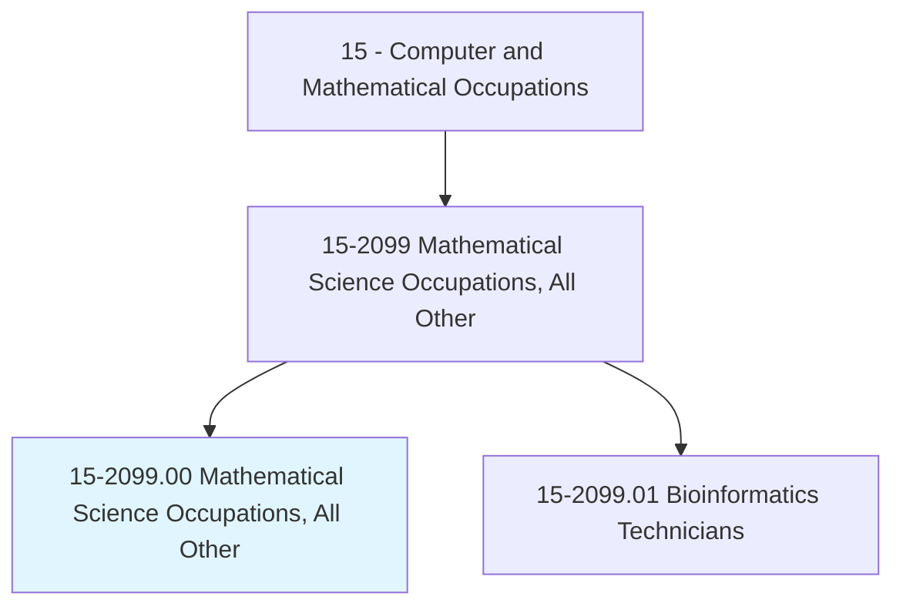
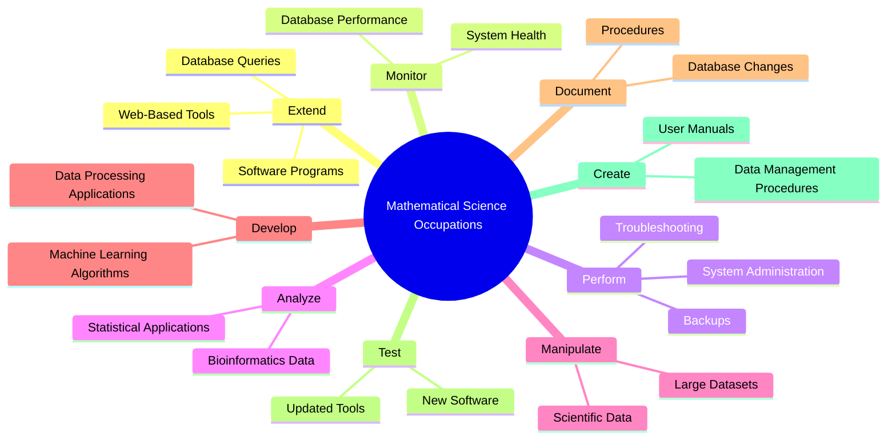
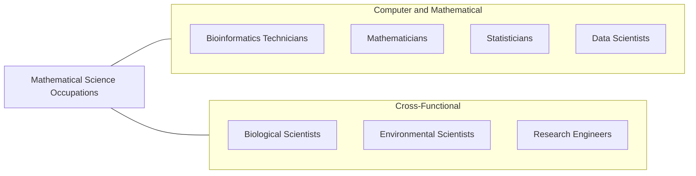
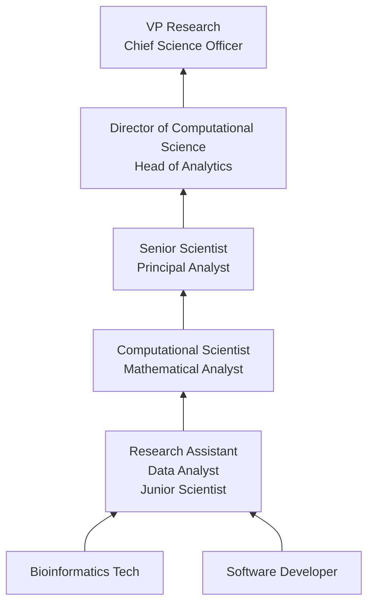

# Mathematical Science Occupations, All Other

> All mathematical scientists not listed separately.

## Overview

Mathematical Science Occupations, All Other is a broad classification that encompasses specialized mathematical and computational roles not individually categorized elsewhere. This category serves as the parent for bioinformatics technicians and other emerging roles that apply mathematical and computational methods to scientific, business, and technical problems in novel ways.

Professionals in this category typically work at the intersection of mathematics, computer science, and a specific domain such as biology, environmental science, or operations management. They develop algorithms, build computational models, manage scientific databases, and apply data mining and machine learning techniques to extract insights from complex datasets. The unifying thread is the application of mathematical and quantitative reasoning to problems that do not fit neatly into traditional statistics, actuarial science, or operations research categories.

As computational methods become increasingly central to scientific research and business operations, new mathematical science roles continue to emerge. These include computational biologists, quantitative analysts, algorithm developers, and data engineers with strong mathematical foundations. The category reflects the evolving nature of mathematical work in an era of big data, artificial intelligence, and interdisciplinary collaboration.

## Classification Hierarchy

## Key Statistics

| Metric | Value |
|--------|-------|
| SOC Code | 15-2099.00 |
| Job Zone | 4 (Considerable Preparation) |
| Category | [Computer and Mathematical](/occupations/Technology/index) |
| Task Count | 65 |
| Median Salary | $75,000 |
| Growth Rate | Faster Than Average |
| Source | O*NET |

## Core Tasks

### extend.SoftwarePrograms

Mathematical scientists extend and customize computational tools for evolving research needs.

**Actions:**
- `extend.ExistingSoftwarePrograms.for.NewAnalysisMethods`
- `extend.WebBasedInteractiveTools.for.DataVisualization`
- `extend.DatabaseQueries.as.SequenceManagementNeedsEvolve`
- `develop.CustomAlgorithms.for.DomainSpecificProblems`

### analyze.ScientificData

Mathematical scientists analyze complex datasets using statistical and computational methods.

**Actions:**
- `analyze.BioinformaticsData.using.SoftwarePackages`
- `analyze.Data.using.StatisticalApplications`
- `analyze.Data.using.DataMiningTechniques`
- `apply.MachineLearningAlgorithms.to.extract.Patterns`

### monitor.DatabasePerformance

Mathematical scientists maintain databases and computational infrastructure.

**Actions:**
- `monitor.DatabasePerformance.for.Optimization`
- `perform.NecessaryMaintenance.on.ComputationalSystems`
- `perform.SystemUpgrades.for.ImprovedCapability`
- `manage.DataBackups.for.RecoveryReadiness`

### develop.ComputationalTools

Mathematical scientists build applications for processing scientific data.

**Actions:**
- `develop.Applications.to.process.BiologicalData`
- `develop.DataMiningPipelines.for.PatternDiscovery`
- `develop.MachineLearningAlgorithms.for.Prediction`
- `create.DataManagementProcedures.for.QualityAssurance`

## Tech Stack

### Programming Languages
- **Python** - Data analysis, ML, scripting
- **R** - Statistical computing
- **Perl** - Legacy bioinformatics
- **SQL** - Database querying
- **Julia** - High-performance computing
- **MATLAB** - Numerical computing
- **C/C++** - Performance-critical algorithms

### Data Analysis & ML
- **Scikit-learn** - Machine learning
- **TensorFlow/PyTorch** - Deep learning
- **Pandas/NumPy** - Data manipulation
- **Bioconductor** - Biological data analysis
- **SAS** - Statistical analysis
- **SPSS** - Statistical analysis

### Databases & Infrastructure
- **PostgreSQL/MySQL** - Relational databases
- **MongoDB** - Document databases
- **HPC Clusters** - High-performance computing
- **AWS/GCP** - Cloud computing
- **Docker** - Containerized environments
- **Nextflow/Snakemake** - Workflow managers

### Visualization
- **Matplotlib/Seaborn** - Python plotting
- **ggplot2** - R visualization
- **Tableau** - Business visualization
- **Jupyter Notebooks** - Interactive analysis

## Certifications

| Certification | Provider | Level |
|---------------|----------|-------|
| AWS Cloud Practitioner | Amazon | Foundation |
| SAS Certified Specialist | SAS | Professional |
| Google Data Analytics | Google | Professional |
| CompTIA Data+ | CompTIA | Foundation |
| ISCB Bioinformatics Certification | ISCB | Professional |

## Skills & Competencies

### Technical Skills
- **Mathematical Modeling** - Expert
- **Programming (Python/R)** - Advanced
- **Statistical Analysis** - Expert
- **Database Management** - Advanced
- **Machine Learning** - Advanced
- **Algorithm Development** - Advanced
- **Data Mining** - Advanced
- **Scientific Computing** - Advanced

### Soft Skills
- **Analytical Thinking** - Critical
- **Problem Solving** - Critical
- **Scientific Communication** - Essential
- **Collaboration** - Essential (interdisciplinary teams)
- **Attention to Detail** - Critical
- **Continuous Learning** - Essential

## Variant Occupations

| Variant | Code | Description |
|---------|------|-------------|
| [Bioinformatics Technicians](/occupations/Technology/BioinformaticsTechnicians) | 15-2099.01 | Computational biology and genomics |

## Related Occupations

- [Bioinformatics Technicians](/occupations/Technology/BioinformaticsTechnicians)
- [Mathematicians](/occupations/Technology/Mathematicians)
- [Statisticians](/occupations/Technology/Statisticians)
- [Data Scientists](/occupations/Technology/DataScientists)

## Industry Variations

### Pharmaceutical / Biotech
- Computational biology
- Drug discovery algorithms
- Genomic data processing
- Clinical data analysis

### Academic / Research
- Scientific computing
- Algorithm research
- Open-source tool development
- Publication-driven work

### Technology
- Algorithm engineering
- Search and recommendation systems
- Quantitative analysis
- Data platform development

### Government / National Labs
- Scientific simulation
- Climate and environmental modeling
- Defense analytics
- National security computing

### Finance
- Quantitative modeling
- Risk algorithm development
- High-frequency trading algorithms
- Portfolio optimization

## Career Progression

## Education & Training

| Requirement | Details |
|-------------|---------|
| Typical Education | Master's or PhD in Mathematics, Applied Mathematics, Computational Science, or related field |
| Alternative Paths | Bachelor's in STEM with strong quantitative skills and experience |
| Work Experience | 0-2 years entry, 3-5 years mid |
| Key Knowledge Areas | Mathematics, statistics, programming, domain-specific science |
| Continuing Education | Conference attendance, new tool and method training |

## Departments

This occupation typically works in:
- [Research & Development](/departments/RnD)
- [Data Science & Analytics](/departments/DataScience)
- [Information Technology](/departments/IT)
- [Computational Science](/departments/CompSci)

---

*Source: O*NET 15-2099.00 - ONETOccupation*
