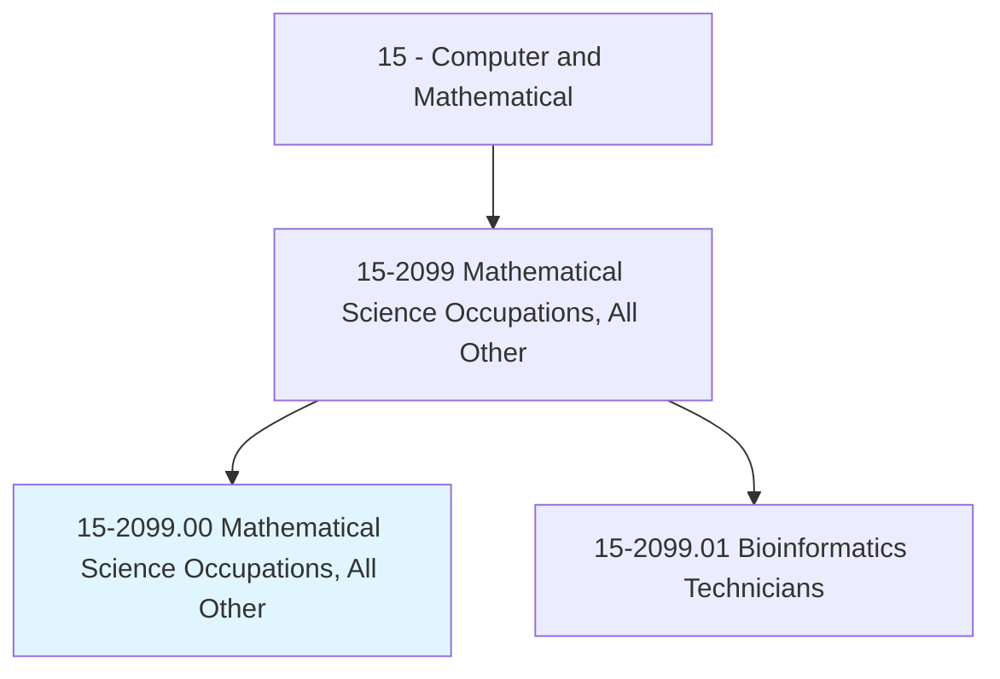
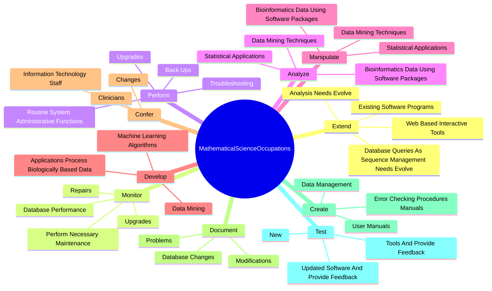
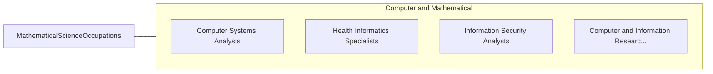

# Mathematical Science Occupations, All Other

> All mathematical scientists not listed separately.

## Overview

Mathematical Science Occupations, All Other is classified under Computer and Mathematical (SOC 15). All mathematical scientists not listed separately.

## Classification Hierarchy

## Key Statistics

| Metric | Value |
|--------|-------|
| SOC Code | 15-2099.00 |
| Category | [Computer and Mathematical](/occupations/Technology/index) |
| Task Count | 65 |
| Source | O*NET |

## Core Tasks

### extend.ExistingSoftwarePrograms

Mathematical Science Occupations, All Other extend existing software programs as part of their core responsibilities.

**Actions:**
- `extend.ExistingSoftwarePrograms`
- `extend.WebBasedInteractiveTools`
- `extend.DatabaseQueriesAsSequenceManagementNeedsEvolve`
- `extend.AnalysisNeedsEvolve`

### monitor.DatabasePerformance

Mathematical Science Occupations, All Other monitor database performance as part of their core responsibilities.

**Actions:**
- `monitor.DatabasePerformance`
- `monitor.PerformNecessaryMaintenance`
- `monitor.Upgrades`
- `monitor.Repairs`

### perform.RoutineSystemAdministrativeFunctions

Mathematical Science Occupations, All Other perform routine system administrative functions as part of their core responsibilities.

**Actions:**
- `perform.RoutineSystemAdministrativeFunctions`
- `perform.Troubleshooting`
- `perform.BackUps`
- `perform.Upgrades`

## Skills & Competencies

### Technical Skills
- **Programming** - Advanced
- **Systems Analysis** - Advanced
- **Database Management** - Advanced

### Soft Skills
- **Communication** - Essential
- **Problem Solving** - Essential
- **Critical Thinking** - Important
- **Teamwork** - Important
- **Adaptability** - Important

## Related Occupations

## Industries

This occupation is found across multiple industries. See [Industries](/industries) for sector-specific employment data.

## Career Progression

---

*Source: O*NET 15-2099.00 - ONETOccupation*
