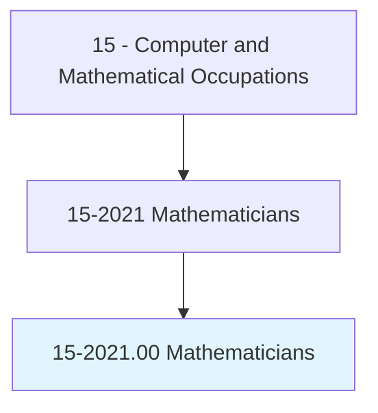
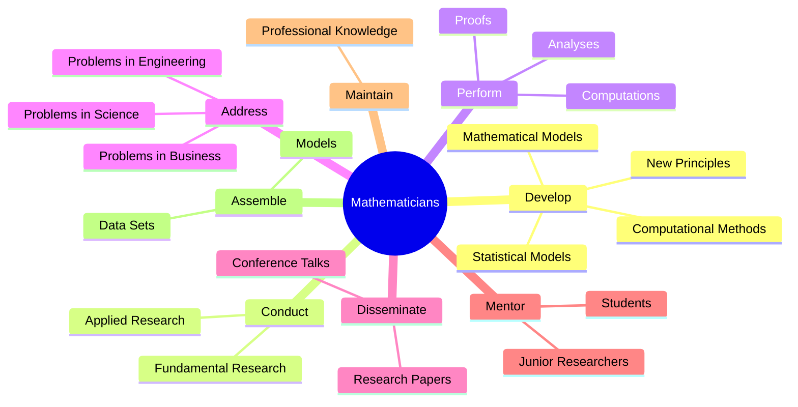
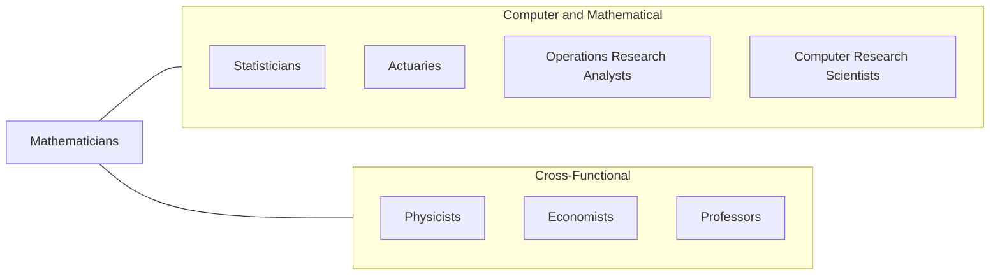
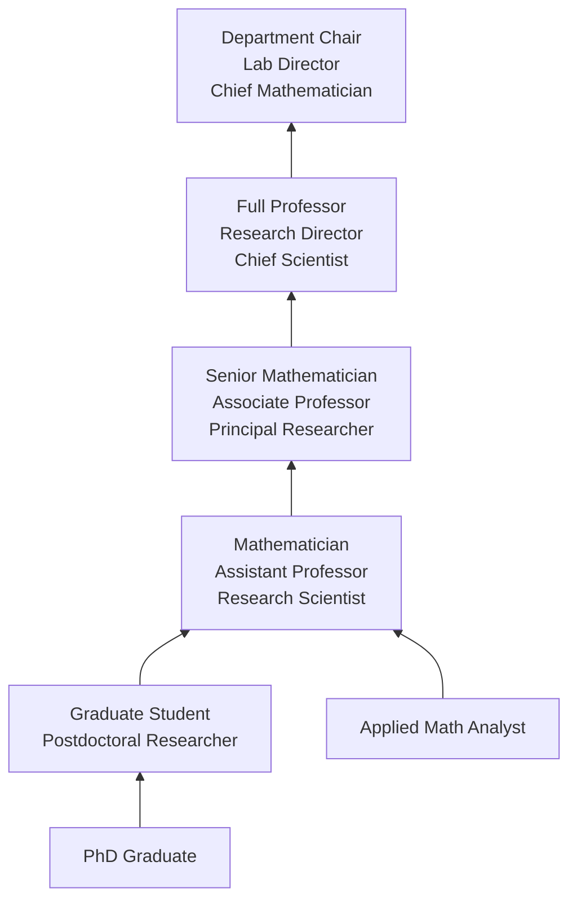

# Mathematicians

> Conduct research in fundamental mathematics or in application of mathematical techniques to science, management, and other fields. Solve problems in various fields using mathematical methods.

## Overview

Mathematicians conduct research in pure and applied mathematics, developing new mathematical theories, principles, and relationships and applying them to solve real-world problems in science, engineering, business, and technology. They work with abstract concepts such as algebra, topology, number theory, and geometry, as well as applied areas including optimization, numerical analysis, computational mathematics, and mathematical modeling.

Pure mathematicians advance human understanding of mathematics itself, discovering new theorems, proving conjectures, and extending existing mathematical frameworks. Applied mathematicians translate mathematical theory into practical solutions for problems in physics, engineering, economics, computer science, biology, and national defense. In both tracks, the work requires exceptional analytical abilities, creativity, and the capacity for deep, sustained concentration on abstract problems.

The demand for mathematical expertise has surged with the rise of data science, artificial intelligence, and quantitative finance. Mathematicians bring a level of theoretical rigor and problem-solving capability that complements the more empirical approach of data scientists and engineers. Their ability to formulate problems precisely, construct proofs, and reason about complex systems makes them valuable in research labs, technology companies, financial firms, government agencies, and academic institutions.

## Classification Hierarchy

## Key Statistics

| Metric | Value |
|--------|-------|
| SOC Code | 15-2021.00 |
| Job Zone | 5 (Extensive Preparation) |
| Category | [Computer and Mathematical](/occupations/Technology/index) |
| Task Count | 47 |
| Median Salary | $112,110 |
| Employment | ~3,500 |
| Growth Rate | Faster Than Average (31%) |
| Source | O*NET |

## Core Tasks

### develop.MathematicalTheory

Mathematicians develop new mathematical principles, relationships, and models.

**Actions:**
- `develop.NewPrinciples.between.ExistingMathematicalConcepts`
- `develop.MathematicalModels.of.ComplexPhenomena`
- `develop.StatisticalModels.for.DataAnalysis`
- `develop.ComputationalMethods.for.NumericalSimulation`

### conduct.Research

Mathematicians conduct fundamental and applied research to advance mathematical knowledge.

**Actions:**
- `conduct.FundamentalResearch.to.extend.MathematicalKnowledge`
- `conduct.AppliedResearch.to.solve.RealWorldProblems`
- `prove.Theorems.to.establish.MathematicalTruths`
- `formulate.Conjectures.for.FutureInvestigation`

### apply.MathematicalMethods

Mathematicians apply mathematical techniques to solve problems across disciplines.

**Actions:**
- `perform.Computations.to.solve.ScientificProblems`
- `apply.OptimizationMethods.to.improve.BusinessProcesses`
- `address.Problems.in.EngineeringAndPhysics`
- `model.Phenomena.for.PredictiveAnalysis`

### disseminate.Research

Mathematicians share their findings through publications and professional engagement.

**Actions:**
- `disseminate.Research.through.PeerReviewedJournals`
- `present.Findings.at.ProfessionalConferences`
- `mentor.Others.on.MathematicalTechniques`
- `maintain.Knowledge.by.ReadingProfessionalJournals`

## Tech Stack

### Computational Tools
- **MATLAB** - Numerical computing
- **Mathematica** - Symbolic computation
- **Maple** - Computer algebra system
- **SageMath** - Open-source mathematics software
- **Julia** - High-performance scientific computing
- **Python (SymPy/NumPy/SciPy)** - Scientific computing

### Programming Languages
- **Python** - General computation and ML
- **C/C++** - Performance-critical algorithms
- **Fortran** - Legacy scientific computing
- **Haskell** - Functional programming (type theory)
- **LaTeX** - Mathematical typesetting
- **R** - Statistical computing

### Research Tools
- **arXiv** - Preprint server
- **Overleaf** - Collaborative LaTeX
- **Zotero/Mendeley** - Reference management
- **MathSciNet** - Mathematical reviews database
- **Coq/Lean** - Theorem provers

### Specialized Software
- **CPLEX/Gurobi** - Optimization solvers
- **GAP** - Computational group theory
- **Magma** - Algebra and number theory
- **PARI/GP** - Number theory
- **HPC Clusters** - Large-scale computation

## Certifications

| Certification | Provider | Level |
|---------------|----------|-------|
| PhD in Mathematics | Universities | Doctoral |
| Accredited Professional Statistician (PStat) | ASA | Professional |
| Certified Analytics Professional (CAP) | INFORMS | Professional |
| Society for Industrial and Applied Mathematics (SIAM) | SIAM | Membership |

## Skills & Competencies

### Technical Skills
- **Mathematical Proof & Reasoning** - Expert
- **Abstract Algebra & Analysis** - Expert
- **Numerical Methods** - Expert
- **Mathematical Modeling** - Expert
- **Programming** - Advanced
- **Statistical Methods** - Advanced
- **Optimization Theory** - Advanced
- **Scientific Writing** - Expert

### Soft Skills
- **Analytical Thinking** - Critical
- **Abstract Reasoning** - Critical
- **Intellectual Curiosity** - Critical
- **Persistence** - Critical (proofs can take years)
- **Communication** - Essential (teaching, presenting)
- **Collaboration** - Important (interdisciplinary research)

## Related Occupations

- [Statisticians](/occupations/Technology/Statisticians)
- [Actuaries](/occupations/Technology/Actuaries)
- [Operations Research Analysts](/occupations/Technology/OperationsResearchAnalysts)
- [Computer and Information Research Scientists](/occupations/Technology/ComputerAndInformationResearchScientists)

## Industry Variations

### Academic / University
- Pure mathematics research
- Teaching and mentoring
- Grant-funded research programs
- Peer-reviewed publication

### Government / National Labs
- Cryptography and code-breaking (NSA)
- Defense modeling and simulation
- Climate and weather modeling
- Census and demographic analysis

### Technology
- Algorithm design and analysis
- Machine learning theory
- Cryptographic systems
- Computational geometry

### Finance / Quantitative Trading
- Derivatives pricing models
- Risk quantification
- Algorithmic trading strategies
- Portfolio optimization

### Aerospace / Engineering
- Computational fluid dynamics
- Control theory
- Signal processing
- Structural optimization

## Career Progression

## Education & Training

| Requirement | Details |
|-------------|---------|
| Typical Education | PhD in Mathematics, Applied Mathematics, or closely related field |
| Alternative Paths | Master's for some applied/industry roles |
| Work Experience | Postdoctoral research common for academic track |
| Key Knowledge Areas | Analysis, algebra, topology, probability, numerical methods |
| Continuing Education | Conference attendance, seminar participation, ongoing research |

## Departments

This occupation typically works in:
- [Mathematics Department](/departments/Mathematics)
- [Research & Development](/departments/RnD)
- [Data Science & Analytics](/departments/DataScience)
- [Quantitative Research](/departments/Quant)
- [National Security](/departments/Security)

---

*Source: O*NET 15-2021.00 - ONETOccupation*
