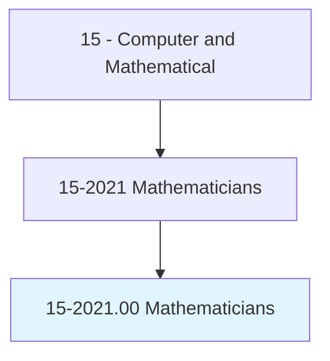
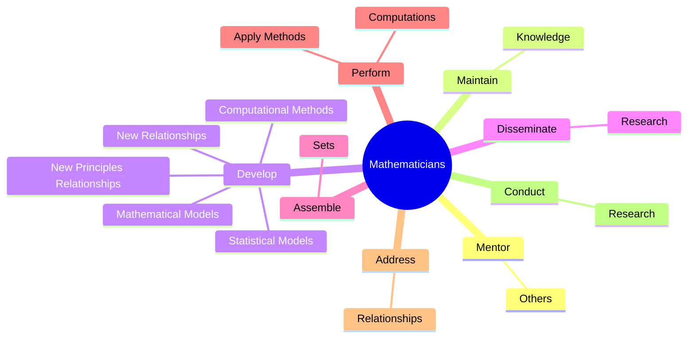
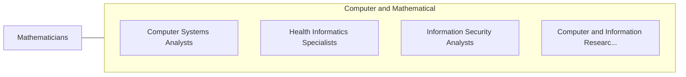

# Mathematicians

> Conduct research in fundamental mathematics or in application of mathematical techniques to science, management, and other fields. Solve problems in various fields using mathematical methods.

## Overview

Mathematicians is an occupation within the Computer and Mathematical category. Conduct research in fundamental mathematics or in application of mathematical techniques to science, management, and other fields. 

## Classification Hierarchy

## Key Statistics

| Metric | Value |
|--------|-------|
| SOC Code | 15-2021.00 |
| Category | [Computer and Mathematical](/occupations/Technology/index) |
| Task Count | 47 |
| Source | O*NET |

## Core Tasks

### mentor.Others

Mathematicians mentor others as part of their core responsibilities.

**Actions:**
- `mentor.Others.on.MathematicalTechniques`

### maintain.Knowledge

Mathematicians maintain knowledge as part of their core responsibilities.

**Actions:**
- `maintain.Knowledge.in.Field.by.ReadingProfessionalJournals`
- `maintain.Knowledge.in.Talking.with.OtherMathematicians`
- `maintain.Knowledge.in.AttendingProfessionalConferences`

### develop.NewPrinciplesRelationships

Mathematicians develop new principles relationships as part of their core responsibilities.

**Actions:**
- `develop.NewPrinciplesRelationships.between.ExistingMathematicalPrinciples.to.advance.MathematicalScience`
- `develop.NewRelationships.between.ExistingMathematicalPrinciples.to.advance.MathematicalScience`
- `develop.MathematicalModels.of.PhenomenaToBeUsedForAnalysisComputationalSimulation`
- `develop.MathematicalModels.of.ForComputationalSimulation`

## Skills & Competencies

### Technical Skills
- **Programming** - Advanced
- **Systems Analysis** - Advanced
- **Database Management** - Advanced

### Soft Skills
- **Communication** - Essential
- **Problem Solving** - Essential
- **Critical Thinking** - Important
- **Teamwork** - Important
- **Adaptability** - Important

## Related Occupations

## Industries

This occupation is found across multiple industries. See [Industries](/industries) for sector-specific employment data.

## Career Progression

---

*Source: O*NET 15-2021.00 - ONETOccupation*
