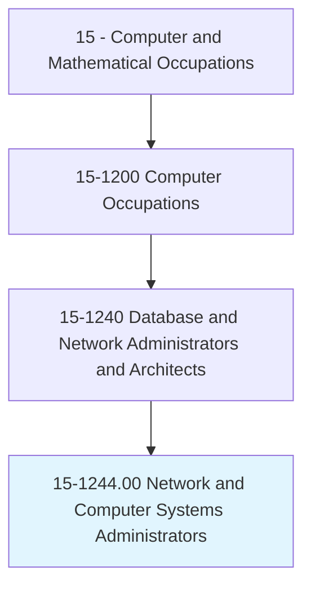
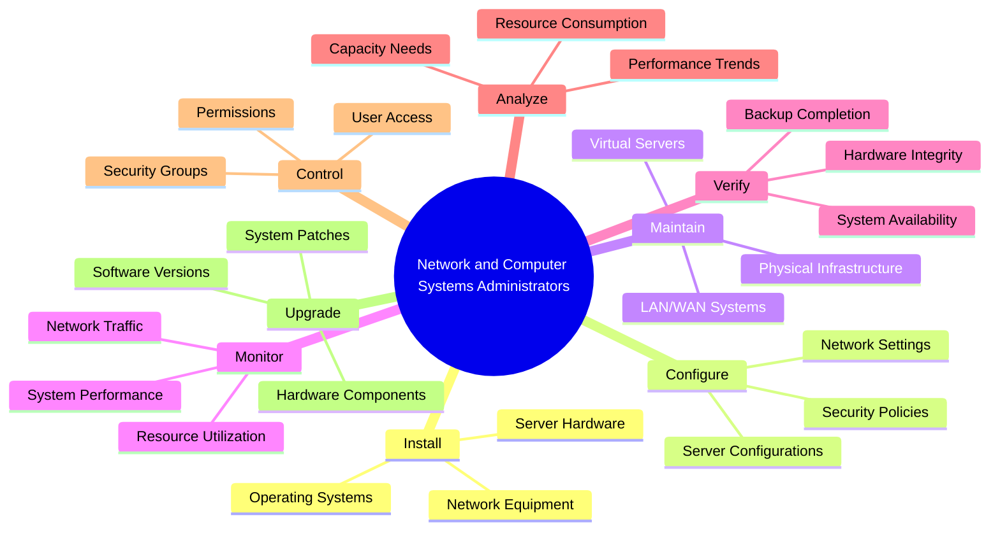
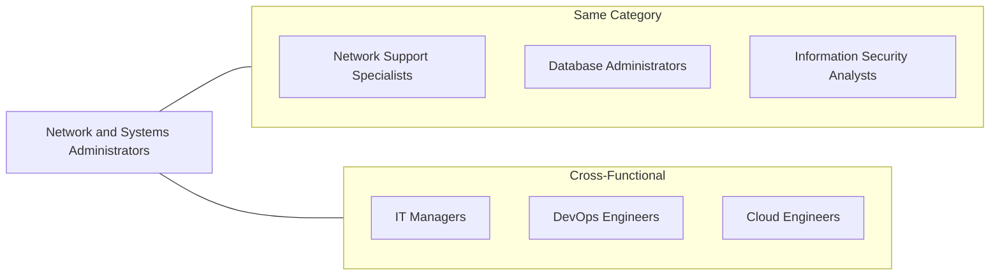
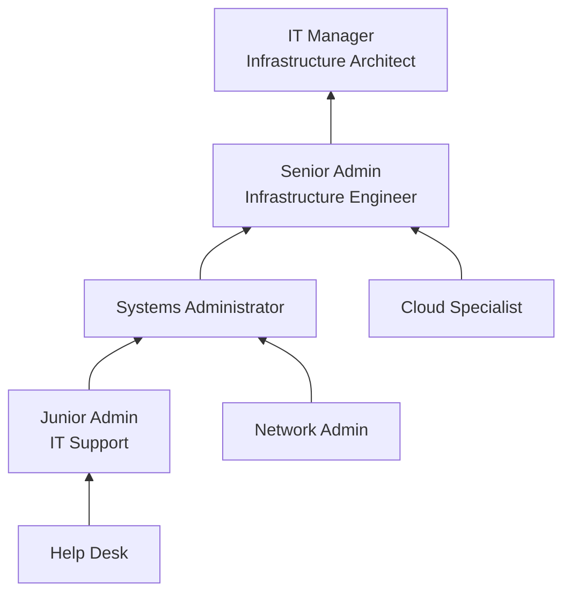

# Network and Computer Systems Administrators

> Install, configure, and maintain an organization's local area network (LAN), wide area network (WAN), data communications network, operating systems, and physical and virtual servers. Perform system monitoring and verify the integrity and availability of hardware, network, and server resources and systems. Review system and application logs and verify completion of scheduled jobs, including system backups. Analyze network and server resource consumption and control user access. Install and upgrade software and maintain software licenses. May assist in network modeling, analysis, planning, and coordination between network and data communications hardware and software.

## Overview

Network and Computer Systems Administrators are the operational backbone of IT infrastructure, responsible for the daily management and maintenance of servers, networks, and computing environments. They ensure systems run efficiently, securely, and with minimal downtime. This role requires hands-on technical expertise across operating systems, networking, and security, combined with the ability to respond quickly to incidents and plan for system growth.

## Classification Hierarchy

## Key Statistics

| Metric | Value |
|--------|-------|
| SOC Code | 15-1244.00 |
| Job Zone | 4 (Considerable Preparation) |
| Category | [Computer and Mathematical](/occupations/Technology) |
| Core Tasks | 15+ |
| Source | O*NET |

## Core Tasks

### install.Systems

Network and Computer Systems Administrators deploy infrastructure components.

**Actions:**
- `install.LocalAreaNetwork.for.Organization` - Deploy LAN infrastructure
- `install.WideAreaNetwork.for.MultiSiteConnectivity` - Implement WAN connections
- `configure.OperatingSystems.for.Servers` - Set up server OS
- `maintain.PhysicalServers.for.Operations` - Manage hardware systems
- `maintain.VirtualServers.for.Operations` - Manage virtualized environments

### monitor.Systems

Network and Computer Systems Administrators track system health and performance.

**Actions:**
- `perform.SystemMonitoring.to.verify.Integrity` - Monitor system health
- `verify.IntegrityOfHardware.to.ensure.Reliability` - Validate hardware status
- `verify.AvailabilityOfNetworkResources.to.ensure.Uptime` - Check network availability
- `verify.AvailabilityOfServerResources.to.ensure.Availability` - Ensure server uptime

### review.Logs

Network and Computer Systems Administrators analyze system activity and jobs.

**Actions:**
- `review.SystemLogs.to.identify.Issues` - Analyze system events
- `review.ApplicationLogs.to.troubleshoot.Problems` - Examine application logs
- `verify.CompletionOfScheduledJobs.including.Backups` - Confirm job success
- `verify.SystemBackups.for.DataProtection` - Validate backup integrity

### analyze.Resources

Network and Computer Systems Administrators assess and manage resource utilization.

**Actions:**
- `analyze.NetworkResourceConsumption.to.optimize.Performance` - Evaluate network usage
- `analyze.ServerResourceConsumption.to.plan.Capacity` - Assess server utilization
- `control.UserAccess.to.protect.Resources` - Manage access permissions
- `manage.SoftwareLicenses.for.Compliance` - Track license usage

### upgrade.Software

Network and Computer Systems Administrators maintain software currency.

**Actions:**
- `install.Software.on.ServerSystems` - Deploy new software
- `upgrade.Software.to.CurrentVersions` - Update applications
- `maintain.SoftwareLicenses.for.Compliance` - Manage licensing
- `apply.SecurityPatches.to.protect.Systems` - Patch vulnerabilities

## Tech Stack

### Operating Systems
- **Windows Server** - Enterprise Windows infrastructure
- **Red Hat Enterprise Linux** - Enterprise Linux
- **Ubuntu Server** - Open-source Linux
- **VMware vSphere** - Virtualization platform
- **Microsoft Hyper-V** - Windows virtualization

### Network Management
- **Cisco IOS** - Network operating system
- **Juniper Junos** - Network management
- **Aruba AirWave** - Network management
- **SolarWinds Network Performance Monitor** - Network monitoring
- **Nagios** - Infrastructure monitoring

### Server Management
- **Microsoft SCCM** - Configuration management
- **Ansible** - Automation platform
- **Puppet** - Configuration management
- **Chef** - Infrastructure automation
- **PowerShell** - Windows automation

### Cloud Platforms
- **Microsoft Azure** - Cloud services
- **Amazon Web Services** - Cloud infrastructure
- **Google Cloud Platform** - Cloud computing
- **VMware Cloud** - Hybrid cloud

### Monitoring & Logging
- **Splunk** - Log management
- **Zabbix** - Monitoring solution
- **Prometheus/Grafana** - Metrics and visualization
- **Datadog** - Cloud monitoring
- **PRTG** - Network monitoring

## Certifications

| Certification | Provider | Level |
|---------------|----------|-------|
| CompTIA Server+ | CompTIA | Entry |
| MCSA Windows Server | Microsoft | Associate |
| RHCSA/RHCE | Red Hat | Associate/Engineer |
| VCP-DCV | VMware | Professional |
| AWS SysOps Administrator | Amazon | Associate |
| Azure Administrator | Microsoft | Associate |
| CCNA | Cisco | Associate |

## Skills & Competencies

### Technical Skills
- **Windows Server Administration** - Expert
- **Linux Administration** - Advanced
- **Virtualization** - Advanced
- **Network Configuration** - Advanced
- **Active Directory** - Expert
- **Scripting (PowerShell, Bash)** - Intermediate
- **Cloud Platforms** - Intermediate

### Soft Skills
- **Problem Solving** - Critical
- **Attention to Detail** - Critical
- **Time Management** - Essential
- **Communication** - Essential
- **Documentation** - Essential

## Related Occupations

## Industry Variations

### Corporate IT
- Mixed Windows/Linux environments
- Active Directory management
- Microsoft 365 administration
- Hybrid cloud infrastructure

### Financial Services
- High-availability requirements
- Strict change management
- Security-focused operations
- Compliance-driven processes

### Healthcare
- EHR system support
- HIPAA compliance
- 24/7 availability requirements
- Medical device integration

### Education
- Student lab management
- Learning management systems
- Seasonal scaling
- Budget-conscious solutions

## Career Progression

## Education & Training

| Requirement | Details |
|-------------|---------|
| Typical Education | Bachelor's degree in Information Technology, Computer Science, or related field |
| Work Experience | 2-5 years in IT support or systems administration |
| On-the-Job Training | Moderate - vendor certifications and platform-specific training |
| Common Certifications | MCSA, RHCE, VCP, CompTIA Server+, AWS/Azure Admin |

## Departments

This occupation typically works in:
- [Information Technology](/departments/IT)
- [Infrastructure](/departments/Infrastructure)
- [Operations](/departments/Operations)
- [Network Engineering](/departments/NetworkEngineering)

---

*Source: O*NET 15-1244.00 - ONETOccupation*
